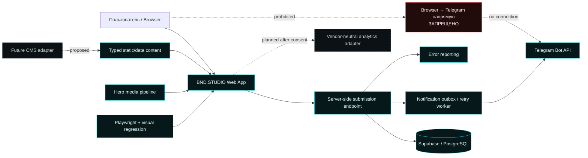
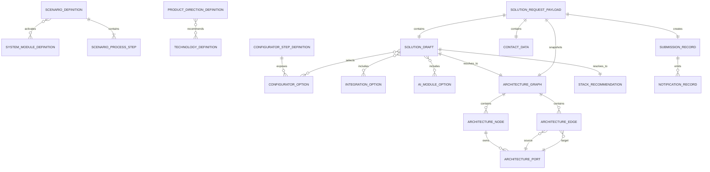
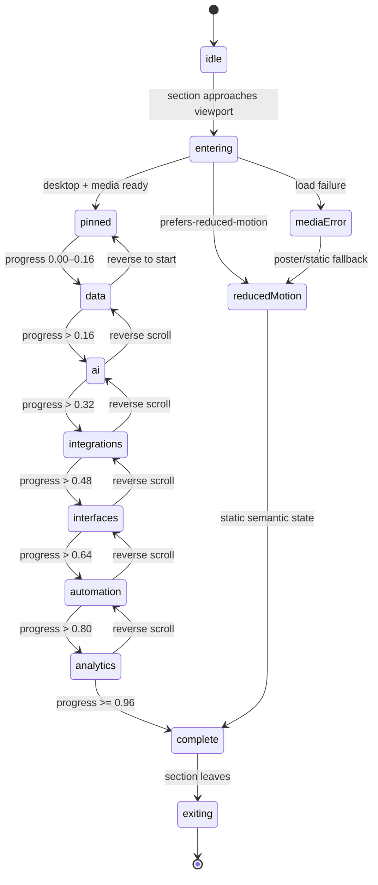
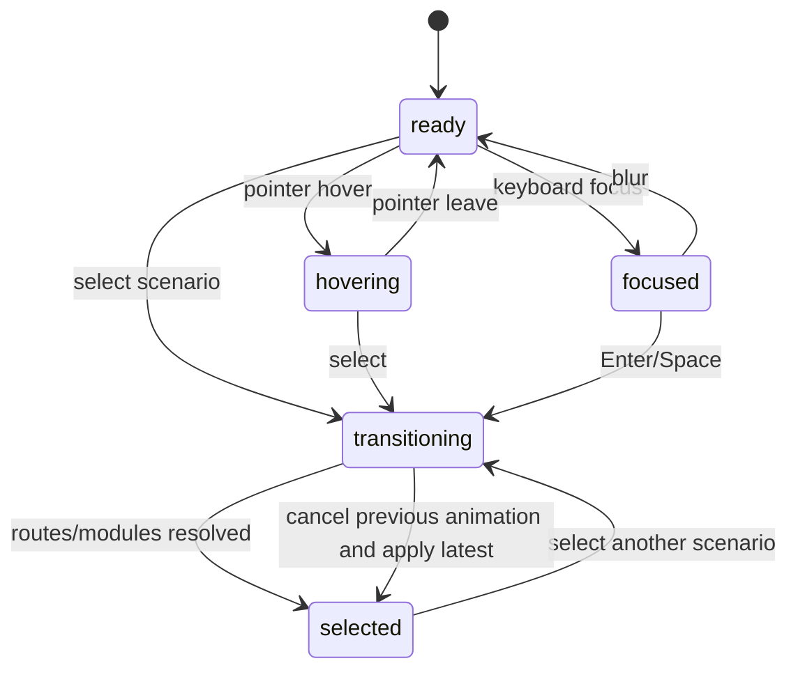
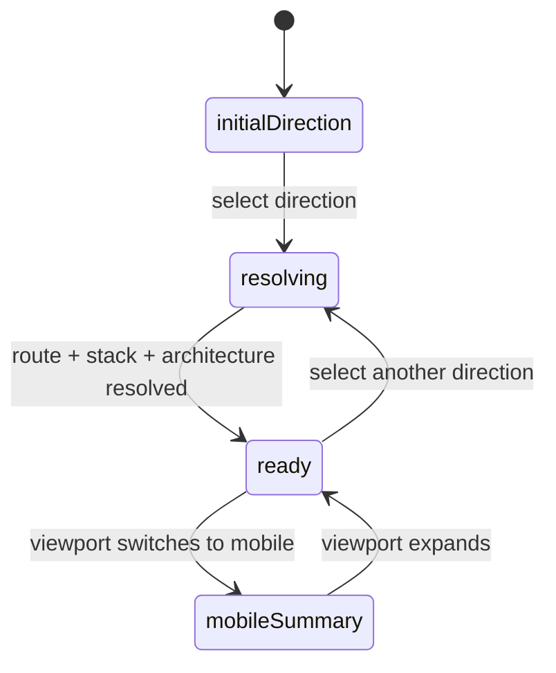
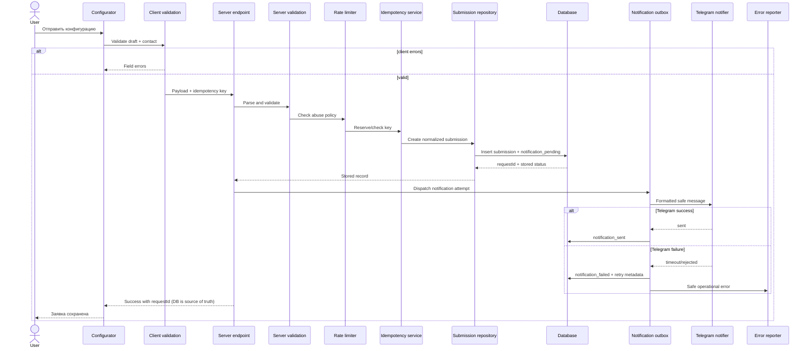

# BND.STUDIO — Stage 2 Architecture

**Файл:** `BND_STAGE_2_ARCHITECTURE.md`  
**Этап:** Stage 2 — Architecture  
**Дата фиксации:** 23 июля 2026  
**Статус:** завершён на уровне архитектуры; production-код не создавался  
**Режим:** local-first, без GitHub, публикации, Supabase-мутаций и реальных Telegram-отправок  
**Источник истины:** `BND_STUDIO_REQUIREMENTS_BASELINE.md` со статусом `READY WITH NON-BLOCKING GAPS`

---

# 1. Executive Architecture Summary

BND.STUDIO проектируется как **модульное data-driven web-приложение с server-side trust boundary**, а не как монолитный лендинг и не как один растровый экран.

Архитектурный стиль:

- **Next.js production foundation**, запускаемый локально;
- server-rendered shell и статический контент по умолчанию;
- изолированные client islands только там, где необходимы scroll, selection, form state и динамическая SVG-графика;
- типизированные domain entities и чистые deterministic resolvers отдельно от React;
- локальное состояние по доменам вместо глобального store;
- лёгкий page-level `SolutionDraft` для неперсонального prefill между секциями 02–04;
- reusable HTML/CSS/SVG HUD-библиотека;
- изолированная media abstraction для Hero Core;
- безопасный pipeline заявки: frontend → server validation → anti-spam/idempotency → database → notification outbox → Telegram;
- responsive composition с прогрессивным упрощением, а не пропорциональным уменьшением desktop;
- visual regression как архитектурное требование с первого skeleton.

Основные домены:

1. shell/navigation;
2. hero;
3. problem-explorer;
4. product-assembler;
5. configurator;
6. architecture-preview;
7. projects;
8. HUD graphics;
9. media;
10. submission;
11. analytics;
12. content/data;
13. QA.

Ключевые решения Stage 2:

- cross-section prefill принят через versioned non-PII `SolutionDraft`, page-level context и session persistence;
- глобальный store не используется;
- Hero Core скрыт за renderer contract и может переключаться между placeholder, sequence, video и poster;
- пользовательские схемы строятся собственными HTML/SVG-компонентами для ограниченного DAG;
- конфигуратор разделяет draft data, UI state, validation/submission state, database state и notification state;
- запись заявки является первичной операцией; Telegram — последующее уведомление;
- notification retry проектируется через outbox/status model;
- серверные adapters имеют mock и production implementations, поэтому локальная разработка не зависит от Supabase и Telegram;
- Stage 3 может начаться без финального шрифта, точных цветов и 3D-ассетов.

---

# 2. Architecture Principles

| Принцип | Архитектурное правило | Связанные требования |
|---|---|---|
| Reference-first | Геометрия, плотность, иерархия и motion сверяются с загруженными референсами; generic cyberpunk не используется. | VIS-001–VIS-014, QA-001–QA-006 |
| Data-driven UI | Сценарии, продукты, стек, шаги и кейсы поступают из versioned schemas/registries, а не из дублируемого JSX. | BUS-006, FE-004, FE-005, PROB-011, DATA-001 |
| Reusable components | Общие панели, рамки, routes, statuses и option cards имеют единые contracts и variants. | FE-004, SVG-001, SVG-003, VIS-004 |
| Progressive enhancement | Базовый контент и формы остаются доступными при отключённой сложной анимации или media fallback. | HERO-014, HERO-015, A11Y-011, RESP-010 |
| Local-first development | Архитектура полностью запускается локально с mock adapters и не требует GitHub/production services. | BUS-007, FE-011, TG-006, BE-010 |
| Accessibility by construction | Semantic structure, keyboard flow, focus, form semantics и text alternatives проектируются в component contracts. | A11Y-001–A11Y-011, CONF-028 |
| Server-side trust boundary | Browser считается недоверенным; secrets, validation, persistence и Telegram находятся только server-side. | BE-001–BE-009, TG-001–TG-005, SEC-001–SEC-012 |
| Media isolation | Hero media renderer не знает о copy/HUD и заменяется без перестройки секции. | HERO-012, HERO-016, 3D-001–3D-009 |
| Controlled motion | Motion сообщает состояние системы и имеет cancel/reverse/reduced-motion behavior. | HERO-010, HERO-011, MOTION-001–MOTION-010 |
| Visual testability | Композиции имеют фиксированные viewports, deterministic states и screenshot fixtures. | DEC-010, QA-001–QA-012 |
| No fictitious content | Неподтверждённые metrics, cases, technologies и claims не становятся UI-данными. | BUS-004, BUS-005, HERO-007, CASE-001–CASE-008 |
| Graceful degradation | При media/network/viewport ограничениях сохраняются смысл, управление и возможность отправить форму. | CONF-017, RESP-003–RESP-010, PERF-002, PERF-009 |


---

# 3. System Context Diagram

## 3.1. Контекст системы



## 3.2. Статус связей

| Связь | Статус | Правило |
|---|---|---|
| Browser → BND.STUDIO | current | HTML, CSS, SVG, media и client islands |
| Typed content → UI | current | Schema-validated registries |
| Hero media pipeline → Hero renderer | current architecture / asset pending | Источник заменяемый |
| Browser → server endpoint | planned implementation | Только нормализованный request |
| Server endpoint → database | planned implementation | Запись до Telegram |
| Database/outbox → Telegram | planned implementation | Retry/status model |
| Browser → Telegram | **forbidden** | Bot token и API вызов не попадают в client |
| CMS → content adapter | proposed | Не требуется для local prototype |
| Site → analytics adapter | proposed | Только после consent/privacy review |
| Visual tests → site | current architecture | Fixed viewport fixtures |

---

# 4. Section Map

| Секция | Цель | Inputs | State | Outputs | Основные компоненты | Технологии | Требования |
|---|---|---|---|---|---|---|---|
| 01 Hero / BND AI Core | Позиционирование и демонстрация внутренней архитектуры | Hero content; media manifest; viewport capabilities | Scroll stage; media status; reduced-motion | CTA navigation; stage analytics; visual introduction | HeroSection, HeroCopy, HeroCore, HeroMediaRenderer, HeroHudLayer | HTML/CSS/SVG/Canvas | IA-001, HERO-001–HERO-016 |
| 02 Problem Explorer | Диагностика проблемы и показ задействованных модулей | ScenarioDefinition, modules, routes | selectedScenarioId; transition token | Resolved modules/routes/flow; non-PII draft patch | ProblemExplorerSection, ScenarioList, CubeCore, SystemModuleGraph, ScenarioFlow | HTML/CSS/SVG + cube asset | PROB-001–PROB-014 |
| 03 Product Assembler | Связать процесс с продуктом, архитектурой и стеком | ProductDirectionDefinition, technologies, principles | selectedDirectionId; route transition | Stack recommendation; architecture summary; draft patch | ProductAssemblerSection, OctagonalCore, ProductRoutes, TechnologyStack | HTML/CSS/SVG | PROD-001–PROD-014 |
| 04 Solution Configurator | Сформировать структурированный технический бриф | Step definitions, options, prefill draft, resolvers | Draft; current step; validation; submission | SolutionRequestPayload; graph; stack; safe result | SolutionConfigurator, five steps, ArchitecturePreview | HTML form + SVG graph + server endpoint | CONF-001–CONF-029, BE-001–BE-012 |
| 05 Projects | Подтвердить подход реальными кейсами | Approved ProjectCase records | Preview playback/expanded state | Project navigation; project event | ProjectsSection, ProjectCase, ProjectPreview | HTML/media/SVG | CASE-001–CASE-008 |
| 06 Workflow | Объяснить путь реализации | WorkflowStage data | none | Narrative context | WorkflowSection, ProcessTimeline | HTML/SVG decor | REM-001, REM-005 |
| 07 Technologies and Principles | Показать инженерные основания без продажи технологий самих по себе | TechnologyDefinition, EngineeringPrinciple | none | Trust/context | TechnologiesSection, TechnologyStack, PrinciplesList | HTML/SVG icons | REM-002, REM-005 |
| 08 Contact | Дать прямой альтернативный контактный путь | Approved contact content | none | CTA event/navigation | ContactSection, SystemButton | HTML | REM-003, REM-005, A11Y-001 |
| 09 Footer | Legal/contact/navigation завершение | Footer content, privacy route | none | Navigation | TechFooter | HTML | REM-004, REM-006, SEC-005 |


---

# 5. Route Architecture

| Route | Статус | Назначение | Rendering | State/данные | Примечание |
|---|---|---|---|---|---|
| `/` | confirmed | Главная из девяти секций | Server shell + client islands | Typed local data; page-level non-PII draft | Основной Stage 3–11 scope |
| `/projects` | proposed | Каталог реальных проектов | Server-rendered content | Approved ProjectCase records | Создаётся только при достаточном числе кейсов |
| `/projects/[slug]` | proposed | Детальный системный кейс | Server-rendered + preview island | ProjectCase by stable slug | Не блокирует главную |
| `/privacy` | required before production form | Политика обработки данных | Static/server-rendered | Approved legal content | Контент pending: INP-011 |
| `/request/success` | deferred | Отдельный success route | Не нужен для первой версии | requestId только через безопасный state/token | Inline success предпочтительнее, чтобы не раскрывать lead status |
| `/api/solution-requests` | architecture accepted | Server endpoint конфигуратора | Server-only | Validated SolutionRequestPayload | Конкретный framework syntax проверяется перед Stage 4 |
| `/admin` | not in scope | Админ-панель | — | — | Не добавляется без отдельного требования |

**Решение:** success-state остаётся внутри конфигуратора. Отдельный public lead-status route не создаётся: он повышает privacy/security complexity без подтверждённой бизнес-потребности.

---

# 6. Domain Decomposition

| Домен | Ответственность | Публичный контракт | Внутреннее состояние | Inputs | Outputs | Разрешённые зависимости | Запрещённые зависимости |
|---|---|---|---|---|---|---|---|
| shell-navigation | Общий каркас страницы, Header, навигация, section anchors и сквозные layout-правила. | `SiteShellContract`: секции, nav items, active section, CTA targets. | Локально: active anchor, mobile menu; server: статический nav/content. | Site configuration, section metadata. | Navigation events, section visibility. | content/data, HUD primitives | Не зависит от hero media, configurator state или backend. |
| hero | Позиционирование, Hero copy, CTA, HUD-обвязка и оркестрация Hero Core. | `HeroViewModel`, `HeroCoreContract`, CTA events. | Scroll stage, media load state, reduced-motion mode. | Hero content, media manifest, viewport capabilities. | CTA events, stage-viewed events, accessible stage summary. | media, HUD graphics, analytics interface | Не вызывает submission и не импортирует configurator internals. |
| problem-explorer | Диагностика проблемы через 6 сценариев и визуализацию задействованных модулей. | `ScenarioSelectionContract`: selectedScenarioId, resolved modules/routes/flow. | Локально: hover/focus/selected/transition token. | Scenario definitions, module definitions. | Non-PII prefill patch, selection analytics. | content/data, resolvers, HUD graphics | Не знает о форме контактов и Telegram. |
| product-assembler | Выбор продуктового направления, маршрута, архитектурного описания и стека. | `ProductSelectionContract`: directionId, routeId, stack recommendation. | Локально: selected direction и transition state. | Product directions, technologies, principles, workflow. | Non-PII prefill patch, selection analytics. | content/data, resolvers, OctagonalCore | Не импортирует Problem Explorer UI и configurator form. |
| configurator | Пятишаговая форма, валидация, draft lifecycle и submit orchestration. | `ConfiguratorContract`: SolutionDraft, step state, validation result, submit intent. | Draft data, UI step, validation state, submission state — раздельно. | Step definitions, options, prefill draft, resolver outputs. | Validated payload intent, UI status, analytics events. | architecture-preview, resolvers, client validation, submission client | Не вызывает Telegram/Supabase напрямую. |
| architecture-preview | Построение и отображение ограниченного DAG решения, summary, tags и stack. | `ArchitecturePreviewContract`: graph, summary, tags, stack, status. | Только presentation state: selected node/focus; graph вычисляется resolvers. | SolutionDraft, graph rules, technology registry. | HTML/SVG graph, текстовое представление. | resolvers, HUD graphics | Не владеет form state и не мутирует draft. |
| projects | Вывод реальных системных кейсов и будущих страниц проектов. | `ProjectCaseContract`: approved project content and media. | Локально: preview playback/expanded state. | Approved ProjectCase records. | Project opened events, navigation. | content/data, media, HUD primitives | Не зависит от configurator и submission. |
| hud-graphics | Переиспользуемые панели, рамки, коннекторы, узлы, иконки и OctagonalCore. | `HudPrimitiveProps`, SVG symbol IDs, geometry contracts. | Только visual transient state через props/CSS. | Geometry tokens, icon registry, view-model props. | HTML/SVG presentation. | styles/tokens, graphics definitions | Не импортирует business data, state machines или server modules. |
| media | Абстракция poster/video/render-sequence, loading, cache, DPR и fallback. | `HeroMediaSource`, `HeroMediaRendererContract`. | Loader/cache/ready/error, без бизнес-состояния. | Media manifest, capabilities, normalized progress. | Rendered frame, media status. | asset loader, browser capabilities | Не знает Hero copy, CTA или backend. |
| submission | Server-side validation, anti-spam, idempotency, persistence и notification outbox. | `SubmissionService`, repository/notifier/security interfaces. | Server record statuses и notification statuses. | Normalized payload, request metadata, secrets server-side. | Safe response, DB records, notification attempts. | validation, repository, notifier, logger | Не импортируется client bundle; browser не вызывает notifier. |
| analytics | Vendor-neutral tracking contract без PII. | `EventTracker.track(AnalyticsEvent)` conceptual interface. | Consent state/queue adapter; provider вне домена. | Allowed event payloads, consent state. | Vendor-neutral event stream. | consent boundary | Не принимает contact fields, free text или raw form values. |
| content-data | Типизированные определения сценариев, продуктов, технологий, workflow и проектов. | Versioned data schemas and registries. | Нет UI state. | Local typed files; future CMS adapter. | Validated domain entities. | schema validation | Не зависит от React/DOM и не содержит JSX. |
| qa | Тестовые harnesses, visual fixtures, viewport profiles и acceptance mapping. | `TestFixture`, `ViewportProfile`, screenshot naming contract. | Тестовый runtime state. | Requirement IDs, components, routes, fixtures. | Reports, screenshots, overlay, diff. | all public contracts | Не меняет production behavior и не хранит secrets. |


---

# 7. Component Architecture

## 7.1. Component Tree

```mermaid
flowchart TD
    SiteFrame --> Header
    SiteFrame --> MainContent
    SiteFrame --> TechFooter
    Header --> BrandMark
    Header --> Navigation
    Header --> MobileNavigation

    MainContent --> HeroSection
    MainContent --> ProblemExplorerSection
    MainContent --> ProductAssemblerSection
    MainContent --> SolutionConfigurator
    MainContent --> ProjectsSection
    MainContent --> WorkflowSection
    MainContent --> TechnologiesSection
    MainContent --> ContactSection

    HeroSection --> HeroCopy
    HeroSection --> HeroActions
    HeroSection --> TrustIndicators
    HeroSection --> HeroCore
    HeroSection --> HeroHudLayer
    HeroSection --> TechnologyStrip
    HeroSection --> StatusConsole
    HeroCore --> HeroMediaRenderer
    HeroSection --> HeroScrollController
    HeroHudLayer --> HeroSystemPanel

    ProblemExplorerSection --> ScenarioList
    ScenarioList --> ScenarioCard
    ProblemExplorerSection --> CubeCore
    ProblemExplorerSection --> SystemModuleGraph
    SystemModuleGraph --> SystemModuleNode
    SystemModuleGraph --> ScenarioRoutes
    ProblemExplorerSection --> ScenarioFlow

    ProductAssemblerSection --> ProductDirectionList
    ProductDirectionList --> ProductDirectionCard
    ProductAssemblerSection --> OctagonalCore
    ProductAssemblerSection --> ProductRoutes
    ProductAssemblerSection --> TechnologyStack
    ProductAssemblerSection --> PrinciplesList
    ProductAssemblerSection --> ProcessTimeline

    SolutionConfigurator --> ConfiguratorIntro
    SolutionConfigurator --> ConfiguratorProgress
    SolutionConfigurator --> ConfiguratorStepNavigation
    SolutionConfigurator --> ConfiguratorForm
    ConfiguratorForm --> TaskStep
    ConfiguratorForm --> ProductStep
    ConfiguratorForm --> IntegrationsStep
    ConfiguratorForm --> AiStep
    ConfiguratorForm --> ContactStep
    TaskStep --> SelectableOptionCard
    ProductStep --> SelectableOptionCard
    IntegrationsStep --> SelectableOptionCard
    AiStep --> SelectableOptionCard
    SolutionConfigurator --> ArchitecturePreview
    ArchitecturePreview --> ArchitectureGraph
    ArchitectureGraph --> ArchitectureNodeView
    ArchitectureGraph --> ArchitectureConnectorView
    ArchitecturePreview --> ConfigurationSummary
    ArchitecturePreview --> SystemTags
    ArchitecturePreview --> RecommendedStack

    ProjectsSection --> ProjectCase
    ProjectCase --> ProjectArchitecture
    ProjectCase --> ProjectPreview

    HudPanel --> CutCornerPanel
    HudPanel --> NestedFrame
    HudPanel --> PanelHeader
    HudPanel --> MicroLabel
    HudPanel --> StatusIndicator
    HudPanel --> TechDivider
    ScenarioRoutes --> ConnectorLine
    ProductRoutes --> ConnectorLine
```



**Component catalog:** 70 именованных компонентов/примитивов.  
**Правило:** section orchestrators не рисуют низкоуровневую геометрию и не содержат resolver/business logic.

## 7.2. Component Responsibility Matrix

| Component | Responsibility | Inputs | Local state | Events | Render technology | Client/server | Reusable | Tests | Related requirements |
|---|---|---|---|---|---|---|---|---|---|
| SiteFrame | Сквозной каркас, landmarks, section order, background grid | section metadata, children | active section only if needed | sectionEntered | HTML/CSS | server shell + small client observer | yes | structure, landmarks, visual | IA-001, IA-002, A11Y-001 |
| Header | Бренд, desktop/mobile navigation, contact CTA | nav items, CTA target | mobile menu open | navClick, ctaClick | HTML/CSS | server + client nav island | yes | keyboard, responsive, visual | IA-003, IA-004, RESP-011 |
| Navigation | Якорная навигация и active section | items, activeId | focus only | navigate | HTML | client | yes | keyboard, focus, E2E | IA-004, A11Y-002, A11Y-009 |
| SectionFrame | Единая рамка, number, heading region, spacing | section id, number, variant | none | — | HTML/CSS/SVG border | server | yes | visual snapshots | IA-002, IA-005, VIS-004 |
| HeroSection | Композиция Hero и связывание независимых слоёв | HeroViewModel, media source | none; delegates | CTA and stage events | HTML/CSS | server wrapper + client islands | no | visual/E2E | HERO-001–HERO-009 |
| HeroCopy | Семантический заголовок, описание и CTA | copy, actions, trust indicators | none | ctaClick | HTML | server | yes | content, a11y | HERO-002–HERO-007 |
| HeroCore | Абстракция Core без знания renderer implementation | progress, stage, source set, fallback | media status via child | ready,error,stageChange | Canvas/video/img shell | client | yes | contract, fallback | HERO-008, HERO-010–HERO-016 |
| HeroMediaRenderer | Выбор poster/sequence/video и отрисовка frame | media manifest, progress, DPR cap | loading/cache/error | ready,error | Canvas/video/img | client | yes | loader, performance | 3D-002–3D-009, PERF-001–PERF-009 |
| HeroHudLayer | HUD panels, labels, routes, status synchronized to stage | stage, loading status, labels | none | — | HTML/SVG | client presentation | yes | visual/reduced motion | HERO-009, SVG-001, MOTION-002 |
| HeroScrollController | Scroll progress, pinning, stage mapping, cleanup | section ref, stage map, reduced motion | progress/stage lifecycle | progressChange | controller only | client | no | unit mapping, E2E, perf | HERO-010, HERO-013–HERO-015 |
| ProblemExplorerSection | Оркестрация scenario selection и outputs | scenario registry, module/route registries | selectedScenarioId, transition state | scenarioSelected,prefillPatch | HTML/SVG composition | client | no | interaction/visual | PROB-001–PROB-014 |
| ScenarioList | Доступная группа сценариев | items, selectedId, disabled IDs | focus index optional | select | HTML | client | yes | keyboard, group semantics | PROB-002, PROB-005, PROB-014 |
| ScenarioCard | Одна option-card без domain resolver logic | scenario view model, selected, disabled | hover/focus visual only | select | button/radio + HTML | client | yes | states/a11y | PROB-005, PROB-014 |
| CubeCore | Визуальный куб первой панели с controlled response | asset source, response token, reduced motion | animation token | animationEnd | image/canvas + SVG shell | client presentation | yes | visual/motion | PROB-003, PROB-008 |
| SystemModuleGraph | Модули, active state и routes вокруг cube | module view models, route view models | none | nodeFocus optional | SVG + HTML labels | client presentation | yes | visual/a11y summary | PROB-004, PROB-006, PROB-007 |
| ScenarioFlow | Правая процессная цепочка, status и result | resolved process steps, statuses, result | none | — | HTML | client/server-compatible | yes | content/a11y | PROB-009, PROB-010 |
| ProductAssemblerSection | Оркестрация 4 directions, routes, stack и summary | direction registry, technologies, principles | selectedDirectionId, transition | directionSelected,prefillPatch | HTML/SVG | client | no | interaction/visual | PROD-001–PROD-014 |
| ProductDirectionList | Доступная группа product directions | items, selectedId | focus index optional | select | HTML | client | yes | keyboard | PROD-002, PROD-009 |
| OctagonalCore | Изолированное фронтальное SVG-ядро | label keys, visual state, size | none | — | inline SVG | server-renderable | yes | isolated visual diff | PROD-003–PROD-007, SVG-005 |
| ProductRoutes | Четыре маршрута, active route и pulse | route definitions, activeRouteId | none | — | SVG | client presentation | yes | visual/reduced motion | PROD-008, PROD-009 |
| TechnologyStack | Рендер предварительного стека с disclaimer | StackRecommendation, registry | none | technologyInfo optional | HTML | server/client-compatible | yes | content/schema | PROD-010, CONF-026 |
| PrinciplesList | Общие инженерные принципы | principles | none | — | HTML | server | yes | content/a11y | PROD-011 |
| ProcessTimeline | Workflow stages | stages | none | — | HTML/SVG decor | server | yes | responsive/a11y | PROD-012 |
| SolutionConfigurator | Boundary конфигуратора: draft, UI state, submission orchestration | definitions, prefill, adapters | separate draft/UI/submission reducers | draftChange,submit | HTML | client | no | state/E2E | CONF-001–CONF-029 |
| ConfiguratorProgress | Шаги, active/completed/upcoming и announcements | steps,current,completed | none | goToCompletedStep | HTML | client | yes | a11y/visual | CONF-003, CONF-004 |
| ConfiguratorForm | Рендер текущего step и навигация | step definition, draft slice, errors | field interaction | change,next,back | HTML form | client | no | validation/a11y | CONF-005–CONF-021 |
| TaskStep | Step 1 multi-select задач | task options, selected IDs | custom field draft UI | change | fieldset/checkboxes | client | yes | unit/a11y | CONF-005, CONF-028 |
| ProductStep | Step 2 зависимые продукты | eligible options, selected ID | none | change | fieldset/radios | client | yes | dependency tests | CONF-006, CONF-007 |
| IntegrationsStep | Step 3 multi-select/custom/unknown | integration options, selections | custom input UI | change/add/remove | fieldset/checkboxes | client | yes | validation/a11y | CONF-008, CONF-009 |
| AiStep | Step 4 AI modules и conditional details | AI options, selected, detail schema | conditional UI fields | change | fieldset/checkboxes/form fields | client | yes | dependency/a11y | CONF-010, CONF-011 |
| ContactStep | Step 5 сроки, бюджет, PII и consent | options, ContactData, errors | form fields | change | semantic form controls | client | yes | security/a11y | CONF-012, CONF-013, SEC-004 |
| SelectableOptionCard | Accessible visual wrapper for radio/checkbox/button | control semantics, label, description, state | none | activate | HTML control + visual shell | client | yes | states/a11y | CONF-028, A11Y-002–A11Y-005 |
| ArchitecturePreview | Boundary preview: graph, summary, tags, stack, status | SolutionDraft, viewport mode, resolver outputs | presentation only | nodeFocus optional | HTML/SVG | client | no | resolver/integration/a11y | CONF-022–CONF-026 |
| ArchitectureGraph | Контролируемый DAG render и text alternative hook | ArchitectureGraph entity | focus/selected node optional | nodeFocus | SVG connectors + HTML nodes | client | yes | graph invariants/visual | CONF-023, SVG-004, A11Y-010 |
| ConfigurationSummary | Текстовая сводка и accessible graph description | draft summary, graph summary | none | — | HTML | client/server-compatible | yes | content/a11y | CONF-024, A11Y-010 |
| SystemTags | Релевантные system tags | tag IDs + registry | none | — | HTML | server/client-compatible | yes | resolver tests | CONF-025 |
| RecommendedStack | Стек, rationale и preliminary disclaimer | StackRecommendation | none | — | HTML | server/client-compatible | yes | resolver/content | CONF-026, DATA-006 |
| ProjectsSection | Список approved project cases | ProjectCase[] | none | projectOpened | HTML | server | no | schema/visual | CASE-001–CASE-008 |
| ProjectCase | Системная карточка реального кейса | approved ProjectCase | preview state optional | open,playPreview | HTML/media | server + client preview island | yes | content/a11y/visual | CASE-001–CASE-008 |
| WorkflowSection | Отдельное объяснение процесса работы | workflow content | none | — | HTML/SVG decor | server | no | content/visual | REM-001, REM-005 |
| TechnologiesSection | Technology/principles evidence block | approved technology/principle data | none | — | HTML | server | no | content | REM-002, REM-005 |
| ContactSection | Контактный CTA без дублирования конфигуратора | contact content, CTA | none | ctaClick | HTML | server + small client event | no | a11y/navigation | REM-003, REM-005 |
| TechFooter | Footer, legal links, contacts | footer content | none | navigate | HTML | server | yes | a11y | REM-004, REM-006 |
| HudPanel | Базовый panel shell и variants | variant, slots, semantic element | none | — | HTML/CSS/SVG | server-compatible | yes | visual snapshots | VIS-003–VIS-009, SVG-001 |
| CutCornerPanel | Простая cut-corner геометрия | cut size, variant, content | none | — | HTML/CSS mask | server-compatible | yes | browser/visual | SVG-002 |
| ConnectorLine | SVG connector primitive без business state | geometry, state, marker, pulse | none | — | SVG | server/client-compatible | yes | geometry/reduced motion | SVG-003, SVG-006 |
| StatusConsole | Status lines и live/technical modes | status items, mode | none | — | HTML | server/client-compatible | yes | a11y/visual | VIS-009, A11Y-006 |
| MicroLabel | Техническая подпись, скрываемая по responsive rules | text, priority, semantic/decorative | none | — | HTML | server | yes | responsive/contrast | VIS-008, RESP-008 |


## 7.3. Component Contracts

### 7.3.1. `HeroCore`

| Contract field | Type concept | Required | Description | Owner | Validation |
|---|---|---:|---|---|---|
| `progress` | normalized number `0..1` | yes | Позиция раскрытия | HeroScrollController | clamp |
| `stage` | HeroStage | yes | Именованный смысловой этап | Hero state mapper | known enum |
| `sourceSet` | HeroMediaSourceSet | yes | Desktop/mobile/reduced-motion sources | media domain | manifest schema |
| `poster` | MediaAsset | yes | Первый кадр/fallback | media domain | dimensions/URL |
| `loadingState` | idle/loading/ready/error | yes | Media lifecycle | HeroMediaRenderer | state transition |
| `dprLimit` | number | yes | Верхний предел canvas DPR | media domain | bounded |
| `onReady` | event | no | Сигнал готовности | renderer | no payload PII |
| `onError` | safe error event | no | Код ошибки без stack/URL secrets | renderer | allow-list |
| `reducedMotion` | boolean | yes | Отключение scrub | accessibility layer | capability-derived |

### 7.3.2. `ScenarioCard`

| Contract field | Type concept | Required | Description | Owner | Validation |
|---|---|---:|---|---|---|
| `scenario` | ScenarioCardViewModel | yes | Только display data | Problem Explorer |
| `selected` | boolean | yes | Domain selection projection | parent |
| `disabled` | boolean | yes | Доступность выбора | rules |
| `controlType` | radio/button concept | yes | Семантика группы | A11Y contract |
| `onSelect` | `(scenarioId) => event` | yes | Не мутирует graph напрямую | parent |
| `ariaDescriptionId` | string | yes | Связь с описанием | component |
| `visualState` | derived | yes | default/hover/focus/selected/disabled | component CSS |

### 7.3.3. `SystemModuleGraph`

| Contract field | Type concept | Required | Description | Owner | Validation |
|---|---|---:|---|---|---|
| `modules` | SystemModuleViewModel[] | yes | Positions + active state | resolver/view adapter |
| `routes` | RouteViewModel[] | yes | Geometry + visual state | resolver |
| `coreAnchor` | GraphAnchor | yes | Coordinate reference | graph config |
| `transitionToken` | string/number | no | Cancels/restarts controlled pulse | section |
| `layoutMode` | desktop/tablet/mobile | yes | Responsive arrangement | viewport adapter |
| `textSummary` | string[] | yes | Accessible equivalent | resolver/content |
| `reducedMotion` | boolean | yes | Disables pulse/stroke animation | capability layer |

### 7.3.4. `OctagonalCore`

| Contract field | Type concept | Required | Description | Owner | Validation |
|---|---|---:|---|---|---|
| `size` | responsive size token | yes | ViewBox remains invariant | parent |
| `state` | idle/active/transition | yes | Controlled visual state | Product Assembler |
| `title` | display label | yes | `BND ENGINE` | content |
| `subtitle` | display label | yes | `ЯДРО СИСТЕМЫ` | content |
| `decorative` | boolean | yes | Accessible behavior | A11Y contract |
| `glowLevel` | token | yes | No arbitrary filter | design system |
| `routeAnchors` | readonly anchor map | yes | External connectors attach outside component | SVG contract |

### 7.3.5. `ProductRoutes`

| Contract field | Type concept | Required | Description | Owner | Validation |
|---|---|---:|---|---|---|
| `routeDefinitions` | ProductRouteDefinition[] | yes | Four fixed logical routes | data registry |
| `activeRouteId` | StableID | yes | Selected route | section state |
| `anchors` | AnchorMap | yes | Core/card connection points | layout config |
| `pulseMode` | none/once | yes | No infinite pulse | motion contract |
| `layoutMode` | desktop/tablet/mobile | yes | Simplification rules | responsive adapter |
| `reducedMotion` | boolean | yes | Static active line | capability layer |

### 7.3.6. `SolutionConfigurator`

| Contract field | Type concept | Required | Description | Owner | Validation |
|---|---|---:|---|---|---|
| `definitions` | ConfiguratorDefinitionBundle | yes | Steps/options/rules/versions | content/data |
| `initialDraft` | SolutionDraft | yes | New/prefilled/recovered | draft factory |
| `repositoryClient` | SubmissionClient interface | yes | Calls only server endpoint | app boundary |
| `eventTracker` | EventTracker | yes | Vendor-neutral | analytics |
| `draftPersistence` | DraftPersistence interface | yes | Non-PII session strategy | state domain |
| `onSuccess` | safe result event | no | Contains requestId/status only | app |
| `mode` | normal/mock | yes | Local adapter selection | environment |
| `privacyReady` | boolean | yes | Production submit gate | app config |

### 7.3.7. `ArchitecturePreview`

| Contract field | Type concept | Required | Description | Owner | Validation |
|---|---|---:|---|---|---|
| `draft` | normalized SolutionDraft | yes | Source selections | configurator |
| `graph` | ArchitectureGraph | yes | Resolver output | architecture resolver |
| `stack` | StackRecommendation | yes | Resolver output | stack resolver |
| `tags` | StableID[] | yes | Resolver output | tag resolver |
| `status` | configuring/ready/invalid | yes | Preview state | resolver adapter |
| `layoutMode` | responsive mode | yes | Desktop/tablet/mobile-summary | viewport adapter |
| `textAlternative` | string[] | yes | Meaningful non-visual summary | resolver/content |

### 7.3.8. `ArchitectureGraph`

| Contract field | Type concept | Required | Description | Owner | Validation |
|---|---|---:|---|---|---|
| `nodes` | ArchitectureNode[] | yes | Bounded node set | graph resolver |
| `edges` | ArchitectureEdge[] | yes | Valid directed edges | graph resolver |
| `layout` | GraphLayout | yes | Precomputed own layout | layout resolver |
| `maxNodes` | integer | yes | DOM/performance guard | architecture |
| `allowCycles` | false for MVP | yes | Graph is DAG | validator |
| `activeEdgeIds` | StableID[] | no | Controlled highlight | preview |
| `accessibleSummaryId` | string | yes | Links SVG to text summary | component |

### 7.3.9. `SelectableOptionCard`

| Contract field | Type concept | Required | Description | Owner | Validation |
|---|---|---:|---|---|---|
| `control` | radio/checkbox/button | yes | Native/semantic interaction | form |
| `name` | string | conditional | Group name for form controls | form |
| `value` | StableID | yes | System ID, not display label | data |
| `label` | localized text | yes | User-facing | content |
| `description` | localized text | yes | User-facing | content |
| `checked/pressed` | boolean | yes | Controlled state | form |
| `disabled` | boolean | yes | Rule projection | resolver |
| `errorId` | string | no | Associated validation | form |
| `onChange` | event | yes | Emits ID only | form |

### 7.3.10. `RecommendedStack`

| Contract field | Type concept | Required | Description | Owner | Validation |
|---|---|---:|---|---|---|
| `recommendation` | StackRecommendation | yes | Versioned deterministic output | resolver |
| `technologies` | TechnologyDefinition[] | yes | Display registry | data |
| `disclaimerKey` | I18nKey | yes | Preliminary architecture notice | content |
| `showRationale` | boolean | yes | Contextual explanation | parent |
| `status` | ready/review_required | yes | Handles ambiguous rules | resolver |

### 7.3.11. `ProjectCase`

| Contract field | Type concept | Required | Description | Owner | Validation |
|---|---|---:|---|---|---|
| `caseData` | approved ProjectCase | yes | Only approved content | projects domain |
| `variant` | card/featured/detail | yes | Presentation variant | section |
| `mediaPolicy` | lazy/autoplay-on-visible/manual | yes | Performance/a11y | media |
| `onOpen` | project ID event | no | Analytics/navigation | app |
| `metricsVisible` | derived | yes | True only with approved metrics | content governance |
| `architectureSummary` | text + optional SVG model | yes | Meaning not media-only | projects domain |

## 7.4. Server and Client Component Boundaries

| Component/domain | Server by default | Client boundary reason | Browser state | Server dependency | Notes |
|---|---|---|---|---|---|
| SiteFrame / static section wrappers | yes | Только active anchor observer может быть client island | active section/menu | static content loading | Не делать всю страницу client component |
| Header | yes | Mobile menu и active section | menu open/focus | none | Navigation island внутри server header |
| HeroCopy/TechnologyStrip | yes | Нет | none | static content | Чистый semantic content |
| HeroScrollController | no | Scroll/resize/capabilities | progress/stage | none | Отдельный client controller |
| HeroMediaRenderer | no | Canvas/video/image loading | cache/loading/error | none | Не импортирует server modules |
| HeroHudLayer | conditional | Синхронизация со stage | derived stage only | none | Можно SSR initial state, hydrate client |
| Problem Explorer | no | Selection/keyboard/animated graph | selected scenario | static registries delivered as props | Resolvers client-safe/pure |
| Product Assembler | no | Selection/routes/stack | selected direction | static registries delivered as props | Resolvers client-safe/pure |
| Projects content | yes | Только preview playback | preview state | approved project source | Project data не тащится из client fetch без причины |
| Solution Configurator | no | Form/draft/state machine | draft/UI/submission state | server endpoint only on submit | Client validation mirrors, not replaces server |
| Architecture Preview | no | Live graph from draft | presentation state | none | Pure resolvers may run client-side |
| Contact block | yes | Click tracking optional | none | static content | No hidden form submission |
| Submission endpoint | server only | — | server request lifecycle | validation, repository, notifier, secrets | Never imported by client |
| Repository/notifier/security | server only | — | server records/retry | DB/Telegram/env secrets | Use `server-only` boundary concept |


---

# 8. Data Architecture

## 8.1. Общие правила

1. Stable system IDs отделены от русских display labels.
2. Domain data не содержит JSX, DOM references или React types.
3. Registries валидируются при build/startup.
4. `SolutionDraft`, resolver rules и payload имеют независимые версии.
5. UI получает предсказуемые defaults и typed safe fallbacks.
6. PII маркируется на уровне схемы и не попадает в analytics/prefill URL.
7. Draft migration выполняется до использования resolver modules.
8. Architecture graph — производный snapshot; server может пересобрать/проверить его.
9. User-facing labels готовы к будущей локализации через keys/adapter.
10. Проектные данные публикуются только со статусом `approved`.

## 8.2. Data Entities

### 8.2.1. `ScenarioDefinition`

| Field | Type | Required | Source | Validation | Consumer | PII | Serializable |
|---|---|---|---|---|---|---|---|
| id | StableID | yes | Typed content registry | prefix `task.`; unique | Problem Explorer, prefill, analytics | no | yes |
| schemaVersion | string | yes | Content build | supported version | validators/migrations | no | yes |
| labelKey | I18nKey | yes | Content | non-empty | ScenarioCard | no | yes |
| descriptionKey | I18nKey | yes | Content | non-empty | ScenarioCard/flow | no | yes |
| activeModuleIds | StableID[] | yes | Content | all IDs exist | resolveActiveModules | no | yes |
| activeRouteIds | StableID[] | yes | Content | all IDs exist | resolveScenarioRoutes | no | yes |
| processSteps | ScenarioProcessStep[] | yes | Content | ordered, ≥1 | ScenarioFlow | no | yes |
| resultKey | I18nKey | yes | Content | non-empty | ScenarioFlow | no | yes |
| systemStatusKeys | I18nKey[] | yes | Content | bounded list | StatusConsole | no | yes |
| isDefault | boolean | no | Content | max one true | initial selection | no | yes |


### 8.2.2. `SystemModuleDefinition`

| Field | Type | Required | Source | Validation | Consumer | PII | Serializable |
|---|---|---|---|---|---|---|---|
| id | StableID | yes | Typed content registry | prefix `module.`; unique | SystemModuleGraph | no | yes |
| labelKey | I18nKey | yes | Content | non-empty | Node label | no | yes |
| descriptionKey | I18nKey | no | Content | optional | Accessible summary | no | yes |
| iconId | IconID | yes | Icon registry | icon exists | IconTile | no | yes |
| positionKey | ModulePositionKey | yes | Graph config | known position | graph layout | no | yes |
| category | enum | yes | Architecture taxonomy | known value | tags/resolvers | no | yes |


### 8.2.3. `ScenarioProcessStep`

| Field | Type | Required | Source | Validation | Consumer | PII | Serializable |
|---|---|---|---|---|---|---|---|
| id | StableID | yes | Scenario content | unique within scenario | ScenarioFlow | no | yes |
| order | integer | yes | Scenario content | ≥1; unique | ordering | no | yes |
| labelKey | I18nKey | yes | Content | non-empty | flow item | no | yes |
| descriptionKey | I18nKey | yes | Content | non-empty | flow item | no | yes |
| iconId | IconID | yes | Icon registry | exists | flow item | no | yes |
| moduleId | StableID | no | Scenario mapping | module exists | active context | no | yes |


### 8.2.4. `ProductDirectionDefinition`

| Field | Type | Required | Source | Validation | Consumer | PII | Serializable |
|---|---|---|---|---|---|---|---|
| id | StableID | yes | Typed content registry | prefix `product.`; unique | Product Assembler/prefill | no | yes |
| schemaVersion | string | yes | Content build | supported | validator | no | yes |
| labelKey | I18nKey | yes | Content | non-empty | Product card | no | yes |
| descriptionKey | I18nKey | yes | Content | non-empty | Product card | no | yes |
| architectureSummaryKey | I18nKey | yes | Content | non-empty | Right panel | no | yes |
| routeId | StableID | yes | Graph registry | route exists | ProductRoutes | no | yes |
| technologyIds | StableID[] | yes | Technology registry | IDs exist | stack resolver | no | yes |
| moduleIds | StableID[] | yes | Module registry | IDs exist | tags/graph | no | yes |
| suggestedOptionIds | StableID[] | no | Configurator registry | IDs exist | prefill resolver | no | yes |


### 8.2.5. `TechnologyDefinition`

| Field | Type | Required | Source | Validation | Consumer | PII | Serializable |
|---|---|---|---|---|---|---|---|
| id | StableID | yes | Technology registry | prefix `technology.` | Stack/Projects | no | yes |
| labelKey | I18nKey | yes | Content | non-empty | Technology badge | no | yes |
| category | enum | yes | Taxonomy | known value | resolver/grouping | no | yes |
| iconId | IconID | no | Icon registry | exists if set | badge | no | yes |
| status | enum | yes | Content governance | approved/proposed/hidden | stack output | no | yes |
| displayOrder | integer | yes | Content | ≥0 | presentation | no | yes |


### 8.2.6. `EngineeringPrinciple`

| Field | Type | Required | Source | Validation | Consumer | PII | Serializable |
|---|---|---|---|---|---|---|---|
| id | StableID | yes | Content registry | prefix `principle.` | PrinciplesList | no | yes |
| labelKey | I18nKey | yes | Content | non-empty | UI | no | yes |
| descriptionKey | I18nKey | yes | Content | non-empty | UI | no | yes |
| iconId | IconID | yes | Icon registry | exists | UI | no | yes |
| order | integer | yes | Content | unique | UI | no | yes |


### 8.2.7. `WorkflowStage`

| Field | Type | Required | Source | Validation | Consumer | PII | Serializable |
|---|---|---|---|---|---|---|---|
| id | StableID | yes | Content registry | prefix `workflow.` | ProcessTimeline | no | yes |
| labelKey | I18nKey | yes | Content | non-empty | UI | no | yes |
| descriptionKey | I18nKey | yes | Content | non-empty | UI | no | yes |
| iconId | IconID | yes | Icon registry | exists | UI | no | yes |
| order | integer | yes | Content | 1..N unique | timeline | no | yes |


### 8.2.8. `ConfiguratorStepDefinition`

| Field | Type | Required | Source | Validation | Consumer | PII | Serializable |
|---|---|---|---|---|---|---|---|
| id | StableID | yes | Configurator registry | prefix `step.` | Configurator | no | yes |
| order | integer | yes | Product rules | 1..5 unique | Progress/navigation | no | yes |
| labelKey | I18nKey | yes | Content | non-empty | UI | no | yes |
| descriptionKey | I18nKey | yes | Content | non-empty | UI | no | yes |
| requiredFieldKeys | FieldKey[] | yes | Validation design | known fields | validation | no | yes |
| optionSourceKey | RegistryKey | no | Configuration | known registry | step renderer | no | yes |
| validationSchemaKey | SchemaKey | yes | Validation registry | exists | client/server validation | no | yes |


### 8.2.9. `ConfiguratorOption`

| Field | Type | Required | Source | Validation | Consumer | PII | Serializable |
|---|---|---|---|---|---|---|---|
| id | StableID | yes | Option registry | namespace by category | SelectableOptionCard | no | yes |
| stepId | StableID | yes | Option registry | step exists | step filtering | no | yes |
| labelKey | I18nKey | yes | Content | non-empty | UI | no | yes |
| descriptionKey | I18nKey | yes | Content | non-empty | UI | no | yes |
| dependencies | RuleExpression[] | no | Rules registry | valid references | resolver | no | yes |
| conflicts | StableID[] | no | Rules registry | IDs exist | dependency resolver | no | yes |
| tagIds | StableID[] | no | Taxonomy | IDs exist | preview/tags | no | yes |
| displayOrder | integer | yes | Content | ≥0 | UI | no | yes |
| allowCustom | boolean | yes | Product rule | boolean | custom input | no | yes |


### 8.2.10. `IntegrationOption`

| Field | Type | Required | Source | Validation | Consumer | PII | Serializable |
|---|---|---|---|---|---|---|---|
| id | StableID | yes | Integration registry | prefix `integration.` | Step 3/resolvers | no | yes |
| labelKey | I18nKey | yes | Content | non-empty | UI | no | yes |
| category | enum | yes | Taxonomy | known category | grouping | no | yes |
| customAllowed | boolean | yes | Rule | boolean | custom integration | no | yes |
| nodeType | ArchitectureNodeType | yes | Graph rule | known type | graph builder | no | yes |
| technologyHintIds | StableID[] | no | Technology registry | IDs exist | stack resolver | no | yes |


### 8.2.11. `AiModuleOption`

| Field | Type | Required | Source | Validation | Consumer | PII | Serializable |
|---|---|---|---|---|---|---|---|
| id | StableID | yes | AI registry | prefix `ai.` | Step 4/resolvers | no | yes |
| labelKey | I18nKey | yes | Content | non-empty | UI | no | yes |
| category | enum | yes | Taxonomy | known value | grouping | no | yes |
| requiredDetailKeys | FieldKey[] | no | Rules | known fields | conditional form | no | yes |
| outputType | enum | yes | Architecture taxonomy | known value | graph/summary | no | yes |
| humanLoopDefault | enum | yes | Product rule | allowed value | draft default | no | yes |
| sensitivityQuestions | FieldKey[] | no | Privacy design | known fields | Step 4 | no | yes |


### 8.2.12. `SolutionDraft`

| Field | Type | Required | Source | Validation | Consumer | PII | Serializable |
|---|---|---|---|---|---|---|---|
| schemaVersion | string | yes | Draft factory | supported/migratable | all configurator domains | no | yes |
| configuratorVersion | string | yes | App config | supported | compatibility check | no | yes |
| resolverRulesVersion | string | yes | Rules bundle | supported | resolver audit | no | yes |
| taskTypeIds | StableID[] | yes | User selection/prefill | valid IDs, ≥1 before step complete | resolvers/submission | no | yes |
| productTypeId | StableID\|null | yes | User selection/prefill | valid or null | resolvers/submission | no | yes |
| integrationIds | StableID[] | yes | User selection | valid IDs | graph/submission | no | yes |
| customIntegrations | CustomValue[] | no | User input | length/character limits | submission | possible | yes |
| aiModuleIds | StableID[] | yes | User selection | valid IDs | graph/submission | no | yes |
| aiDetails | AiDetails\|null | no | User input | conditional schema | submission | possible | yes |
| timelineId | StableID\|null | yes | User selection | configured option | submission | no | yes |
| budgetId | StableID\|null | yes | User selection | configured option | submission | no | yes |
| contact | ContactData\|null | no | User input | Step 5 schema | submission only | yes | yes but not persisted by default |
| source | DraftSource | yes | Page context | known source | analytics/submission | no | yes |
| createdAt | ISODate | yes | Draft factory | valid ISO | recovery | no | yes |
| updatedAt | ISODate | yes | Draft reducer | valid ISO | recovery | no | yes |


### 8.2.13. `ArchitectureNode`

| Field | Type | Required | Source | Validation | Consumer | PII | Serializable |
|---|---|---|---|---|---|---|---|
| id | StableID | yes | Graph builder | unique | ArchitectureGraph | no | yes |
| type | ArchitectureNodeType | yes | Graph rules | known type | Node view/layout | no | yes |
| labelKey | I18nKey | yes | Resolver/content | non-empty | Node view/summary | no | yes |
| groupId | StableID\|null | no | Graph builder | group exists | layout | no | yes |
| ports | ArchitecturePort[] | yes | Node type definition | valid directions | edge validation | no | yes |
| metadata | Record<string,primitive> | no | Resolver | allow-list keys | tags/accessibility | no | yes |
| order | integer | yes | Graph builder | ≥0 | layout | no | yes |


### 8.2.14. `ArchitecturePort`

| Field | Type | Required | Source | Validation | Consumer | PII | Serializable |
|---|---|---|---|---|---|---|---|
| id | StableID | yes | Node type definition | unique per node | Edge validation | no | yes |
| direction | in\|out | yes | Node type definition | enum | Graph builder | no | yes |
| dataType | enum | yes | Graph taxonomy | compatible types | Edge validation | no | yes |
| side | top\|right\|bottom\|left | yes | Layout rule | enum | Connector view | no | yes |
| labelKey | I18nKey | no | Content | optional | accessible graph | no | yes |


### 8.2.15. `ArchitectureEdge`

| Field | Type | Required | Source | Validation | Consumer | PII | Serializable |
|---|---|---|---|---|---|---|---|
| id | StableID | yes | Graph builder | unique | Connector view | no | yes |
| sourceNodeId | StableID | yes | Graph builder | node exists | Graph validator | no | yes |
| sourcePortId | StableID | yes | Graph builder | port exists/output | Graph validator | no | yes |
| targetNodeId | StableID | yes | Graph builder | node exists | Graph validator | no | yes |
| targetPortId | StableID | yes | Graph builder | port exists/input | Graph validator | no | yes |
| type | data\|control\|event\|notification | yes | Graph taxonomy | enum | style/summary | no | yes |
| labelKey | I18nKey | no | Resolver/content | optional | accessible summary | no | yes |
| order | integer | yes | Graph builder | ≥0 | route animation | no | yes |


### 8.2.16. `ArchitectureGraph`

| Field | Type | Required | Source | Validation | Consumer | PII | Serializable |
|---|---|---|---|---|---|---|---|
| schemaVersion | string | yes | Graph builder | supported | Preview | no | yes |
| nodes | ArchitectureNode[] | yes | Resolver | valid DAG, bounded count | Graph/summary | no | yes |
| edges | ArchitectureEdge[] | yes | Resolver | valid references | Graph/summary | no | yes |
| groups | ArchitectureGroup[] | no | Resolver | valid IDs | layout | no | yes |
| tagIds | StableID[] | yes | Resolver | valid tags | SystemTags | no | yes |
| status | GraphStatus | yes | Resolver | valid state | Preview status | no | yes |
| layoutMode | desktop\|tablet\|mobile-summary | yes | Viewport adapter | enum | layout | no | yes |
| summaryStepKeys | I18nKey[] | yes | Resolver | non-empty when graph ready | text fallback | no | yes |


### 8.2.17. `StackRecommendation`

| Field | Type | Required | Source | Validation | Consumer | PII | Serializable |
|---|---|---|---|---|---|---|---|
| rulesVersion | string | yes | Resolver bundle | supported | Audit/UI | no | yes |
| technologyIds | StableID[] | yes | Stack resolver | IDs exist, deduplicated | RecommendedStack | no | yes |
| rationaleKeys | I18nKey[] | yes | Resolver/content | aligned to output | UI/accessibility | no | yes |
| warningKeys | I18nKey[] | no | Resolver | optional | UI | no | yes |
| confidence | preliminary\|review_required | yes | Resolver | enum | disclaimer | no | yes |
| sourceSelectionIds | StableID[] | yes | Resolver | valid selections | trace/debug | no | yes |


### 8.2.18. `ProjectCase`

| Field | Type | Required | Source | Validation | Consumer | PII | Serializable |
|---|---|---|---|---|---|---|---|
| id | StableID | yes | Approved content | prefix `project.` | Projects | no | yes |
| slug | string | yes | Content | URL-safe unique | future route | no | yes |
| status | draft\|approved\|hidden | yes | Governance | enum | publishing adapter | no | yes |
| titleKey | I18nKey | yes | Content | non-empty | UI | no | yes |
| problemKey | I18nKey | yes | Approved content | non-empty | case narrative | no | yes |
| solutionKey | I18nKey | yes | Approved content | non-empty | case narrative | no | yes |
| architecture | ProjectArchitecture | yes | Approved content | schema valid | case diagram | no | yes |
| technologyIds | StableID[] | yes | Registry | IDs exist | case stack | no | yes |
| integrationIds | StableID[] | no | Registry | IDs exist | case details | no | yes |
| resultKey | I18nKey | yes | Approved content | factually approved | UI | no | yes |
| metrics | ApprovedMetric[] | no | Approved source | source required | UI | no | yes |
| media | ProjectMedia[] | no | Media registry | approved/licensed | preview | no | yes |
| approvedAt | ISODate\|null | yes | Governance | required if approved | publishing | no | yes |


### 8.2.19. `ContactData`

| Field | Type | Required | Source | Validation | Consumer | PII | Serializable |
|---|---|---|---|---|---|---|---|
| name | string | yes | User input | length/characters | Submission | yes | yes |
| company | string | no | User input | length/characters | Submission | yes | yes |
| telegram | string | conditional | User input | handle/URL pattern | Submission | yes | yes |
| email | string | conditional | User input | email format | Submission | yes | yes |
| phone | string | no | User input | normalized optional | Submission | yes | yes |
| projectUrl | string | no | User input | URL allowlist/length | Submission | possible | yes |
| comment | string | no | User input | length + safe escaping | Submission/Telegram | yes | yes |
| consent | boolean | yes | User input | must be true | Submission | yes | yes |


### 8.2.20. `SolutionRequestPayload`

| Field | Type | Required | Source | Validation | Consumer | PII | Serializable |
|---|---|---|---|---|---|---|---|
| schemaVersion | string | yes | Payload builder | supported | Server validator | no | yes |
| source | string | yes | Page/app config | allow-listed | Submission service | no | yes |
| draft | SolutionDraftWithoutLocalMeta | yes | Draft normalizer | server-valid | Submission service | mixed | yes |
| contact | ContactData | yes | User input | server schema | Repository/notifier | yes | yes |
| architecturePreview | ArchitectureGraphSummary | yes | Resolvers | rebuildable/validated | Repository/notifier | no | yes |
| consent | ConsentRecord | yes | User input/context | valid timestamp/version | Repository | yes | yes |
| clientRequestId | string | yes | Client idempotency factory | UUID-like | Idempotency service | no | yes |


### 8.2.21. `SubmissionRecord`

| Field | Type | Required | Source | Validation | Consumer | PII | Serializable |
|---|---|---|---|---|---|---|---|
| id | DatabaseID | yes | Database | generated | Repository | no | yes |
| requestId | string | yes | Server service | unique/human-readable | User/Telegram/support | no | yes |
| payloadVersion | string | yes | Payload | supported | Migrations/audit | no | yes |
| status | SubmissionStatus | yes | Submission service | allowed transition | Ops/UI response | no | yes |
| payload | NormalizedPayload | yes | Server validator | schema valid | Repository | yes | yes |
| idempotencyKey | string | yes | Request | unique scoped | Duplicate prevention | no | yes |
| source | string | yes | Payload | allow-listed | Analytics/ops | no | yes |
| createdAt | ISODate | yes | Database | generated | Audit | no | yes |
| updatedAt | ISODate | yes | Database | generated | Audit | no | yes |


### 8.2.22. `NotificationRecord`

| Field | Type | Required | Source | Validation | Consumer | PII | Serializable |
|---|---|---|---|---|---|---|---|
| id | DatabaseID | yes | Database | generated | Notifier/outbox | no | yes |
| submissionId | DatabaseID | yes | Submission service | record exists | Notifier | no | yes |
| channel | telegram | yes | Notifier | enum | Ops | no | yes |
| status | NotificationStatus | yes | Notifier | allowed transition | Ops/user response | no | yes |
| attemptCount | integer | yes | Notifier | ≥0, capped | Retry policy | no | yes |
| nextAttemptAt | ISODate\|null | no | Retry scheduler | valid future date | Scheduler | no | yes |
| lastErrorCode | string\|null | no | Notifier | safe code only | Ops | no | yes |
| sentAt | ISODate\|null | no | Notifier | set on success | Ops | no | yes |
| createdAt | ISODate | yes | Database | generated | Audit | no | yes |


### 8.2.23. `AnalyticsEvent`

| Field | Type | Required | Source | Validation | Consumer | PII | Serializable |
|---|---|---|---|---|---|---|---|
| schemaVersion | string | yes | Analytics contract | supported | Adapter | no | yes |
| name | EventName | yes | Domain event | allow-listed | Event tracker | no | yes |
| timestamp | ISODate | yes | Tracker | valid | Adapter | no | yes |
| sessionId | opaque string | yes | Consent-aware session | not contact identifier | Analytics | no | yes |
| anonymousId | opaque string\|null | no | Consent-aware adapter | non-PII | Analytics | no | yes |
| properties | AllowedEventProperties | yes | Event producer | allow-list per event | Analytics | no | yes |
| consentState | enum | yes | Consent layer | known state | Tracker | no | yes |


## 8.3. Relationships



**Ограничение:** это архитектурная схема. Она не является Supabase migration и не утверждает финальные table names/enums.

## 8.4. Stable ID Convention

Формат:

```text
<namespace>.<snake_case_identifier>
```

Примеры:

```text
task.process_automation
task.telegram_product
product.telegram_mini_app
product.internal_crm
integration.crm
integration.google_sheets
ai.classification
ai.routing
module.data
module.automation
technology.nextjs
technology.postgresql
workflow.analysis
route.problem.input_to_ai
tag.automation
project.redline
```

Правила:

- lowercase ASCII;
- namespace обязателен;
- display text не является ID;
- ID не меняется при редактировании русской подписи;
- ID URL-safe;
- ID пригоден для analytics, prefill и database records;
- алиасы старых IDs поддерживаются migration registry, а не вечными conditionals;
- custom values получают отдельный generated ID и сохраняют безопасный label;
- internal database IDs не заменяют domain IDs.

## 8.5. Resolver Architecture

| Resolver | Input | Output | Deterministic | Error strategy | Tests | Requirements |
|---|---|---|---|---|---|---|
| resolveActiveModules | scenarioId + scenario registry | ordered module IDs + module definitions | yes | Unknown scenario → typed empty/error result; never partial silent mapping | unit fixtures for all 6 scenarios | PROB-004, PROB-006, DATA-004 |
| resolveScenarioRoutes | scenarioId + route registry | active route IDs + route view model | yes | Invalid route ID → validation failure in content build; runtime safe fallback | unit + snapshot of route IDs | PROB-007, SVG-003, DATA-004 |
| resolveProductOptions | taskTypeIds + option registry + rulesVersion | eligible product options + recommendation flags | yes | Unknown selection → no recommendation + reason code | rule matrix tests | CONF-006, CONF-007, DATA-001 |
| resolveProductRoute | productDirectionId + route registry | active product route view model | yes | Unknown direction → default safe route state | unit for 4 directions | PROD-008, PROD-009 |
| resolveArchitectureGraph | normalized SolutionDraft + graph rules + viewport mode | validated ArchitectureGraph + text summary | yes | Invalid dependencies → invalid-graph state + safe text summary | unit graph fixtures + invariant tests | CONF-022, CONF-023, DATA-003, SVG-004 |
| resolveRecommendedStack | SolutionDraft + technology registry + rulesVersion | StackRecommendation | yes | Conflicting rules → `review_required` + warning; no invented technology | rule table tests | PROD-010, CONF-026, DATA-006 |
| resolveSystemTags | SolutionDraft + graph + taxonomy | ordered system tag IDs | yes | Unknown tags removed with diagnostic code | unit selection matrices | CONF-025, DATA-001 |
| resolveConfiguratorDependencies | current draft + changed field + option rules | next draft patch + reset reasons + eligible options | yes | Circular rules rejected at build-time; runtime keeps last valid state | dependency/reset tests | CONF-006, CONF-008, CONF-010, CONF-016 |
| normalizeSolutionDraft | raw prefill/session draft + current versions | current-version SolutionDraft or migration result | yes | Unsupported version → discard non-PII draft with user notice | migration/version tests | DATA-009, SEC-012, CONF-018 |
| buildSubmissionPayload | validated SolutionDraft + ContactData + graph/stack snapshots + clientRequestId | SolutionRequestPayload | yes | Missing required fields → structured validation errors; no network side effect | schema/PII tests | DATA-002, BE-002, SEC-002 |


### Resolver dependency rule

```text
validated registries + normalized draft
                ↓
          pure resolvers
                ↓
      immutable view models
                ↓
        React/SVG presentation
```

Resolver modules:

- не импортируют React;
- не читают DOM/viewport напрямую;
- не выполняют network calls;
- не мутируют registries/draft;
- принимают version identifiers явно;
- возвращают typed result с reason/warning codes;
- тестируются полными selection matrices.

---

# 9. State Architecture

## 9.1. Hero State Model



Ownership:

- normalized progress и named stage принадлежат `HeroScrollController`;
- media loading/cache принадлежат `HeroMediaRenderer`;
- HUD только получает stage/progress view model;
- resize пересчитывает geometry и media source без изменения semantic stage;
- reverse scroll является симметричным и отменяет незавершённые visual transitions;
- media error не ломает Hero copy/CTA;
- mobile не использует desktop pin/sequence по умолчанию.

## 9.2. Problem Explorer State Model



Separation:

- `selectedScenarioId` — domain state;
- hover/focus — card UI state;
- `transitionToken` — ephemeral animation cancellation key;
- modules/routes/flow — resolver outputs, не отдельные mutable states;
- cube response — projection от transition token;
- keyboard selection соответствует radio/listbox semantics, без positive tabindex.

## 9.3. Product Assembler State Model



State:

- mutable: `selectedDirectionId`, transient transition token;
- derived: activeRoute, technologyIds, stack, architectureSummary;
- mobile graph использует те же domain outputs, но другой layout adapter;
- OctagonalCore не хранит selected direction внутри SVG.

## 9.4. Configurator State Machine

```mermaid
stateDiagram-v2
    [*] --> idle
    idle --> editing: start or prefill
    editing --> validating: Next
    validating --> editing: client/server field errors
    validating --> stepCompleted: current step valid
    stepCompleted --> editing: advance to next step
    editing --> editing: Back / edit completed step
    editing --> validating: dependent selection changed
    validating --> editing: apply dependent resets with notice
    editing --> submitting: final valid submit
    submitting --> submitting: repeated click ignored
    submitting --> success: DB stored; request accepted
    submitting --> recoverableError: network/temporary server error
    submitting --> fatalError: unrecoverable safe error
    recoverableError --> submitting: retry same idempotency key
    recoverableError --> editing: modify draft
    fatalError --> editing: preserve data and return
    success --> [*]: clear non-PII draft after acknowledgement

    state editing {
        [*] --> step1
        step1 --> step2: valid task selection
        step2 --> step3: valid product selection
        step3 --> step4: integrations resolved
        step4 --> step5: AI details valid
        step5 --> step4: Back
        step4 --> step3: Back
        step3 --> step2: Back
        step2 --> step1: Back
    }
```



Отдельные состояния:

| Layer | Содержимое | Где хранится |
|---|---|---|
| UI state | current step, open custom field, focus target | component reducer |
| Draft data | task/product/integrations/AI/timeline/budget/contact | configurator domain reducer |
| Validation state | field errors, step validity | validation adapter |
| Submission state | idle/submitting/success/errors | submission reducer |
| Server record state | received/stored/rejected | database/service |
| Notification state | pending/sent/failed/retry | notification record/outbox |

Telegram failure после успешной DB-записи **не переводит пользовательский submit в failure**. Пользователь получает requestId и сообщение, что заявка сохранена; notification operational status обрабатывается отдельно.

## 9.5. Draft Persistence

| Данные | Memory | sessionStorage | localStorage | URL | Server |
|---|---:|---:|---:|---:|---:|
| Task IDs | yes | yes | no by default | optional safe IDs | on submit |
| Product ID | yes | yes | no by default | optional safe ID | on submit |
| Integration IDs | yes | yes | no by default | optional safe IDs | on submit |
| Custom integration text | yes | optional session only | no | no | on submit |
| AI module IDs | yes | yes | no by default | optional safe IDs | on submit |
| AI free-text/details | yes | optional session only | no | no | on submit |
| Timeline/budget IDs | yes | yes | no by default | no by default | on submit |
| Name/company/contact/comment | yes | no by default | **never by default** | **never** | on submit |
| Consent | yes | no | no | no | on submit |
| Architecture graph | derived | optional compact cache | no | no | snapshot/rebuild |
| Resolver/version metadata | yes | yes | no | optional schema version | on submit |

Versioning:

- `schemaVersion` — draft shape;
- `configuratorVersion` — option/step bundle;
- `resolverRulesVersion` — architecture/stack rules;
- known older draft → deterministic migration;
- unknown/incompatible version → discard only persisted non-PII part, show notice, start safe default;
- successful submit → clear session draft after user sees success;
- privacy-sensitive data remains in memory until submit/refresh unless user explicitly opts into recovery in a future policy-reviewed feature.

---

# 10. ADR-002 — Prefill from Interactive Panels to Configurator

## 10.1. Comparison

| Подход | Связность | Shareable URL | Privacy | Complexity | Recovery | Recommendation |
|---|---|---|---|---|---|---|
| URL/search parameters | Low component coupling, but URL contract coupling | Strong | Safe only for allow-listed IDs | Medium | Browser history/share | Secondary, explicit share/deep-link only |
| Shared page context + versioned session state | Moderate at page boundary, low between sections | No by default | Strong: non-PII only | Medium | Good within tab/session | **Primary** |
| Independent sections without prefill | Lowest | None | Strongest | Low | None | Required fallback behavior |

## 10.2. Decision

**Accepted:** секции 02 и 03 формируют non-PII patch для versioned `SolutionDraft`.

Architecture:

1. `ProblemExplorer` emits `taskTypeIds`/module hints.
2. `ProductAssembler` emits `productTypeId`/technology hints.
3. Page-level `SolutionDraftProvider` merges only allow-listed stable IDs.
4. Non-PII draft may persist in session storage.
5. Configurator validates/migrates draft before applying it.
6. User can change or clear all prefilled values.
7. Configurator works identically when provider/draft is absent.
8. URL prefill exists only as future optional adapter and contains only allow-listed IDs plus schema version.
9. Free text, contact data, comment, consent and internal graph snapshots never pass through URL.
10. Sections share domain contracts, not each other’s UI/components.

**Global state manager:** rejected for current scope. Page context + reducers are sufficient and easier to test.

Related: UJ-005, ASM-005, DATA-001, SEC-012, FE-008.

---

# 11. Hero Scroll Architecture

## 11.1. Layers

| Layer | Responsibility | Technology | Owner |
|---|---|---|---|
| Semantic HTML | Heading, copy, CTA, status text, accessible stage summary | HTML/React server output | Hero content |
| Layout | Grid, spacing, z-index, responsive geometry, reserved media aspect ratio | CSS/SCSS | HeroSection |
| HUD SVG | Frames, routes, nodes, labels synchronized to stages | Inline SVG + HTML labels | HeroHudLayer |
| Media canvas | Render sequence frame/video/poster | Canvas/video/img adapter | HeroMediaRenderer |
| Interaction controller | Progress, pin, reverse, stage mapping, cleanup | Client controller; GSAP candidate later | HeroScrollController |
| Asset loader | Manifest, chunks, cache, abort, capabilities | Media domain | HeroAssetLoader |
| Fallback | Poster/keyframe/static expanded state | img/video/HTML status | HeroCore |

## 11.2. `HeroCore` Abstract Media Contract

| Field | Meaning |
|---|---|
| `progress: 0..1` | Renderer-independent progress |
| `stage: HeroStage` | data/ai/integrations/interfaces/automation/analytics |
| `mediaState` | idle/loading/ready/error |
| `poster` | Required first visual/fallback |
| `desktopSource` | Sequence/video/interactive adapter source |
| `mobileSource` | Separate lightweight source |
| `reducedMotionSource` | Static or short non-scrub source |
| `frameManifestVersion` | Media compatibility |
| `dprStrategy` | Clamp based on viewport/device memory |
| `resizePolicy` | Preserve aspect ratio, reselect source, redraw current progress |
| `onReady/onError` | Safe lifecycle events |
| `cleanup()` concept | Abort fetches, release cache, kill timelines |

## 11.3. Scroll Timeline

Предварительные диапазоны; Stage 6 benchmark может уточнить границы без изменения named stages.

| Stage | Progress range | Core action | HUD change | Text/status change | Reverse behavior |
|---|---:|---|---|---|---|
| Data | 0.00–0.16 | Outer shell unlocks; data channels become visible | `DATA` nodes/routes active | `DATA LAYER ONLINE` | Shell closes smoothly |
| AI | 0.16–0.32 | AI module lifts/reveals | AI panel/route active | `AI CORE INITIALIZED` | AI layer retracts |
| Integrations | 0.32–0.48 | Side interfaces separate | Integration ports active | `INTEGRATION BUS CONNECTED` | Ports return |
| Interfaces | 0.48–0.64 | Front UI layer exposes | Interface labels active | `INTERFACE LAYER READY` | Layer covers core |
| Automation | 0.64–0.80 | Process channels connect | Automation route pulses once | `AUTOMATION ROUTES ACTIVE` | Pulse cancelled, routes dim |
| Analytics | 0.80–0.96 | Final analytics layer/status becomes visible | Analytics/result panels active | `SYSTEM ARCHITECTURE COMPLETE` | Reverts to automation state |
| Complete | 0.96–1.00 | Stable fully explained state | All required nodes balanced | CTA/next section cue | Returns to analytics |

## 11.4. Asset Loading

1. Reserve Core aspect ratio before media load to prevent CLS.
2. Preload poster/first frame only.
3. On near-viewport intersection, load critical frames around current starting progress.
4. Load sequence in chunks ordered by expected scroll direction.
5. Abort lower-priority chunks if user leaves section or viewport source changes.
6. Maintain bounded LRU-like frame cache; do not retain all decoded images on memory-constrained devices.
7. Recalculate canvas dimensions on resize; redraw current semantic frame.
8. Manifest maps normalized progress to frame index; UI never assumes a file naming pattern.
9. Network failure falls back to poster/static key state and emits safe error code.
10. Mobile selects a distinct manifest/video/poster before desktop assets are requested.
11. Exact frame format is deferred until benchmark; architecture accepts modern still formats, spritesheet or video adapter.

## 11.5. Performance Safeguards

- Desktop sequence disabled by default below mobile breakpoint.
- Canvas DPR clamped; no unbounded `devicePixelRatio`.
- Lazy initialize controller/media only near viewport.
- Frame skipping allowed while preserving named semantic stages.
- Timelines/listeners/observers cleaned on unmount/source change.
- No scroll trap; pin duration is finite and keyboard navigation remains available.
- Reduced-motion skips pin/scrub.
- Offscreen Hero stops unnecessary drawing.
- HUD glow filters use shared definitions and bounded count.
- Media and HUD have independent failure paths.

---

# 12. Interactive Graph Architecture

## 12.1. Problem Explorer Graph

- Coordinate system: fixed logical `viewBox`, independent from CSS pixel size.
- Module positions live in a `ProblemGraphLayout` registry keyed by layout mode.
- Core anchor is a named center region, not derived from DOM query.
- Routes reference stable node/port IDs.
- Active path is resolver output from selected scenario.
- Pulse is a separate overlay path and runs once per selection.
- SVG lines are decorative; module labels and process meaning remain HTML/text summary.
- Tablet uses reduced route set and repositioned modules.
- Mobile replaces radial graph with sequential module rail/summary while preserving selected scenario and active module semantics.
- Unknown/missing route produces safe graph state and visible textual flow.
- Graph data depends on `ScenarioDefinition`, not JSX.

## 12.2. Product Assembler Graph

- Exactly four logical routes map to four product directions.
- `OctagonalCore` owns only internal geometry and exposed anchor coordinates.
- External `ProductRoutes` owns connectors and active states.
- Technology mapping is resolver output, not embedded in SVG.
- Route selection does not mutate SVG paths; it changes view-model state.
- Mobile shows core plus one active route/card or a compact four-direction selector.
- Core remains independently screenshot-testable on transparent background.

## 12.3. Configurator Architecture Graph

### Node types

- `source`;
- `interface`;
- `ai`;
- `data`;
- `integration`;
- `automation`;
- `notification`;
- `analytics`;
- `result`.

### Port types

- input/output;
- data/control/event/notification;
- top/right/bottom/left anchors;
- compatible source/target validation.

### Edge rules

- directed edges only;
- no loops/cycles in MVP;
- branches supported;
- merges supported only through explicit compatible node type;
- maximum node count enforced;
- ordering deterministic from draft and resolver rules;
- duplicate semantic nodes consolidated;
- invalid graph becomes text-first safe state.

### Layout decision

A general graph library is **not selected**. The preview has a bounded number of known node types, so a controlled own layout is preferred:

| Viewport | Layout |
|---|---|
| Desktop | Left-to-right layered DAG, max two rows, orthogonal connectors |
| Laptop | Reduced spacing; optional two-row grouping |
| Tablet | Vertical bands with shorter connectors |
| Mobile | Textual step sequence + compact node rail; SVG connectors optional |
| Empty | Source placeholder + “выберите задачу” |
| Invalid | Text summary and safe warning; no broken SVG |

Layout pipeline:

```text
SolutionDraft
  → resolveArchitectureGraph
  → validate DAG and node limits
  → assign layers/groups/order
  → map to responsive layout
  → render HTML nodes + SVG edges
  → expose textual summary
```

---

# 13. Backend and Integration Architecture

## 13.1. Submission Pipeline



## 13.2. Proposed Server-side Statuses

These are conceptual, not final database enums:

### Submission lifecycle

- `received`;
- `validated`;
- `stored`;
- `rejected`.

### Notification lifecycle

- `notification_pending`;
- `notification_processing`;
- `notification_sent`;
- `notification_failed`;
- `notification_retry_scheduled`;
- `notification_abandoned` after capped attempts.

The submission remains `stored` even if notification fails.

## 13.3. Failure Matrix

| Failure | DB record | Telegram | Frontend response | Retry | Logging | User data preserved |
|---|---|---|---|---|---|---|
| Client validation error | no | no | Field errors; no request | after correction | client diagnostics only | yes |
| Server validation error | optional rejected log, no lead record | no | Structured safe field/general errors | after correction | safe validation codes | yes |
| Rate limit | no lead record or minimal abuse event | no | 429-like safe response | after window | rate-limit event, no raw PII | yes |
| Duplicate idempotency key | existing record reused | no duplicate notification unless previous pending policy | Return existing safe result/requestId | same key resolves existing | idempotency lookup | yes |
| Database unavailable | no | no | Recoverable error | same idempotency key | infrastructure error without payload dump | yes |
| Database insert failed | no/transaction rolled back | no | Recoverable error | same idempotency key | repository safe error | yes |
| Telegram timeout | yes: stored | pending/failed | Success: request saved; notification delayed | outbox retry | safe notifier code | draft cleared only after acknowledgement |
| Telegram rejected message | yes: stored | failed | Success: request saved | retry after formatting/ops fix | safe response code, no full message in logs | yes |
| Response interrupted after DB insert | yes: stored | may be sent/pending | Client may show network error | retry same idempotency key returns existing request | correlation/requestId | yes |
| Unknown internal error | depends on completed transaction | no new side effect after failure boundary | Generic safe error or existing success on retry | idempotent retry | correlation ID; no stack to client | yes |


## 13.4. Security Boundary

- Browser is untrusted.
- Client validation improves UX only.
- Server parses unknown input and validates against current schema/version.
- Telegram token and Supabase service role remain server-only.
- Repository receives normalized values, not raw browser objects.
- Free text is length-limited and safely escaped for HTML and Telegram formatting.
- Logs use request/correlation IDs and safe error codes; raw contact/comment is not logged.
- PII minimization applies to storage, notification and analytics.
- Consent includes policy version/timestamp; production submit is disabled until privacy wording exists.
- Origin/CSRF strategy is evaluated for the final endpoint based on deployment topology; same-site/origin validation is required.
- Rate limiting and honeypot are independent checks.
- Idempotency key is scoped and cannot expose another user’s result.
- Notification formatting must respect Telegram length/markup limits.
- Database RLS/access policy is designed before production schema.
- No public success/status endpoint reveals lead existence.

## 13.5. Repository and Notifier Interfaces

| Interface | Input | Output | Errors | Mock implementation | Production implementation | Test strategy |
|---|---|---|---|---|---|---|
| `SubmissionRepository` | normalized payload, idempotency key | SubmissionRecord | duplicate, unavailable, insert failure | in-memory/local JSON test repository | Supabase/PostgreSQL adapter | contract + integration + transaction tests |
| `TelegramNotifier` | SubmissionRecord + formatted message | NotificationResult | timeout, rejection, format limit | local logger/fake notifier | server-side Bot API or protected workflow | formatter unit + mocked transport |
| `RateLimiter` | request metadata, safe fingerprint | allow/deny + retry metadata | storage unavailable | deterministic in-memory limiter | durable edge/server store | boundary and abuse tests |
| `IdempotencyService` | key + request scope | reserved/existing/conflict | unavailable, invalid key | map-based adapter | database-backed unique constraint/service | duplicate/concurrency tests |
| `EventTracker` | allow-listed AnalyticsEvent | accepted/dropped | consent/provider unavailable | no-op/in-memory collector | future vendor adapter | property allow-list/PII tests |
| `ErrorReporter` | safe error code + correlation context | accepted | transport unavailable | console-safe collector | future monitoring provider | no-PII snapshot tests |

## 13.6. Telegram Retry Model

**Accepted architectural model:** transactional outbox concept.

1. Submission and notification intent are created together where possible.
2. User success depends on DB persistence, not Telegram availability.
3. Initial notifier attempt may occur in the request lifecycle only if bounded.
4. Failed/pending notifications retain separate retry metadata.
5. Retry uses same `submissionId`, never creates a second submission.
6. Attempts are capped with backoff.
7. A future scheduler/worker, Supabase function, cron or n8n adapter may process outbox.
8. Local mode uses mock notifier and exposes status to test fixtures.
9. User sees “заявка сохранена” even if Telegram is delayed; no false “отправка не удалась” after DB success.
10. Operations log contains requestId, notification status and safe error code.

---

# 14. Responsive Composition Architecture

| Section | Desktop ≥1440 | Laptop 1024–1439 | Tablet 768–1023 | Mobile <768 | Hidden/simplified elements | Interaction preserved |
|---|---|---|---|---|---|---|
| Header | Full nav + CTA | Tighter spacing | Compact nav | Accessible menu + key CTA | Secondary micro-lines | yes |
| Hero | Two-column, pinned sequence | Two-column with lower HUD density | Stacked/overlap composition | Single flow; lightweight media | Peripheral panels/lines | yes |
| Hero HUD | Full labels/routes/platform | Reduced labels/routes | Selected labels only | Status summary; decorative HUD minimized | Micro labels, non-critical nodes | yes |
| Hero Core | Large desktop sequence | Reduced sequence dimensions | Keyframe/video | Poster/short sequence/static state | Desktop frames | semantic stage summary |
| Problem Explorer | 3 zones + radial graph | Compressed zones | Selector + graph + flow stacked | Selector → Core/summary → process flow | Complex radial connectors | yes |
| Product Assembler | Full four routes + right stack | Reduced spacing | Core and cards stacked | Active direction card + compact core/stack | Inactive connector detail | yes |
| OctagonalCore | Reference-scale center | Smaller independent scale | Centered compact | Minimum readable core or simplified SVG | Minor nested micro-lines | yes |
| Configurator | 3 columns | Narrow 3/2-column adaptive | Intro/progress then form; preview below | One flow; sticky compact progress; preview accordion/block | Desktop architecture graph details | yes |
| Architecture Preview | Horizontal DAG + summary | Compact DAG | Vertical bands | Text summary + node rail | Complex edge routing | yes |
| Projects | Multi-column featured grid | 2-column | 1–2 column | Single card stream | Autoplay previews | yes |
| Workflow | Horizontal timeline | Compressed horizontal | Wrapped/vertical | Vertical sequence | Decorative arrows | yes |
| Technologies | Dense grouped grid | Reduced columns | Scrollable/wrapped groups | Prioritized list/grid | Secondary logos/microcopy | yes |
| Contact | Wide panel | Wide panel | Stacked | Single CTA/contact flow | Decorative routing | yes |
| Footer | Multi-column tech footer | Reduced columns | Wrapped groups | Single column | Micro status decoration | yes |


Additional responsive rules:

- block order may change, but semantic DOM order remains logical;
- preview moves after form on tablet/mobile;
- sticky elements never cover form controls or browser UI;
- touch targets meet 44×44 CSS px equivalent;
- central Core sizes have explicit min/max clamps independent of heading scale;
- connector geometries use layout registries, not CSS transforms on desktop paths;
- horizontal overflow is forbidden in primary page flow;
- optional horizontal selectors must have visible affordance and keyboard access;
- status/micro labels have priority levels to decide hiding;
- mobile media source selection happens before desktop media fetch;
- visual equivalence, not desktop pixel replication, is the acceptance target below reference viewport.

---

# 15. Accessibility Architecture

| Responsibility | Owner component/domain | Architectural requirement |
|---|---|---|
| Landmarks | SiteFrame, Header, MainContent, TechFooter | `header`, `nav`, `main`, sections with labels, `footer` |
| Heading hierarchy | SectionFrame + content | One H1 in Hero; ordered section headings |
| Keyboard navigation | Navigation, ScenarioList, ProductDirectionList, Configurator | Native controls; logical order; no positive tabindex |
| Roving tabindex | Only if custom composite selector is proven necessary | Prefer native radio groups first |
| Radio/checkbox groups | SelectableOptionCard + step components | `fieldset/legend`, labels, descriptions, errors |
| Focus management | ConfiguratorProgress/Form | On step change focus step heading; on error focus summary/first invalid field |
| Progress announcement | ConfiguratorProgress | `aria-current`, textual `Шаг N из 5`, optional polite live region |
| Error announcement | ConfiguratorForm | Linked errors + summary; no color-only indication |
| Submit/success status | SolutionConfigurator | `aria-live`; disabled/loading label; requestId readable |
| Reduced motion | Capability layer + all motion owners | No scrub/pulse/reveal dependency |
| Decorative SVG | HUD primitives | `aria-hidden`, no pointer capture |
| Meaningful graph | ArchitecturePreview | Text sequence/summary linked to visual graph |
| Contrast | Design system | WCAG AA target for text/control states |
| Touch targets | Controls/Header/Configurator | 44×44 equivalent hit area |
| Media error | HeroCore | Static poster + text; no missing-content void |
| Animation cancellation | Interactive sections | Latest selection wins; focus remains stable |

Architecture Preview text equivalent example:

```text
Источник: Telegram-форма.
Далее: AI-анализ и маршрутизация.
Хранение: PostgreSQL.
Интеграция: CRM API.
Выход: уведомление и дашборд.
```

The text is generated from graph semantics, not copied manually into each component.

---

# 16. Analytics Architecture

Vendor-neutral event interface; provider is deferred.

| Event | Trigger | Allowed properties | Forbidden PII | Owner | Consent dependency |
|---|---|---|---|---|---|
| `hero_primary_cta_clicked` | Primary CTA activation | targetSection, viewportClass | contact/free text | Hero | analytics consent |
| `hero_stage_viewed` | Named stage first visible | stageId, direction, viewportClass | device fingerprint/contact | Hero controller | analytics consent |
| `problem_scenario_selected` | Scenario selected | scenarioId, interactionMethod | labels/free text/contact | Problem Explorer | analytics consent |
| `product_direction_selected` | Direction selected | productDirectionId | contact/free text | Product Assembler | analytics consent |
| `configurator_started` | First edit/prefill accepted | source, prefilled boolean | selected free text/contact | Configurator | analytics consent |
| `configurator_step_viewed` | Step becomes active | stepId, stepIndex | field values | Configurator |
| `configurator_option_selected` | Allow-listed option selected | stepId, optionId, action add/remove | custom values, contact | Configurator |
| `configurator_step_completed` | Step passes validation | stepId, elapsedBucket | values/errors text | Configurator |
| `configurator_back_clicked` | Back activated | fromStepId, toStepId | values | Configurator |
| `configurator_submit_started` | Valid submit begins | schemaVersion, source | payload/contact | Configurator |
| `configurator_submit_success` | Safe response received | requestOutcome, source | requestId if provider policy disallows; all contact | Configurator |
| `configurator_submit_error` | Safe error | errorCategory, recoverable | server message, payload, PII | Configurator |
| `configurator_abandoned` | Session ends after start | lastStepId, completionBucket | values/contact | Configurator |
| `project_opened` | Case opened | projectId, location | personal data | Projects |
| `contact_cta_clicked` | Contact CTA | location, targetType | contact value | Contact/Header |

Rules:

- raw validation values and comments never enter analytics;
- operational submission records are not analytics events;
- analytics disabled until consent/privacy decision;
- event schemas are versioned;
- provider adapter can drop events when consent is absent;
- `requestId` is operational; analytics receives only a coarse success outcome unless privacy review approves otherwise.

---

# 17. Proposed Folder Architecture

```text
src/
  app/
    (site)/
      page
      projects/
      privacy/
    api/
      solution-requests/
    layout
    error-boundaries/
  components/
    layout/
    hero/
    problem-explorer/
    product-assembler/
    configurator/
    architecture-preview/
    projects/
    hud/
    graphics/
    icons/
    sections/
  data/
    scenarios/
    modules/
    product-directions/
    technologies/
    configurator/
    projects/
    content/
  domain/
    contracts/
    ids/
    versions/
    errors/
  resolvers/
    scenarios/
    products/
    architecture/
    stack/
    configurator/
    submission/
  state/
    solution-draft/
    hero/
    configurator/
    persistence/
  styles/
    foundations/
    components/
    utilities/
  assets/
    svg/
    images/
    sequences/
    fonts/
    manifests/
  lib/
    client/
      capabilities/
      analytics/
      media/
      submission/
    server/
      validation/
      repositories/
      notifications/
      security/
      idempotency/
      rate-limit/
      logging/
  types/
  tests/
    unit/
    integration/
    e2e/
    visual/
    accessibility/
    performance/
  fixtures/
    viewports/
    scenarios/
    configurator/
    submissions/
```

| Folder | Responsibility | Запрещённые зависимости |
|---|---|---|
| `app/` | Route composition, server/client boundaries, endpoint wiring | Не содержит domain rules |
| `components/` | Presentation и section orchestration | Не импортирует server adapters; не хранит content registries |
| `data/` | Schema-valid content registries | Не зависит от React/DOM |
| `domain/` | Pure contracts, IDs, versions, error types | Не зависит от components/app |
| `resolvers/` | Deterministic business/view resolution | Нет DOM/network/React |
| `state/` | Reducers, state machines, persistence contracts | Нет Telegram/DB |
| `styles/` | Tokens/foundations/component styles | Нет business data |
| `assets/` | Media/SVG/font manifests | Нет state/business logic |
| `lib/client/` | Browser-only adapters | Не импортирует server modules |
| `lib/server/` | Secrets, validation, repository, notifier, security | Никогда не импортируется client components |
| `tests/` | Test suites by level | Не меняет production behavior |
| `fixtures/` | Deterministic test/reference data | Не содержит real secrets/PII |

---

# 18. Dependency Rules

| From | May depend on | Must not depend on |
|---|---|---|
| App routes | components, data adapters, server services at server boundary | concrete UI internals across domains |
| UI components | domain contracts, view models, HUD primitives | DB, Telegram, environment secrets |
| Domain contracts | primitive types and schema concepts | React, DOM, Next.js |
| Resolvers | domain contracts, validated registries | React, browser APIs, network |
| State reducers | domain contracts, resolver interfaces | DOM queries, DB/Telegram |
| SVG graphics | geometry props/tokens | business state, content registries directly |
| Hero media renderer | media manifest/capabilities/progress | Hero copy, CTA, configurator |
| Configurator form | draft reducer, validation adapter, submission client | Telegram notifier, repository |
| Architecture Preview | graph/stack/tag resolver outputs | form control internals |
| Projects | approved project data/media | configurator/problem state |
| Server endpoint | server validation, security, repository, notifier interfaces | client components |
| Repository | normalized server records | UI components |
| Notifier | stored submission view + formatter | browser, React |
| Analytics adapter | allow-listed event contract, consent | PII/contact/draft raw values |
| Shared HUD primitives | tokens, geometry contracts | section-specific registries/state |

Forbidden cycles:

- `components ↔ resolvers`;
- `domain → components`;
- `client → lib/server`;
- `media → hero content`;
- `architecture-preview → configurator controls`;
- `problem-explorer ↔ product-assembler`;
- `submission → UI`;
- `data → React`.

Cycle prevention is enforced through import boundaries/lint rules at Stage 4.

---

# 19. Testability Architecture

| Domain/component | Unit | Integration | E2E | Visual regression | Accessibility | Performance |
|---|---|---|---|---|---|---|
| Resolvers | full rule matrices | registry validation | — | snapshot selected view models | — | micro benchmark |
| State transitions | reducer/state-machine transitions | draft + validation adapters | five-step E2E | state screenshots | keyboard/focus | transition timing |
| Hero progress mapping | progress→stage boundaries | controller + HUD sync | forward/reverse scroll | key stages | reduced motion | scroll profiling |
| Frame loader | manifest/cache/abort/DPR | renderer with fake assets | fallback path | poster/frame snapshots | media error text | memory/network |
| Scenario selection | resolver + reducer | cards/modules/routes/flow | mouse/keyboard selection | reference state diff | radio/focus | pulse cost |
| Product selection | resolver + reducer | route/stack/core | four directions | OctagonalCore + panel diff | keyboard/focus | SVG/DOM |
| Configurator validation | field/step schemas | dependent reset behavior | all five steps | error/success states | labels/live/focus | input latency |
| Draft recovery | version migration | session adapter | refresh/recover/discard | notice state | PII absence | storage size |
| Architecture graph | DAG/ports/node limits | layout adapters | selection→preview | desktop/tablet/mobile diff | text alternative | DOM/SVG count |
| Submission endpoint | payload schema | repository/security mocks | submit success/errors | — | error announcements | latency/load |
| Idempotency | same/different keys, concurrency | repository constraint | retry after interrupted response | — | — | race test |
| Telegram formatter | escaping/length/chunks | mock notifier | notification failure after DB success | — | — | format cost |
| Responsive layouts | — | component layout fixtures | viewport E2E | all target viewports | touch/zoom | Lighthouse |
| OctagonalCore | geometry helpers | isolated component | — | strict isolated diff | decorative semantics | SVG size/filter count |


Visual fixtures:

- Hero reference: actual PNG viewport, preliminary.
- Central panels reference: actual PNG viewport, preliminary.
- Configurator reference: actual PNG viewport, preliminary.
- Target responsive fixtures: 1440+, 1280, 1024, 768, 390, 360.
- Each fixture stores state ID, viewport, DPR policy, reduced-motion setting and content version.

---

# 20. Architecture Decision Records

## ADR-001

| Поле | Содержание |
|---|---|
| Status | accepted |
| Context | Нужен локальный production foundation с будущими server endpoints. |
| Decision | Next.js foundation, но без version-specific syntax на Stage 2. |
| Alternatives | Vite + separate backend; static site. |
| Consequences | Единые boundaries/routes; local run remains possible. |
| Risks | Framework complexity; versions checked before Stage 4. |
| Related requirements | FE-001, FE-002, FE-009, FE-011, FE-012 |


## ADR-002

| Поле | Содержание |
|---|---|
| Status | accepted |
| Context | Секции 02/03 логически должны продолжать путь в конфигуратор без PII coupling. |
| Decision | Versioned non-PII SolutionDraft via page context/session; URL only optional allow-listed IDs. |
| Alternatives | URL-only; no prefill. |
| Consequences | Better continuity and recovery; configurator independent fallback. |
| Risks | Version migration and coupling at page boundary. |
| Related requirements | UJ-005, DATA-001, SEC-012 |


## ADR-003

| Поле | Содержание |
|---|---|
| Status | accepted |
| Context | Есть несколько интерактивных доменов, но нет необходимости в application-wide store. |
| Decision | Local reducers/state machines; one narrow SolutionDraft provider. |
| Alternatives | Global Redux/Zustand; prop drilling only. |
| Consequences | Lower coupling/testability. |
| Risks | Provider scope can grow; enforce contract. |
| Related requirements | FE-008, CONF-019 |


## ADR-004

| Поле | Содержание |
|---|---|
| Status | accepted |
| Context | Final Hero media source is pending and may change after benchmark. |
| Decision | Renderer abstraction for placeholder/sequence/video/poster with normalized progress. |
| Alternatives | Hardwired canvas; Three.js scene. |
| Consequences | Hero layout independent from asset. |
| Risks | Adapter complexity. |
| Related requirements | HERO-012, HERO-016, 3D-002–3D-009 |


## ADR-005

| Поле | Содержание |
|---|---|
| Status | accepted |
| Context | Three dynamic graph systems require visual control and accessibility. |
| Decision | Own HTML nodes + SVG connectors for bounded graphs; Mermaid only docs. |
| Alternatives | Graph library; bitmap; Mermaid runtime. |
| Consequences | Reference fidelity, deterministic layouts, text alternative. |
| Risks | Manual layout adapters. |
| Related requirements | CONF-023, SVG-004, PERF-005 |


## ADR-006

| Поле | Содержание |
|---|---|
| Status | accepted |
| Context | Product core is frontal geometric object and must be isolated. |
| Decision | Standalone editable inline SVG with external route anchors. |
| Alternatives | Raster asset; reuse cube. |
| Consequences | Sharp scalable geometry and isolated visual tests. |
| Risks | SVG detail/filter budget. |
| Related requirements | PROD-003–PROD-007, SVG-005 |


## ADR-007

| Поле | Содержание |
|---|---|
| Status | accepted |
| Context | Telegram may fail and cannot be source of truth. |
| Decision | Persist validated submission before notification. |
| Alternatives | Telegram first; Telegram-only storage. |
| Consequences | No lost lead on notification failure. |
| Risks | Database becomes required for production submit. |
| Related requirements | BE-003, TG-001, TG-005 |


## ADR-008

| Поле | Содержание |
|---|---|
| Status | accepted |
| Context | Notifications need retry without duplicate submissions. |
| Decision | Separate NotificationRecord/outbox statuses and capped retries. |
| Alternatives | No retry; recreate submission; synchronous-only. |
| Consequences | Operational resilience and diagnostics. |
| Risks | Worker/scheduler adapter needed later. |
| Related requirements | BE-011, TG-009 |


## ADR-009

| Поле | Содержание |
|---|---|
| Status | accepted |
| Context | Options/resolvers will change while local drafts may persist. |
| Decision | Version `SolutionDraft`, configurator bundle and resolver rules; migrate/discard safely. |
| Alternatives | Unversioned storage. |
| Consequences | Controlled compatibility. |
| Risks | Migration registry maintenance. |
| Related requirements | DATA-008, DATA-009, CONF-018 |


## ADR-010

| Поле | Содержание |
|---|---|
| Status | accepted |
| Context | Server/client separation is critical for performance and secrets. |
| Decision | Server by default; narrow client islands; server-only service modules. |
| Alternatives | Whole app client-rendered. |
| Consequences | Smaller client bundle and safer trust boundary. |
| Risks | Careful prop serialization/boundaries. |
| Related requirements | FE-009, BE-001, SEC-001 |


## ADR-011

| Поле | Содержание |
|---|---|
| Status | accepted |
| Context | Desktop visual density cannot be preserved literally on small screens. |
| Decision | Progressive simplification with alternate graph/media layouts. |
| Alternatives | Scale desktop uniformly. |
| Consequences | Functional mobile UX and performance. |
| Risks | Visual parity becomes equivalence, not pixel identity. |
| Related requirements | RESP-003–RESP-010 |


## ADR-012

| Поле | Содержание |
|---|---|
| Status | accepted |
| Context | Provider and consent strategy are not selected. |
| Decision | Vendor-neutral allow-listed event contract and adapter. |
| Alternatives | Direct provider SDK across components. |
| Consequences | Replaceable, testable, no PII coupling. |
| Risks | Adapter implementation deferred. |
| Related requirements | AN-001–AN-006 |


---

# 21. Requirement Traceability

Architecture-related P0 scope checked: **136 P0 requirements** across IA, HERO, PROB, PROD, CONF, FE, SVG, 3D, BE, TG, DATA, A11Y, RESP, PERF, SEC and QA.

| Architecture artifact | Covered requirement IDs | Uncovered relevant IDs | Reason | Follow-up stage |
|---|---|---|---|---|
| Section/route architecture | IA-001, IA-002 | — | Nine-section order and unified shell covered | Stage 3/4 |
| Hero architecture | HERO-001, HERO-002, HERO-003, HERO-005, HERO-007, HERO-008, HERO-010, HERO-011, HERO-012, HERO-014, HERO-015; 3D-001, 3D-002, 3D-003, 3D-005, 3D-006, 3D-009 | — | Media source pending but contract/fallback covered | Stage 3, 5, 6 |
| Problem Explorer | PROB-001, PROB-002, PROB-003, PROB-004, PROB-005, PROB-006, PROB-007, PROB-009, PROB-011, PROB-013 | — | State/resolvers/graph/mobile covered | Stage 3, 7 |
| Product Assembler | PROD-001, PROD-002, PROD-003, PROD-006, PROD-007, PROD-008, PROD-009, PROD-010, PROD-013, PROD-014 | — | Isolated SVG/routes/stack covered | Stage 3, 8 |
| Configurator | CONF-001, CONF-002, CONF-004, CONF-005, CONF-006, CONF-008, CONF-010, CONF-012, CONF-013, CONF-014, CONF-015, CONF-016, CONF-017, CONF-019, CONF-020, CONF-022, CONF-023, CONF-026, CONF-027, CONF-028 | — | Five steps, state separation, preview, responsive and a11y covered | Stage 3, 9 |
| Frontend boundaries | FE-001, FE-002, FE-003, FE-004, FE-005, FE-006, FE-009, FE-011, FE-012 | — | Component/domain/import boundaries covered | Stage 4 |
| SVG/HUD | SVG-001, SVG-003, SVG-004, SVG-005, SVG-006, SVG-009 | — | Geometry contracts and presentation boundaries covered | Stage 3/4 |
| Backend pipeline | BE-001, BE-002, BE-003, BE-005, BE-007, BE-008, BE-009, BE-010 | — | Interfaces/mock/production boundaries covered | Stage 10 |
| Telegram | TG-001, TG-002, TG-003, TG-005, TG-006 | — | Server-only, post-DB, no real send covered | Stage 10 |
| Data architecture | DATA-001, DATA-002, DATA-004, DATA-005, DATA-006, DATA-008, DATA-010 | — | Entities, versioning, resolvers and PII split covered | Stage 4/9/10 |
| Accessibility | A11Y-001, A11Y-002, A11Y-003, A11Y-004, A11Y-005, A11Y-006, A11Y-007, A11Y-008, A11Y-009, A11Y-011 | — | Component ownership and text alternatives covered | Stage 3–12 |
| Responsive | RESP-001, RESP-003, RESP-004, RESP-005, RESP-010 | — | Alternate compositions/media source selection covered | Stage 3–12 |
| Performance | PERF-001, PERF-002, PERF-004, PERF-006, PERF-007, PERF-008, PERF-009 | — | Hero/media/DOM safeguards covered | Stage 3, 6, 12 |
| Security/privacy | SEC-001, SEC-002, SEC-003, SEC-004, SEC-005, SEC-006, SEC-007, SEC-008, SEC-009, SEC-010, SEC-012 | SEC-005 content input pending | Architecture gate exists; legal text unavailable | Before Stage 10 production enablement |
| QA/visual regression | QA-001, QA-002, QA-005, QA-006, QA-007, QA-008, QA-009, QA-010, QA-012 | — | Testability map, fixtures and stage gates covered | Stage 4–12 |

**Coverage status:** all architecture-relevant P0 requirements are covered or explicitly input-gated. No P0 architectural gap blocks Stage 3.

---

# 22. Risk Register

| Risk ID | Риск | Probability | Impact | Affected stage | Mitigation | Trigger |
|---|---|---|---|---|---|---|
| RISK-001 | Original font unknown | High | Medium | Stage 3/final QA | Use preliminary pair; typography tokens; rebaseline after font confirmation | Font causes repeated line-break mismatch |
| RISK-002 | SVG logo unavailable | Medium | Low | Stage 3–5 | Temporary text brand mark with identical container contract | Logo source arrives late |
| RISK-003 | Hero 3D source absent | High | High | Stage 5–6 | Placeholder/media abstraction; separate Blender brief | Hero implementation reaches asset integration |
| RISK-004 | Hero sequence too heavy | Medium | High | Stage 6 | Manifest chunks, mobile fallback, DPR cap, benchmark gate | LCP/memory exceeds budget |
| RISK-005 | Scroll pinning feels restrictive | Medium | High | Stage 6 | Finite pin, no trap, reverse/keyboard/reduced-motion tests | Users overscroll or cannot leave Hero |
| RISK-006 | Excessive DOM/SVG density | Medium | High | Stage 3–12 | Primitive reuse, bounded graph nodes, filter budget, profiling | Long tasks/frame drops |
| RISK-007 | Cyan glow becomes too strong | High | Medium | Stage 3–12 | Tokenized glow levels and visual diff acceptance | Bloom obscures text/lines |
| RISK-008 | Mobile loses system logic | Medium | High | Stage 3–12 | Alternate layouts/text summaries; interaction parity checklist | Graph hidden without equivalent |
| RISK-009 | Cross-section state coupling grows | Medium | Medium | Stage 4–9 | Narrow SolutionDraft contract; no UI imports; provider scope tests | Sections require each other to mount |
| RISK-010 | Persisted draft incompatible | Medium | Medium | Stage 9 | Version/migration/discard notice | Options/schema version changes |
| RISK-011 | Telegram unavailable | Medium | Medium | Stage 10 | DB-first outbox/retry; safe success response | Notification pending/failed |
| RISK-012 | Real project cases unavailable | High | High | Stage 11 | Do not invent; hold/limited approved section | Projects stage begins without content |
| RISK-013 | Privacy wording unavailable | High | High | Stage 10/launch | Production submit gate disabled | Attempt to enable real collection |
| RISK-014 | Budget ranges unknown | High | Medium | Stage 9 | Versioned configurable placeholders; no misleading claims | Configurator copy finalization |
| RISK-015 | Reference screenshot scaled/unknown viewport | Medium | High | Stage 3–4 | Treat PNG dimensions preliminary; visual equivalence + rebaseline | Overlay shows systematic scale mismatch |
| RISK-016 | Graph rules produce invalid/overdense preview | Medium | Medium | Stage 9 | DAG validation, node cap, text fallback, resolver tests | Invalid graph state or overflow |
| RISK-017 | Server/client leak increases bundle or exposes modules | Low | High | Stage 4/10 | Explicit folder/import boundaries and bundle/secret scan | Server package appears in client bundle |
| RISK-018 | Analytics captures sensitive values | Low | High | Stage 9/launch | Allow-listed vendor-neutral events; PII tests; consent gate | Event payload contains custom/contact value |


---

# 23. Stage 2 Acceptance Checklist

| Критерий | Статус | Доказательство |
|---|---|---|
| Создан `BND_STAGE_2_ARCHITECTURE.md` | Выполнено | Текущий документ |
| Описаны все 9 секций | Выполнено | Section Map |
| Создан system context | Выполнено | Mermaid + status table |
| Создан component tree | Выполнено | 70-component catalog |
| Определены component responsibilities | Выполнено | Responsibility Matrix |
| Определены server/client boundaries | Выполнено | Boundary table |
| Определены data entities | Выполнено | 23 entities |
| Определены stable IDs | Выполнено | Naming convention |
| Определены resolvers | Выполнено | 10 contracts |
| Определены state machines | Выполнено | Hero, Problem, Product, Configurator |
| Решён cross-section prefill | Выполнено | ADR-002 accepted |
| Спроектирована Hero scroll architecture | Выполнено | Layers, contract, timeline, loader, safeguards |
| Спроектированы 3 graph systems | Выполнено | Problem/Product/Configurator graph sections |
| Спроектирован configurator state | Выполнено | State separation + persistence |
| Спроектирован backend flow | Выполнено | Sequence diagram/failure matrix |
| Определён Telegram retry model | Выполнено | Outbox/status model |
| Создан responsive composition map | Выполнено | 14 rows |
| Создана accessibility architecture | Выполнено | Responsibility table |
| Создан vendor-neutral analytics contract | Выполнено | 15 events |
| Предложена folder architecture | Выполнено | Tree + responsibility table |
| Определены dependency rules | Выполнено | Dependency matrix |
| Создан testability map | Выполнено | Test matrix |
| Созданы ADR | Выполнено | 12 ADR |
| P0 requirements связаны с архитектурой | Выполнено | 136 P0 checked |
| Production-код отсутствует | Выполнено | Только contracts/pseudodiagrams |
| External mutations отсутствуют | Выполнено | GitHub/Supabase/Telegram/Figma не изменялись |

---

# 24. Definition of Ready — Stage 3 Design System

| Условие | Статус | Комментарий |
|---|---|---|
| Нет blocking conflicts | Выполнено | Stage 1 conflicts = 0 |
| Component hierarchy определена | Выполнено | 70 components, responsibility boundaries |
| Базовые HUD primitives определены | Выполнено | HudPanel, CutCornerPanel, NestedFrame, ConnectorLine и др. |
| Responsive composition определена | Выполнено | Section-by-section map |
| States ключевых компонентов перечислены | Выполнено | Four domain state diagrams + contracts |
| HTML/CSS/SVG/3D boundaries подтверждены | Выполнено | Domains/components/Hero/graphs |
| Hero media container contract определён | Выполнено | Renderer abstraction |
| OctagonalCore boundary определена | Выполнено | Isolated SVG + external anchors |
| Target reference viewports preliminary | Выполнено | Actual PNG dimensions remain preliminary |
| Pending font/colors do not block preliminary tokens | Выполнено | Tokens will be marked preliminary |
| Нет архитектурной неопределённости, требующей переделки design system | Выполнено | Pending inputs isolated behind contracts |

# **READY WITH NON-BLOCKING GAPS**

Stage 3 можно начинать после подтверждения пользователя.

Неблокирующие пробелы:

- точный шрифт и SVG-логотип;
- измеренные точные цвета;
- финальный Hero copy;
- production 3D assets;
- final budgets/timelines;
- real case content;
- privacy/legal wording.

Stage 3 должен создавать **preliminary design tokens и component geometry**, не выдавая неизвестные цвета/шрифт за окончательные.

---

# 25. Stage 2 Summary and Statistics

| Показатель | Значение |
|---|---:|
| Домены | 13 |
| Именованные компоненты/примитивы | 70 |
| Значимые компоненты в responsibility matrix | 48 |
| Data entities | 23 |
| Resolver contracts | 10 |
| State diagrams | 4 |
| Architecture Decision Records | 12 |
| Risks | 18 |
| Architecture-related P0 requirements checked | 136 |
| P0 architecture gaps blocking Stage 3 | 0 |

## Принятые решения

- Next.js local production foundation.
- Server-by-default + client islands.
- Page-level versioned non-PII SolutionDraft prefill.
- Local reducers/state machines; no global store.
- Hybrid replaceable Hero media renderer.
- Own HTML/SVG graph renderer for bounded DAG.
- Isolated SVG OctagonalCore.
- DB persistence before Telegram.
- Outbox/status retry model.
- Versioned drafts/resolver rules.
- Progressive mobile simplification.
- Vendor-neutral analytics.

## Отложенные решения

- exact library versions and syntax;
- exact frame format/encoding and sequence size;
- final 3D pipeline benchmark outcome;
- analytics provider;
- production CMS;
- final database tables/enums/RLS;
- retry worker technology;
- final colors/font;
- deployment provider/domain.

---

# 26. Stage Report

## Выполнено

- Requirements Baseline преобразован в system/domain/component/data/state architecture.
- Зафиксированы 13 доменов и границы ответственности.
- Созданы section map, route map, component tree и responsibility matrix.
- Спроектированы 23 data entities и stable ID convention.
- Определены 10 pure resolver contracts.
- Созданы state models Hero, Problem Explorer, Product Assembler и Configurator.
- Принят cross-section prefill ADR.
- Спроектирована replaceable Hero scroll/media architecture.
- Спроектированы три пользовательские graph systems.
- Спроектирован backend submission pipeline и Telegram outbox/retry model.
- Созданы responsive, accessibility, analytics, folder, dependency и testability architecture.
- Созданы 12 ADR, traceability matrix и risk register.
- Проверено покрытие 136 архитектурных P0 требований.

## Использованные инструменты

- Загруженный `BND_STUDIO_REQUIREMENTS_BASELINE.md` — основной baseline.
- Stage 2 prompt — обязательная структура и acceptance checklist.
- Загруженные визуальные референсы — границы композиции и graph/component roles.
- Python/container — структурирование и проверка статистики/артефакта.
- Mermaid syntax — архитектурные диаграммы в документе.

Не использовались:

- Context7 — версии и production syntax на Stage 2 запрещены;
- GitHub — пользователь выбрал локальный режим;
- Figma/Adobe — визуальный дизайн Stage 3 ещё не начат;
- Supabase/Telegram — никаких внешних мутаций или реальных отправок;
- Error Log Parser — реальных runtime/build logs нет;
- analytics provider — не выбран.

## Созданные артефакты

- `BND_STAGE_2_ARCHITECTURE.md`

## Принятые решения

См. ADR-001–ADR-012 и раздел 25.

## Проверка качества

- документ не содержит production React/Next.js кода;
- не фиксирует версии библиотек;
- не утверждает точные цвета/шрифт;
- не создаёт Supabase schema или migration;
- не вызывает Telegram;
- PII отделена от prefill/analytics/local persistence;
- architecture preview имеет text equivalent;
- server/client boundaries исключают secrets в browser bundle;
- Telegram failure не уничтожает сохранённую заявку;
- mobile layouts являются отдельными композициями;
- все architecture-related P0 требования покрыты либо input-gated.

## Открытые вопросы

Блокирующих вопросов для Stage 3 нет.

Неблокирующие:

1. Подтвердить dark-only для первой версии.
2. Получить точный шрифт или разрешение подобрать preliminary pair.
3. Получить SVG-логотип, если он существует.
4. Позже подтвердить default scenario первой панели.
5. Перед Hero media production выполнить benchmark sequence/video.
6. До реального submit предоставить privacy wording, Supabase и Telegram secrets.

## Следующий шаг

После подтверждения пользователя выполнить **Stage 3 — Design System**: preliminary colors, typography, spacing, panel geometry, cut corners, line/glow system, icon rules, states и responsive tokens — без создания production components.
