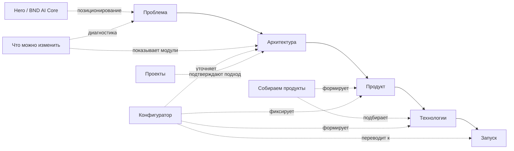

# BND.STUDIO — Requirements Baseline

**Файл:** `BND_STUDIO_REQUIREMENTS_BASELINE.md`  
**Этап:** Stage 1 — нормализованная спецификация требований  
**Дата фиксации:** 23 июля 2026  
**Статус:** завершён; переход к Stage 2 требует подтверждения пользователя  
**Режим:** локально, без GitHub, публикации, Supabase-мутаций и реальных Telegram-отправок

---

## 1. Краткий итог Stage 1

Создан единый baseline требований для проектирования архитектуры, Figma-системы, frontend-компонентов, SVG/HUD-графики, Hero Core, конфигуратора, backend, Telegram-интеграции, accessibility, performance и visual regression.

Baseline:

- объединяет подтверждённые требования из текущего чата, трёх визуальных референсов и Stage 0;
- отделяет подтверждённые решения от предположений и pending inputs;
- не добавляет новые услуги, кейсы, метрики или точные шрифты/цвета без источника;
- фиксирует проверяемые acceptance criteria;
- сохраняет локальный режим разработки;
- не содержит production-кода и не выполняет внешние действия.

**Главная пользовательская логика:**

```text
ПРОБЛЕМА → АРХИТЕКТУРА → ПРОДУКТ → ТЕХНОЛОГИИ → ЗАПУСК
```

**Главный визуальный принцип:** референсы и подтверждённая бизнес-логика важнее общих представлений о cyberpunk, HUD, sci-fi и SaaS.

---

## 2. Сводная статистика

| Показатель | Количество |
|---|---:|
| Всего требований | **281** |
| P0 | **172** |
| P1 | **93** |
| P2 | **15** |
| P3 | **1** |
| confirmed | **250** |
| assumption | **18** |
| pending | **13** |
| deprecated | **0** |
| conflict | **0** |

### Распределение по категориям

| Категория | Требований |
|---|---:|
| Business | 7 |
| User Journey | 6 |
| Information Architecture | 6 |
| Visual System | 14 |
| Hero | 16 |
| Problem Explorer — «Что можно изменить» | 14 |
| Product Assembler — «Собираем продукты» | 14 |
| Solution Configurator | 29 |
| Projects | 8 |
| Remaining Sections | 6 |
| Frontend Architecture | 12 |
| SVG and HUD Graphics | 10 |
| 3D and Hero Media | 10 |
| Backend | 12 |
| Telegram Integration | 9 |
| Data Model | 11 |
| Accessibility | 11 |
| Responsive | 12 |
| Motion | 10 |
| Performance | 10 |
| SEO | 4 |
| Analytics | 6 |
| Security and Privacy | 12 |
| QA and Visual Regression | 12 |
| Content | 10 |
| Tooling and Connectors | 10 |

---

## 3. Правила интерпретации

### Статусы

- `confirmed` — прямо подтверждено пользователем, однозначно видно в референсе или закреплено архитектурным решением Stage 0/Stage 1.
- `assumption` — необходимо для продолжения, но требует будущего подтверждения.
- `pending` — требуется контент, доступ, реквизит или решение пользователя.
- `deprecated` — ранее упомянуто, затем отменено.
- `conflict` — источники противоречат друг другу.

### Приоритеты

- `P0` — обязательно для концепции, безопасности, работоспособности или запуска.
- `P1` — важно для качества, точности и полноценного UX.
- `P2` — улучшение, допустимое позже.
- `P3` — экспериментальное или optional.

### Источники

- `User requirement`
- `Hero reference`
- `Panels reference`
- `Configurator reference`
- `Stage 0 report`
- `Architecture decision`
- `Assumption`
- `Pending confirmation`

---

# 4. Реестр требований

## 4.1. Business

| ID | Категория | Требование | Источник | Статус | Приоритет | Acceptance criterion | Проверка | Зависимости | Комментарий |
|---|---|---|---|---|---|---|---|---|---|
| BUS-001 | Business | Сайт позиционирует BND.STUDIO как инженера цифровых систем, а не как обычное агентство сайтов. | User requirement | confirmed | P0 | В Hero и секциях 02–04 оффер описывает анализ процесса, архитектуру, интеграции и запуск; сайт не сводится к перечню услуг. | Контент-аудит Hero и секций 02–04. | — | — |
| BUS-002 | Business | Сайт визуально демонстрирует метод работы студии, а не только сообщает о нём текстом. | User requirement | confirmed | P0 | Панели 02–04 имеют рабочие интерактивные состояния, показывающие переход от проблемы к системе, продукту и брифу. | Функциональный UX-сценарий в браузере. | — | — |
| BUS-003 | Business | Основной механизм конверсии — структурированный конфигуратор решения. | User requirement | confirmed | P0 | Пользователь проходит 5 шагов и формирует бриф с задачей, продуктом, интеграциями, AI, сроком, бюджетом и контактом. | E2E-тест конфигуратора. | — | — |
| BUS-004 | Business | Проекты используются как доказательство системного подхода и содержат только реальные данные. | User requirement | confirmed | P0 | Каждый опубликованный кейс имеет подтверждённые исходные данные; фиктивные кейсы отсутствуют. | Контент-ревью перед публикацией. | — | — |
| BUS-005 | Business | Сайт не использует выдуманные метрики, проценты эффективности и числа без подтверждения. | User requirement | confirmed | P0 | Значения вроде «300+» и «-65%» отсутствуют без подтверждённого источника. | Поиск по контенту и ручной аудит. | — | — |
| BUS-006 | Business | Новые сценарии, продукты, интеграции и кейсы добавляются без перестройки базовых компонентов. | Architecture decision | confirmed | P1 | Новый элемент добавляется через типизированные data-структуры или CMS без копирования однотипного JSX. | Code review и тестовое добавление записи. | — | — |
| BUS-007 | Business | Текущий режим — локальная разработка без GitHub и публикации. | User requirement | confirmed | P0 | До нового указания не создаются репозиторий, ветка, PR или production deployment. | Проверка артефактов и tool log. | — | — |

## 4.2. User Journey

| ID | Категория | Требование | Источник | Статус | Приоритет | Acceptance criterion | Проверка | Зависимости | Комментарий |
|---|---|---|---|---|---|---|---|---|---|
| UJ-001 | User Journey | Основной путь пользователя: проблема → архитектура → продукт → технологии → запуск. | User requirement | confirmed | P0 | Порядок и смысл секций 02–04 поддерживают пять этапов пути. | UX walkthrough и section map. | — | — |
| UJ-002 | User Journey | Hero подготавливает к диагностике, но не перегружает каталогом услуг. | User requirement | confirmed | P1 | Hero содержит позиционирование, CTA и демонстрацию Core; сценарии начинаются в секции 02. | Контент-аудит. | — | — |
| UJ-003 | User Journey | Панель «Что можно изменить» начинает взаимодействие с проблемы пользователя. | User requirement | confirmed | P0 | Первичный выбор сформулирован как изменение процесса, а не покупка технологии. | Проверка labels. | — | — |
| UJ-004 | User Journey | Панель «Собираем продукты» связывает процесс с продуктом, архитектурой и стеком. | User requirement | confirmed | P0 | Выбор направления обновляет route, architecture summary и technologies. | Функциональный тест. | — | — |
| UJ-005 | User Journey | Конфигуратор продолжает предыдущие секции и может принимать предзаполненный контекст. | Architecture decision | assumption | P2 | При подтверждении UX-механики выбор из секций 02/03 может предзаполнить форму без блокировки ручного изменения. | E2E prefill test. | PROB-005, PROD-009 | Уточнить на Stage 2. |
| UJ-006 | User Journey | После конфигуратора пользователь видит реальные проекты, процесс работы и основания доверия. | User requirement | confirmed | P1 | Секции 05–07 следуют после конфигуратора и не разрывают сценарий повторным агрессивным оффером. | Section-order review. | — | — |

## 4.3. Information Architecture

| ID | Категория | Требование | Источник | Статус | Приоритет | Acceptance criterion | Проверка | Зависимости | Комментарий |
|---|---|---|---|---|---|---|---|---|---|
| IA-001 | Information Architecture | Главная содержит 9 секций в утверждённом порядке. | User requirement | confirmed | P0 | DOM-порядок: Hero, Problem Explorer, Product Assembler, Configurator, Projects, Workflow, Technologies/Principles, Contact, Footer. | DOM и visual audit. | — | — |
| IA-002 | Information Architecture | Все секции воспринимаются как части единой интерфейсной платформы. | User requirement | confirmed | P0 | Секции используют общие SiteFrame, panel system, tokens, numbering, status components и grid rules. | Component/visual audit. | — | — |
| IA-003 | Information Architecture | Header содержит бренд, основную навигацию и контактный CTA. | Hero reference | confirmed | P1 | На desktop header соответствует референсу и позволяет перейти к ключевым разделам. | Visual diff и keyboard test. | — | — |
| IA-004 | Information Architecture | Навигационные якоря соответствуют существующим секциям и имеют понятные русские подписи. | User requirement | confirmed | P1 | Каждый nav item ведёт к существующей секции; focus и active-state видимы. | E2E navigation test. | — | — |
| IA-005 | Information Architecture | Системная нумерация секций применяется последовательно. | Hero reference | confirmed | P1 | Ключевые секции имеют уникальный номер 01–09 в едином формате. | Visual audit. | — | — |
| IA-006 | Information Architecture | Архитектура не блокирует будущие отдельные страницы проектов и контактов. | Architecture decision | assumption | P2 | Routing и component boundaries допускают добавление `/projects/[slug]` и `/contact`. | Architecture review. | — | Набор маршрутов уточнить на Stage 2. |

## 4.4. Visual System

| ID | Категория | Требование | Источник | Статус | Приоритет | Acceptance criterion | Проверка | Зависимости | Комментарий |
|---|---|---|---|---|---|---|---|---|---|
| VIS-001 | Visual System | Базовый фон почти чёрный с холодным сине-зелёным оттенком. | Hero reference | confirmed | P0 | Палитра не уходит в нейтральный серый, фиолетовый или ярко-синий; точные значения помечены preliminary. | Color sampling и visual diff. | — | — |
| VIS-002 | Visual System | Основные поверхности тёмные и полупрозрачные. | Panels reference | confirmed | P0 | Панели используют общие fill/opacity tokens и не выглядят тяжёлыми непрозрачными карточками. | CSS token audit. | — | — |
| VIS-003 | Visual System | Основные контуры используют ограниченную cyan/teal-палитру. | Hero reference | confirmed | P0 | Акцентные линии используют единые tokens; случайные неоновые цвета отсутствуют. | CSS audit. | — | — |
| VIS-004 | Visual System | Панели используют срезанные углы вместо крупных стандартных border-radius. | Panels reference | confirmed | P0 | Ключевые панели имеют cut-corner geometry через CSS/SVG; rounded SaaS-карточки отсутствуют. | Visual/component audit. | — | — |
| VIS-005 | Visual System | Применяются вложенные, ступенчатые и сегментированные рамки. | Panels reference | confirmed | P1 | HudPanel поддерживает минимум три frame variants. | Component preview. | — | — |
| VIS-006 | Visual System | Толщина линий и уровни свечения определяются design tokens. | Architecture decision | confirmed | P1 | Есть tokens hairline/standard/active и subtle/active/selected/hero glow. | Token audit. | — | — |
| VIS-007 | Visual System | Свечение остаётся контролируемым, без крупных cyan halos. | User requirement | confirmed | P0 | Активные элементы читаются без засветки текста и соседних линий. | Visual QA. | — | — |
| VIS-008 | Visual System | Системные номера, status-lines и микроподписи используются функционально. | User requirement | confirmed | P1 | Микродетали связаны со структурой или состоянием; случайный псевдотехнический текст отсутствует. | Контент-аудит. | — | — |
| VIS-009 | Visual System | Композиция плотная, но сохраняет иерархию и читаемость. | Panels reference | confirmed | P1 | На target desktop основные заголовки, controls и маршруты различимы без перекрытий. | Visual diff. | — | — |
| VIS-010 | Visual System | Сайт не выглядит как игровой HUD или интерфейс космического корабля. | User requirement | confirmed | P0 | Нет loot-box aesthetics, game stats, radar/crosshair и постоянного glitch. | Art-direction review. | — | — |
| VIS-011 | Visual System | Сайт не превращается в generic cyberpunk banner или SaaS-шаблон. | User requirement | confirmed | P0 | Композиция следует референсам и собственной panel system; готовые rounded card grids не доминируют. | Reference comparison. | — | — |
| VIS-012 | Visual System | Текст и интерактивные панели не экспортируются одним растровым экраном. | User requirement | confirmed | P0 | DOM содержит семантический текст и controls; raster применяется только к media-assets. | DOM inspection. | — | — |
| VIS-013 | Visual System | Иконографика едина по толщине, геометрии и масштабу. | Architecture decision | confirmed | P1 | Все системные иконки используют общий Icon component, grid и stroke tokens. | Icon sheet review. | — | — |
| VIS-014 | Visual System | Точные цвета и шрифты остаются preliminary до измерения или подтверждения. | Stage 0 report | assumption | P1 | Документация не утверждает неизвестный оригинальный шрифт и точные HEX как факт. | Documentation review. | — | — |

## 4.5. Hero

| ID | Категория | Требование | Источник | Статус | Приоритет | Acceptance criterion | Проверка | Зависимости | Комментарий |
|---|---|---|---|---|---|---|---|---|---|
| HERO-001 | Hero | Hero является первым экраном перед секцией «Что можно изменить». | User requirement | confirmed | P0 | Hero расположен первым после Header и ведёт к секции 02. | DOM order. | — | — |
| HERO-002 | Hero | Hero сообщает направление AI / AUTOMATION / INTEGRATION. | User requirement | confirmed | P0 | Техническая подпись или эквивалентная строка содержит три направления и читается на desktop/mobile. | Content review. | — | — |
| HERO-003 | Hero | Hero объясняет, что BND.STUDIO создаёт AI-продукты, автоматизации и интеграционные решения. | User requirement | confirmed | P0 | Заголовок и подзаголовок передают позиционирование без полного каталога услуг. | Copy review. | — | — |
| HERO-004 | Hero | Левая часть содержит техническую подпись, заголовок, акцентную строку, описание и два CTA. | Hero reference | confirmed | P1 | Все элементы реализованы как HTML и находятся в согласованной grid-column. | DOM и visual diff. | — | — |
| HERO-005 | Hero | Primary CTA ведёт к конфигуратору или началу сборки решения. | Architecture decision | confirmed | P0 | CTA переводит пользователя к секции 04 без потери focus. | E2E click test. | — | — |
| HERO-006 | Hero | Secondary CTA ведёт к реальным проектам. | Architecture decision | confirmed | P1 | CTA ведёт к секции 05 или будущей странице проектов. | Navigation test. | — | — |
| HERO-007 | Hero | Метрики отображаются только при наличии подтверждённых данных. | User requirement | confirmed | P0 | До предоставления данных metrics скрыты или заменены честными trust indicators. | Content audit. | — | — |
| HERO-008 | Hero | Правая часть содержит объёмный кубический BND AI Core. | Hero reference | confirmed | P0 | Hero не использует восьмиугольное ядро; Core визуально является объёмным кубом. | Visual review. | — | — |
| HERO-009 | Hero | Вокруг Core расположены отдельные HTML/SVG HUD-панели, подписи, узлы, маршруты и нижняя платформа. | Hero reference | confirmed | P1 | HUD-обвязка не запечена в один Core asset и адаптируется независимо. | DOM/SVG inspection. | — | — |
| HERO-010 | Hero | При скролле Core раскрывает слои: данные, AI, интеграции, интерфейсы, автоматизация, аналитика. | User requirement | confirmed | P0 | Scroll progress имеет шесть именованных стадий; подписи и visual state синхронизированы. | Scroll E2E. | — | — |
| HERO-011 | Hero | Раскрытие ощущается как инженерная демонстрация, а не взрыв или игровая трансформация. | User requirement | confirmed | P0 | Нет хаотичного разлёта, сильного shake, кислотных вспышек и чрезмерного parallax. | Motion review. | — | — |
| HERO-012 | Hero | Hero Core использует гибрид: 3D/render sequence отдельно от HTML/CSS/SVG UI. | Architecture decision | confirmed | P0 | HeroCore заменяется без изменения HeroCopy и HeroHudLayer. | Architecture/code review. | — | — |
| HERO-013 | Hero | Desktop scroll animation может использовать pin/scrub, но не создаёт scroll trap. | Architecture decision | confirmed | P1 | Пользователь может пройти секцию клавиатурой/скроллом; pinning не блокирует navigation. | Manual QA. | — | — |
| HERO-014 | Hero | Mobile Hero использует упрощённое раскрытие или fallback. | User requirement | confirmed | P0 | На <768 px desktop scene не загружается по умолчанию; доступен keyframe/video/static fallback. | Mobile test. | — | — |
| HERO-015 | Hero | При `prefers-reduced-motion: reduce` scrub заменяется статичным состоянием. | User requirement | confirmed | P0 | Media query отключает scrub и показывает читаемое состояние Core. | Emulation test. | — | — |
| HERO-016 | Hero | Hero foundation не зависит от готовности финальной Blender-модели. | Stage 0 report | confirmed | P1 | Placeholder имеет тот же container, aspect ratio и state API. | Component swap test. | — | — |

## 4.6. Problem Explorer — «Что можно изменить»

| ID | Категория | Требование | Источник | Статус | Приоритет | Acceptance criterion | Проверка | Зависимости | Комментарий |
|---|---|---|---|---|---|---|---|---|---|
| PROB-001 | Problem Explorer | Секция начинается с выбора проблемы или процесса, а не технологии. | User requirement | confirmed | P0 | Заголовок и selector формулируют задачу пользователя; стек не является первичным выбором. | Контент/UX review. | — | — |
| PROB-002 | Problem Explorer | Доступны шесть утверждённых сценариев. | User requirement | confirmed | P0 | Data source содержит шесть сценариев: ручная работа, Telegram/Mini App, сайт/web service, API, AI в процессе, внутренний инструмент/CRM. | Data fixture test. | — | — |
| PROB-003 | Problem Explorer | В центре используется отдельный объёмный куб BND ENGINE. | Panels reference | confirmed | P0 | Объект отличается от Hero Core по роли и от OctagonalCore по геометрии. | Visual review. | — | — |
| PROB-004 | Problem Explorer | Вокруг куба отображаются модули AI-анализ, данные, автоматизация, интеграции, интерфейсы, результат. | User requirement | confirmed | P0 | Каждый модуль имеет стабильный ID и отдельное active-state. | Data/component test. | — | — |
| PROB-005 | Problem Explorer | Выбор сценария активирует соответствующую карточку. | User requirement | confirmed | P0 | Одновременно существует одно основное selected-состояние, доступное мышью и клавиатурой. | Interaction test. | — | — |
| PROB-006 | Problem Explorer | Выбор сценария обновляет activeModules из единого состояния. | User requirement | confirmed | P0 | Список activeModules вычисляется из scenario data и не дублируется вручную. | Unit test resolver. | — | — |
| PROB-007 | Problem Explorer | Выбор сценария обновляет SVG-маршруты. | User requirement | confirmed | P0 | Активные paths меняют opacity/stroke и pulse; неактивные остаются приглушёнными. | Visual/DOM test. | — | — |
| PROB-008 | Problem Explorer | Центральный куб реагирует короткой controlled-анимацией. | User requirement | confirmed | P1 | Реакция ограничена по времени, не пульсирует бесконечно и имеет reduced-motion fallback. | Motion test. | — | — |
| PROB-009 | Problem Explorer | Правая колонка показывает конкретную процессную цепочку. | User requirement | confirmed | P0 | Для каждого сценария отображается последовательность шагов, а не общий маркетинговый абзац. | Data completeness test. | — | — |
| PROB-010 | Problem Explorer | Правая колонка показывает описание, active modules, system status и итог для клиента. | User requirement | confirmed | P1 | Все типы данных присутствуют в Scenario schema и рендерятся для каждого сценария. | Schema/unit test. | — | — |
| PROB-011 | Problem Explorer | Сценарии хранятся в типизированной data-структуре. | User requirement | confirmed | P0 | Scenario components получают данные через props/data module; карточки не дублируются в JSX. | Code review. | — | — |
| PROB-012 | Problem Explorer | При первом входе отображается согласованный default scenario. | Panels reference | assumption | P1 | Initial state показывает полноценную схему, а не пустой центр. | Initial-state test. | — | Предлагаемый default — автоматизация ручной работы. |
| PROB-013 | Problem Explorer | На mobile схема перестраивается в читаемый последовательный блок. | User requirement | confirmed | P0 | Selector, Core/summary и flow доступны в одном потоке; смысл не зависит от декоративных lines. | Mobile UX test. | — | — |
| PROB-014 | Problem Explorer | Карточки поддерживают focus, hover, selected и disabled состояния. | User requirement | confirmed | P1 | Состояния различимы не только свечением и цветом. | Keyboard/contrast test. | — | — |

## 4.7. Product Assembler — «Собираем продукты»

| ID | Категория | Требование | Источник | Статус | Приоритет | Acceptance criterion | Проверка | Зависимости | Комментарий |
|---|---|---|---|---|---|---|---|---|---|
| PROD-001 | Product Assembler | Секция отвечает, какой продукт BND.STUDIO может построить под процесс. | User requirement | confirmed | P0 | Копирайтинг и interaction сфокусированы на продукте и архитектуре, не повторяя диагностику. | Content/UX review. | — | — |
| PROD-002 | Product Assembler | Доступны четыре направления: AI web products, Telegram products, automation/API, CRM/internal systems. | User requirement | confirmed | P0 | Data source содержит четыре направления со стабильными IDs. | Data fixture test. | — | — |
| PROD-003 | Product Assembler | В центре используется плоское фронтальное восьмиугольное ядро BND ENGINE. | Panels reference | confirmed | P0 | Ядро не имеет перспективы и не заменяется верхним кубом. | Visual diff. | — | — |
| PROD-004 | Product Assembler | Ядро компактное, многослойное, с сегментированными рамками и тёмной стеклянной панелью. | Panels reference | confirmed | P1 | SVG содержит вложенные octagonal contours, ограниченное glow и central panel. | SVG review. | — | — |
| PROD-005 | Product Assembler | Ядро содержит `BND ENGINE` и `ЯДРО СИСТЕМЫ`. | User requirement | confirmed | P1 | Текст остаётся отдельным SVG/HTML text element и читается на desktop. | Visual/DOM inspection. | — | — |
| PROD-006 | Product Assembler | Ядро не содержит внешнего фона, лишних кругов и обрезанных коннекторов. | User requirement | confirmed | P0 | Компонент рендерится отдельно на прозрачном фоне без посторонней композиции. | Isolated screenshot. | — | — |
| PROD-007 | Product Assembler | Ядро реализуется чистым или комбинированным SVG-компонентом. | Architecture decision | confirmed | P0 | SVG масштабируется без размытия и использует редактируемые groups/classes. | SVG source audit. | — | — |
| PROD-008 | Product Assembler | От ядра идут четыре независимых маршрута к направлениям. | User requirement | confirmed | P0 | Каждое направление имеет route ID; active route меняется от direction ID. | Interaction/unit test. | — | — |
| PROD-009 | Product Assembler | Выбор направления обновляет active card, route и architecture summary. | User requirement | confirmed | P0 | Все три состояния синхронизированы из одного activeDirection state. | E2E test. | — | — |
| PROD-010 | Product Assembler | Рекомендуемый стек меняется в зависимости от направления. | User requirement | confirmed | P0 | Каждое направление связано с отдельным списком технологий. | Data/unit test. | — | — |
| PROD-011 | Product Assembler | Подходящие технологии визуально подсвечиваются. | User requirement | confirmed | P1 | Active technologies различимы по border/fill/icon/text, а не только bloom. | Visual/contrast test. | — | — |
| PROD-012 | Product Assembler | Правая колонка содержит динамический стек и постоянные инженерные принципы. | User requirement | confirmed | P1 | Стек меняется; модульность, безопасность, надёжность, интеграция и аналитика остаются постоянными. | Interaction test. | — | — |
| PROD-013 | Product Assembler | Нижний workflow: Анализ → Проектирование → Разработка → Тестирование → Запуск и поддержка. | User requirement | confirmed | P0 | Пять этапов отображаются в правильном порядке и адаптируются без потери текста. | Visual/content test. | — | — |
| PROD-014 | Product Assembler | На mobile directions, core и stack panel перестраиваются в один поток. | User requirement | confirmed | P0 | Выбор остаётся полноценным, Core не перекрывает controls, маршруты могут быть упрощены. | Mobile interaction test. | — | — |

## 4.8. Solution Configurator

| ID | Категория | Требование | Источник | Статус | Приоритет | Acceptance criterion | Проверка | Зависимости | Комментарий |
|---|---|---|---|---|---|---|---|---|---|
| CONF-001 | Solution Configurator | Конфигуратор располагается после двух центральных интерактивных панелей. | User requirement | confirmed | P0 | Section order соответствует IA-001. | DOM order. | IA-001 | — |
| CONF-002 | Solution Configurator | На desktop конфигуратор имеет три колонки: навигация, форма, preview архитектуры. | Configurator reference | confirmed | P0 | При viewport ≥1440 px три колонки видимы без horizontal overflow. | Target screenshot. | — | — |
| CONF-003 | Solution Configurator | Левая колонка содержит подпись, заголовок, описание, `Шаг NN из 05`, horizontal progress и vertical list. | Configurator reference | confirmed | P1 | Элементы присутствуют и обновляются при смене шага. | Visual/interaction test. | — | — |
| CONF-004 | Solution Configurator | Этапы называются Бриф, Архитектура, Интеграции, AI, Запуск. | User requirement | confirmed | P0 | Progress UI использует пять утверждённых этапов в правильном порядке. | Content test. | — | — |
| CONF-005 | Solution Configurator | Шаг 1 поддерживает один или несколько сценариев и вариант «Другое». | User requirement | confirmed | P0 | Multi-select позволяет комбинировать задачи; «Другое» открывает текстовое поле. | Form interaction test. | — | — |
| CONF-006 | Solution Configurator | Шаг 2 предлагает продуктовые варианты, динамически зависящие от шага 1. | User requirement | confirmed | P0 | Product resolver фильтрует или ранжирует options на основании taskTypes. | Unit tests resolver. | — | — |
| CONF-007 | Solution Configurator | Шаг 2 включает утверждённый набор product types и «нужна рекомендация». | User requirement | confirmed | P1 | Data source содержит AI-site, web app, cabinet, bot, Mini App, CRM, internal panel, dashboard, API, automation, AI assistant, combined, recommendation. | Schema/data test. | — | — |
| CONF-008 | Solution Configurator | Шаг 3 поддерживает multi-select integrations, удаление, custom value и «неизвестно». | User requirement | confirmed | P0 | Пользователь добавляет и удаляет integration chips и может выбрать unknown. | Interaction test. | — | — |
| CONF-009 | Solution Configurator | Шаг 3 содержит утверждённые категории интеграций. | User requirement | confirmed | P1 | Data source содержит Telegram, CRM, ERP, site, forms, email, Google services, calendar, payments, telephony, APIs, DB, analytics, webhook, other. | Data test. | — | — |
| CONF-010 | Solution Configurator | Шаг 4 поддерживает отсутствие AI, один или несколько AI-модулей и консультацию. | User requirement | confirmed | P0 | Validation исключает комбинацию `none + module`. | Validation/unit test. | — | — |
| CONF-011 | Solution Configurator | Шаг 4 уточняет input data, expected result, human-in-the-loop, autonomy, confidentiality и decision log. | User requirement | confirmed | P1 | Уточняющие controls входят в form state и payload. | Form/schema test. | — | — |
| CONF-012 | Solution Configurator | Шаг 5 собирает срок, бюджет, имя, компанию, Telegram, email, optional phone, URL, комментарий и consent. | User requirement | confirmed | P0 | Все поля присутствуют; обязательность отражена в schema и UI. | Form/schema test. | — | — |
| CONF-013 | Solution Configurator | Диапазоны сроков и бюджетов хранятся в конфигурации или CMS, не в JSX. | User requirement | confirmed | P0 | Изменение options data обновляет UI без правки компонентов. | Code review. | — | — |
| CONF-014 | Solution Configurator | Кнопки `Назад`, `Продолжить` и `Отправить конфигурацию` соответствуют текущему шагу. | User requirement | confirmed | P0 | Back disabled/скрыт на первом шаге; submit появляется только на пятом. | E2E navigation test. | — | — |
| CONF-015 | Solution Configurator | Переход далее блокируется при отсутствии обязательных данных. | User requirement | confirmed | P0 | Validation не меняет шаг и связывает inline error с control. | Invalid-flow E2E. | — | — |
| CONF-016 | Solution Configurator | Пользователь возвращается и изменяет ответы без потери остальных данных. | User requirement | confirmed | P0 | Back/step navigation сохраняет значения и пересчитывает зависимый preview. | E2E backtracking. | — | — |
| CONF-017 | Solution Configurator | Форма не очищается при network или recoverable server error. | User requirement | confirmed | P0 | После mock 5xx/network failure все значения сохранены и доступен retry. | Fault injection. | — | — |
| CONF-018 | Solution Configurator | Поддерживается восстановление draft без ненужного сохранения contact data в localStorage. | User requirement | confirmed | P1 | До contact step сохраняются неперсональные selections; PII не сохраняется по умолчанию. | Storage inspection. | — | — |
| CONF-019 | Solution Configurator | State machine: idle, editing, validating, step-completed, submitting, success, recoverable-error, fatal-error. | User requirement | confirmed | P0 | Каждое состояние определено и покрыто transition tests. | State tests. | — | — |
| CONF-020 | Solution Configurator | Повторная отправка блокируется во время submitting. | User requirement | confirmed | P0 | Submit disabled; запрос использует idempotency key. | Double-click test. | — | — |
| CONF-021 | Solution Configurator | После успешной отправки draft удаляется. | User requirement | confirmed | P1 | Draft очищается только после подтверждённого server response. | Success E2E. | — | — |
| CONF-022 | Solution Configurator | Правая колонка обновляется в реальном времени после каждого выбора. | User requirement | confirmed | P0 | ArchitecturePreview, summary, tags и stack получают текущий normalized state. | Interaction test. | — | — |
| CONF-023 | Solution Configurator | Архитектурная схема реализуется HTML/SVG-компонентами, не bitmap и не Mermaid-render. | User requirement | confirmed | P0 | Nodes и connections существуют как отдельные DOM/SVG elements и меняются от state. | DOM inspection. | — | — |
| CONF-024 | Solution Configurator | Сводка показывает задачу, продукт, интеграции, AI, срок, бюджет и status. | User requirement | confirmed | P1 | Заполненные значения обновляются немедленно; отсутствующие имеют neutral placeholder. | Interaction test. | — | — |
| CONF-025 | Solution Configurator | System tags выводятся только для релевантных модулей. | User requirement | confirmed | P1 | Tag resolver не показывает AI/CRM/WEB без соответствующего выбора. | Unit tests. | — | — |
| CONF-026 | Solution Configurator | Рекомендуемый стек обозначен как предварительный. | User requirement | confirmed | P0 | Preview содержит disclaimer о финальном анализе процесса и ограничений. | Content review. | — | — |
| CONF-027 | Solution Configurator | Mobile configurator использует один поток, compact progress, крупные targets и отдельный architecture block. | User requirement | confirmed | P0 | На <768 px нет сжатых трёх колонок и horizontal scroll. | Mobile E2E. | — | — |
| CONF-028 | Solution Configurator | Карточки выбора реализованы radio/checkbox/button, а не декоративными div. | User requirement | confirmed | P0 | Controls доступны по Tab/Space/Enter и имеют programmatic labels. | Keyboard/DOM audit. | — | — |
| CONF-029 | Solution Configurator | Success-state показывает request ID и понятное дальнейшее действие. | Architecture decision | assumption | P1 | После успешного ответа отображается requestId и подтверждение без технических секретов. | Success mock test. | — | Точный текст согласовать на content stage. |

## 4.9. Projects

| ID | Категория | Требование | Источник | Статус | Приоритет | Acceptance criterion | Проверка | Зависимости | Комментарий |
|---|---|---|---|---|---|---|---|---|---|
| CASE-001 | Projects | Секция проектов следует после конфигуратора. | User requirement | confirmed | P1 | Section order соответствует IA-001. | DOM order. | IA-001 | — |
| CASE-002 | Projects | Каждый кейс содержит задачу, исходный процесс, продукт, архитектуру, технологии, интеграции и результат. | User requirement | confirmed | P0 | Project schema содержит указанные поля; необязательные поля явно отмечены. | Schema/content audit. | — | — |
| CASE-003 | Projects | Публикуются только реальные подтверждённые кейсы. | User requirement | confirmed | P0 | Каждая production-запись имеет source/approval status. | Editorial checklist. | — | — |
| CASE-004 | Projects | Неподтверждённые проценты, пользователи, экономия и рост конверсии запрещены. | User requirement | confirmed | P0 | Numerical claims имеют source reference либо отсутствуют. | Content audit. | — | — |
| CASE-005 | Projects | При отсутствии чисел используются конкретные качественные результаты. | User requirement | confirmed | P1 | Result описывает фактическое изменение процесса без пустых фраз. | Editorial review. | — | — |
| CASE-006 | Projects | Кейс может содержать interactive preview или короткую оптимизированную анимацию. | User requirement | confirmed | P2 | Preview имеет poster/fallback, lazy loading и не блокирует чтение. | Performance/UX test. | — | — |
| CASE-007 | Projects | Проекты хранятся в data-структуре или CMS. | Architecture decision | confirmed | P1 | ProjectCase рендерится из schema; новые кейсы не требуют копирования section JSX. | Code review. | — | — |
| CASE-008 | Projects | До реальных кейсов секция использует честный pending state, а не выдуманные карточки. | Architecture decision | confirmed | P0 | Локальный prototype явно маркирует placeholders и не выдаёт их за опубликованные проекты. | Content review. | — | — |

## 4.10. Remaining Sections

| ID | Категория | Требование | Источник | Статус | Приоритет | Acceptance criterion | Проверка | Зависимости | Комментарий |
|---|---|---|---|---|---|---|---|---|---|
| REM-001 | Remaining Sections | «Как мы работаем» раскрывает workflow без дублирования панели продуктов. | User requirement | confirmed | P1 | Секция объясняет этапы и deliverables, не повторяя направления/stack. | Content review. | — | — |
| REM-002 | Remaining Sections | «Технологии и принципы» разделяет изменяемые инструменты и постоянные инженерные принципы. | User requirement | confirmed | P1 | Technologies и principles имеют разные content groups. | Content structure review. | — | — |
| REM-003 | Remaining Sections | Контактный блок даёт короткий альтернативный способ связи после конфигуратора. | User requirement | confirmed | P1 | Блок не заменяет configurator, но содержит понятный CTA. | UX review. | — | — |
| REM-004 | Remaining Sections | Footer содержит бренд, навигацию и обязательные юридические ссылки при их наличии. | User requirement | confirmed | P1 | Footer не содержит фиктивных реквизитов; privacy link добавляется до production form. | Content/security checklist. | — | — |
| REM-005 | Remaining Sections | Оставшиеся секции используют общую panel/grid system. | User requirement | confirmed | P1 | Нет отдельного визуального шаблона, нарушающего целостность. | Visual review. | — | — |
| REM-006 | Remaining Sections | Финальные тексты секций 06–08 остаются pending до content stage. | Pending confirmation | pending | P1 | До утверждения используются явно помеченные draft-тексты. | Content status review. | — | — |

## 4.11. Frontend Architecture

| ID | Категория | Требование | Источник | Статус | Приоритет | Acceptance criterion | Проверка | Зависимости | Комментарий |
|---|---|---|---|---|---|---|---|---|---|
| FE-001 | Frontend Architecture | Production foundation — Next.js. | Architecture decision | confirmed | P0 | Локальный проект создаётся на актуальной поддерживаемой версии после проверки docs. | package.json и docs check. | — | — |
| FE-002 | Frontend Architecture | Основной UI-стек — React + TypeScript. | Architecture decision | confirmed | P0 | Компоненты и schemas типизированы; `any` не используется без обоснования. | Typecheck/code review. | — | — |
| FE-003 | Frontend Architecture | Стили — SCSS Modules + CSS custom properties. | Architecture decision | confirmed | P0 | Component styles изолированы; design tokens доступны через CSS variables. | Project structure audit. | — | — |
| FE-004 | Frontend Architecture | Повторяемые блоки реализуются reusable components. | User requirement | confirmed | P0 | HudPanel, CutCornerPanel, connector, option card, status и tag не дублируются вручную. | Code review. | — | — |
| FE-005 | Frontend Architecture | Контент интерактивных секций хранится в typed data или CMS. | User requirement | confirmed | P0 | Scenario/product/configurator/project components получают data, а не массивы JSX. | Code review. | — | — |
| FE-006 | Frontend Architecture | HTML/CSS/SVG/3D имеют чёткие границы ответственности. | Architecture decision | confirmed | P0 | Text/forms — HTML; layout/surfaces — CSS; HUD geometry — SVG; Core media — 3D/sequence. | Architecture review. | — | — |
| FE-007 | Frontend Architecture | Project structure разделяет layout, hero, panels, configurator, projects, hud, graphics, icons и sections. | Architecture decision | confirmed | P1 | Folders отражают domain boundaries. | Folder audit. | — | — |
| FE-008 | Frontend Architecture | Состояние локализовано и не требует global store без необходимости. | Architecture decision | assumption | P1 | Local interactions используют reducer/state; shared context добавляется только при подтверждённом cross-section flow. | State architecture review. | — | Уточнить prefill на Stage 2. |
| FE-009 | Frontend Architecture | Server-only код и secrets отделены от client components. | User requirement | confirmed | P0 | Server modules не импортируются в client bundle; secrets доступны только server runtime. | Bundle/import audit. | — | — |
| FE-010 | Frontend Architecture | Critical interaction components покрываются unit/integration tests. | Architecture decision | confirmed | P1 | Resolvers, transitions и validation имеют tests для основного и error flow. | Test report. | — | — |
| FE-011 | Frontend Architecture | Локальная сборка не требует GitHub. | User requirement | confirmed | P0 | Install/dev/build/test выполняются из локальной папки. | Local run. | — | — |
| FE-012 | Frontend Architecture | Версии библиотек проверяются перед Stage 4. | User requirement | confirmed | P0 | Stage 4 фиксирует версии после Context7/официальной документации. | Decision log. | — | — |

## 4.12. SVG and HUD Graphics

| ID | Категория | Требование | Источник | Статус | Приоритет | Acceptance criterion | Проверка | Зависимости | Комментарий |
|---|---|---|---|---|---|---|---|---|---|
| SVG-001 | SVG and HUD Graphics | Сложные рамки реализуются reusable inline SVG-компонентами. | Architecture decision | confirmed | P0 | Frame SVG масштабируется через viewBox и поддерживает state classes. | Isolated render. | — | — |
| SVG-002 | SVG and HUD Graphics | Простые cut-corner panels могут использовать CSS clip-path/masks. | Architecture decision | confirmed | P1 | CSS geometry не создаёт разрывов на target browsers/viewports. | Cross-browser screenshot. | — | — |
| SVG-003 | SVG and HUD Graphics | Connector routes имеют стабильные IDs и управляются data/state. | User requirement | confirmed | P0 | Active route вычисляется из state; paths не выбираются случайными DOM selectors. | Code/unit test. | — | — |
| SVG-004 | SVG and HUD Graphics | Architecture graphs состоят из отдельных nodes и connectors. | User requirement | confirmed | P0 | Graph меняет состав без замены bitmap. | DOM/SVG inspection. | — | — |
| SVG-005 | SVG and HUD Graphics | Octagonal Core создаётся отдельным редактируемым SVG. | Architecture decision | confirmed | P0 | Groups имеют понятные IDs/classes; raster embeds отсутствуют. | SVG audit. | — | — |
| SVG-006 | SVG and HUD Graphics | Stroke animation поддерживает reduced motion. | User requirement | confirmed | P0 | При reduce paths статичны без animated dashoffset. | Media emulation. | — | — |
| SVG-007 | SVG and HUD Graphics | Glow filters используются ограниченно и переиспользуются через defs. | Architecture decision | confirmed | P1 | Нет отдельного тяжёлого filter на каждом node. | SVG/performance audit. | — | — |
| SVG-008 | SVG and HUD Graphics | Иконки используют общий grid и stroke width. | Architecture decision | confirmed | P1 | Icon set согласован на стандартных размерах. | Icon sheet review. | — | — |
| SVG-009 | SVG and HUD Graphics | Decorative SVG не перехватывает pointer events и скрыт от assistive tech. | User requirement | confirmed | P0 | Декоративные layers имеют pointer-events/aria-hidden настройки. | DOM/interaction test. | — | — |
| SVG-010 | SVG and HUD Graphics | Основные подписи остаются HTML; SVG text применяется только внутри самостоятельной графики. | Architecture decision | confirmed | P1 | Доступный текст не превращён в paths и не дублируется screen reader. | Accessibility audit. | — | — |

## 4.13. 3D and Hero Media

| ID | Категория | Требование | Источник | Статус | Приоритет | Acceptance criterion | Проверка | Зависимости | Комментарий |
|---|---|---|---|---|---|---|---|---|---|
| 3D-001 | 3D and Hero Media | Hero Core создаётся как отдельный Blender-объект/animation. | Architecture decision | confirmed | P0 | 3D specification отделена от HUD и содержит key states раскрытия. | Asset handoff review. | — | — |
| 3D-002 | 3D and Hero Media | Основной web delivery — optimized render sequence в canvas. | Architecture decision | confirmed | P0 | Renderer принимает normalized progress 0..1 и не зависит от DOM text. | Prototype test. | — | — |
| 3D-003 | 3D and Hero Media | Sequence загружается поэтапно, не полностью при first paint. | User requirement | confirmed | P0 | First frame/critical chunk preloaded; остальные frames deferred/chunked. | Network waterfall. | — | — |
| 3D-004 | 3D and Hero Media | Retina-качество достигается без необоснованно огромных кадров. | Architecture decision | confirmed | P1 | Pipeline имеет DPR variants или controlled canvas scaling. | Retina/performance test. | — | — |
| 3D-005 | 3D and Hero Media | Mobile получает сокращённую sequence, video или static fallback. | User requirement | confirmed | P0 | Mobile не загружает desktop sequence по умолчанию. | Mobile network audit. | — | — |
| 3D-006 | 3D and Hero Media | Three.js/R3F не используется без реальной интерактивной 3D-потребности. | User requirement | confirmed | P0 | WebGL dependency отсутствует при render-sequence strategy. | Dependency audit. | — | — |
| 3D-007 | 3D and Hero Media | Spline допускается только как prototype option. | Architecture decision | confirmed | P3 | Spline не становится production dependency без performance/ownership decision. | Architecture review. | — | — |
| 3D-008 | 3D and Hero Media | to3D не считается финальной моделью без Blender refinement. | User requirement | confirmed | P2 | Generated mesh проходит topology/material/animation review. | 3D checklist. | — | — |
| 3D-009 | 3D and Hero Media | Core media имеет poster/first-frame fallback. | User requirement | confirmed | P0 | При media error Hero сохраняет композицию и CTA. | Network failure test. | — | — |
| 3D-010 | 3D and Hero Media | Финальные 3D-исходники остаются pending. | Pending confirmation | pending | P1 | Stage 6 не начинается без approved asset source или отдельного modelling task. | Pending register. | — | — |

## 4.14. Backend

| ID | Категория | Требование | Источник | Статус | Приоритет | Acceptance criterion | Проверка | Зависимости | Комментарий |
|---|---|---|---|---|---|---|---|---|---|
| BE-001 | Backend | Заявки обрабатываются только server-side endpoint. | User requirement | confirmed | P0 | Client отправляет на собственный endpoint; direct Telegram API call отсутствует. | Network/code audit. | — | — |
| BE-002 | Backend | Server payload валидируется Zod или эквивалентом. | Architecture decision | confirmed | P0 | Invalid fields отклоняются с safe field errors до записи. | API tests. | — | — |
| BE-003 | Backend | Заявка сохраняется в базе до Telegram notification. | User requirement | confirmed | P0 | DB insert завершается и возвращает requestId до notification step. | Integration test. | — | — |
| BE-004 | Backend | Основной кандидат базы — Supabase/PostgreSQL. | Architecture decision | confirmed | P1 | Stage 2 проектирует ER/schema/RLS до создания resources. | Architecture artifact. | — | — |
| BE-005 | Backend | Отправка защищена rate limiting. | User requirement | confirmed | P0 | Requests сверх лимита получают controlled 429 без дублей. | API abuse test. | — | — |
| BE-006 | Backend | Форма содержит honeypot или эквивалентную anti-spam проверку. | User requirement | confirmed | P1 | Bot-like submission блокируется до DB insert. | API test. | — | — |
| BE-007 | Backend | Используется idempotency key. | User requirement | confirmed | P0 | Повтор одного key не создаёт вторую заявку. | Integration test. | — | — |
| BE-008 | Backend | Ошибки логируются без утечки PII и secrets. | User requirement | confirmed | P0 | Log содержит correlation ID/error class, но не token и полный contact payload. | Log review. | — | — |
| BE-009 | Backend | Server response не раскрывает stack trace и infrastructure details. | User requirement | confirmed | P0 | Frontend получает safe code/message. | API error test. | — | — |
| BE-010 | Backend | Supabase schema/migrations создаются только после подтверждения. | User requirement | confirmed | P0 | На Stage 1–4 external DB resources не создаются. | Action audit. | — | — |
| BE-011 | Backend | Retry Telegram notification не создаёт новую заявку. | Architecture decision | assumption | P1 | Notification status хранится отдельно; retry использует существующий requestId. | Integration design. | — | Уточнить Stage 2. |
| BE-012 | Backend | requestId уникален, создаётся server-side и используется сквозным образом. | User requirement | confirmed | P1 | Один ID присутствует в DB, Telegram и success UI. | Schema/integration test. | — | — |

## 4.15. Telegram Integration

| ID | Категория | Требование | Источник | Статус | Приоритет | Acceptance criterion | Проверка | Зависимости | Комментарий |
|---|---|---|---|---|---|---|---|---|---|
| TG-001 | Telegram Integration | Telegram является каналом уведомления, не единственным хранилищем. | User requirement | confirmed | P0 | Каждая отправка имеет DB record независимо от Telegram result. | Integration test. | — | — |
| TG-002 | Telegram Integration | Bot token отсутствует во frontend и public env. | User requirement | confirmed | P0 | Client bundle и `NEXT_PUBLIC_*` не содержат token. | Secret scan. | — | — |
| TG-003 | Telegram Integration | Telegram API вызывается только server-side или через protected workflow. | User requirement | confirmed | P0 | Browser network не обращается к api.telegram.org. | Network audit. | — | — |
| TG-004 | Telegram Integration | Notification содержит ID, source, task, product, integrations, AI, stack, timeline, budget, contact, comment и record link. | User requirement | confirmed | P1 | Formatter создаёт читаемые секции и экранирует input. | Snapshot test. | — | — |
| TG-005 | Telegram Integration | Telegram error не удаляет сохранённую заявку. | User requirement | confirmed | P0 | При 4xx/5xx DB record остаётся с notification_failed. | Fault injection. | — | — |
| TG-006 | Telegram Integration | Реальные test notifications не отправляются без подтверждения. | User requirement | confirmed | P0 | До разрешения используется mock transport/local logger. | Action audit. | — | — |
| TG-007 | Telegram Integration | Telegram credentials и chat ID предоставляются позже как secrets. | Pending confirmation | pending | P1 | Production integration disabled до безопасного предоставления credentials. | Pending register. | — | — |
| TG-008 | Telegram Integration | Длинные поля обрабатываются с учётом лимитов Telegram. | Architecture decision | assumption | P1 | Formatter обрезает/разбивает message, а полная запись остаётся в DB. | Boundary test. | — | Стратегия Stage 2. |
| TG-009 | Telegram Integration | Notification status доступен для диагностики. | Architecture decision | confirmed | P1 | Record хранит pending/sent/failed и timestamp последней попытки. | Schema review. | — | — |

## 4.16. Data Model

| ID | Категория | Требование | Источник | Статус | Приоритет | Acceptance criterion | Проверка | Зависимости | Комментарий |
|---|---|---|---|---|---|---|---|---|---|
| DATA-001 | Data Model | Configuration payload использует стабильные system IDs и отдельные display labels. | User requirement | confirmed | P0 | Payload хранит machine-readable values; UI получает локализованные labels отдельно. | Schema review. | — | — |
| DATA-002 | Data Model | Normalized request содержит requestId, createdAt, source, taskTypes, productType, integrations, aiModules, timeline, budget, contact, projectUrl, comment, architecturePreview и consent. | User requirement | confirmed | P0 | Server schema валидирует полный объект и обязательные поля. | Schema test. | — | — |
| DATA-003 | Data Model | architecturePreview содержит nodes, connections и recommendedStack. | User requirement | confirmed | P1 | Preview сериализуется и может быть восстановлен из payload или resolver version. | Serialization test. | — | — |
| DATA-004 | Data Model | Scenario data содержит activeModules, activeRoutes, processSteps, result и systemStatus. | User requirement | confirmed | P0 | Все 6 сценариев проходят schema validation. | Data test. | — | — |
| DATA-005 | Data Model | Product direction data содержит route, technologies, architectureSummary и modules. | User requirement | confirmed | P0 | Все 4 направления проходят schema validation. | Data test. | — | — |
| DATA-006 | Data Model | Stack resolver реализуется отдельной deterministic function/module. | Architecture decision | confirmed | P0 | Одинаковый input даёт одинаковый stack; JSX не содержит условных списков технологий. | Unit test. | — | — |
| DATA-007 | Data Model | Projects используют отдельную schema с content source/approval. | Architecture decision | confirmed | P1 | Project record содержит source и approval/status. | Schema/content audit. | — | — |
| DATA-008 | Data Model | Timeline и budget options конфигурируемы и versioned. | User requirement | confirmed | P0 | Изменение options не требует правки components. | Config test. | — | — |
| DATA-009 | Data Model | Payload/schema имеет version для будущих миграций. | Architecture decision | assumption | P1 | Request record содержит schemaVersion. | Schema review. | — | Рекомендуется Stage 2. |
| DATA-010 | Data Model | PII отделяется от analytics events. | User requirement | confirmed | P0 | Analytics payload не содержит name/email/phone/Telegram/free-text comment. | Event audit. | — | — |
| DATA-011 | Data Model | CMS не обязательна для первого local prototype. | Stage 0 report | assumption | P2 | Typed local data обеспечивает секции; migration path описан. | Architecture review. | — | — |

## 4.17. Accessibility

| ID | Категория | Требование | Источник | Статус | Приоритет | Acceptance criterion | Проверка | Зависимости | Комментарий |
|---|---|---|---|---|---|---|---|---|---|
| A11Y-001 | Accessibility | Используется semantic HTML. | User requirement | confirmed | P0 | Sections, headings, nav, main, forms и buttons используют корректные элементы. | DOM/axe audit. | — | — |
| A11Y-002 | Accessibility | Все интерактивные функции доступны с клавиатуры. | User requirement | confirmed | P0 | Tab/Shift+Tab, Enter/Space и требуемые arrow keys работают без traps. | Manual keyboard QA. | — | — |
| A11Y-003 | Accessibility | Focus-state видим на тёмном фоне. | User requirement | confirmed | P0 | Focus indicator имеет достаточный contrast и не маскируется glow. | Visual/contrast test. | — | — |
| A11Y-004 | Accessibility | Form controls имеют labels и связанные error messages. | User requirement | confirmed | P0 | Label association и `aria-describedby` корректны. | DOM/axe test. | — | — |
| A11Y-005 | Accessibility | Группы выбора используют fieldset/legend или эквивалентный accessible pattern. | User requirement | confirmed | P0 | Screen reader объявляет group context и selected state. | Screen reader spot test. | — | — |
| A11Y-006 | Accessibility | Submission statuses сообщаются через aria-live. | User requirement | confirmed | P0 | Validating/submitting/success/error объявляются без хаотичного focus movement. | Screen reader test. | — | — |
| A11Y-007 | Accessibility | Основной UI соответствует WCAG AA по contrast. | Architecture decision | confirmed | P0 | Contrast audit не выявляет critical failures для body text и controls. | Automated/manual audit. | — | — |
| A11Y-008 | Accessibility | Основные mobile touch targets не меньше 44×44 CSS px или имеют эквивалентную hit area. | User requirement | confirmed | P0 | Primary controls проходят touch target inspection. | Mobile inspection. | — | — |
| A11Y-009 | Accessibility | Tab order соответствует visual flow и не использует positive tabindex. | User requirement | confirmed | P0 | Focus не прыгает хаотично между columns. | Keyboard QA. | — | — |
| A11Y-010 | Accessibility | Decorative HUD скрыт от assistive tech; meaningful graphics имеют accessible name. | User requirement | confirmed | P1 | Accessibility tree не содержит шумовых decorative nodes. | Accessibility tree review. | — | — |
| A11Y-011 | Accessibility | Reduced motion поддерживается для Hero, routes, reveals и transitions. | User requirement | confirmed | P0 | При reduce animations заменяются static/minimal states. | Media query test. | — | — |

## 4.18. Responsive

| ID | Категория | Требование | Источник | Статус | Приоритет | Acceptance criterion | Проверка | Зависимости | Комментарий |
|---|---|---|---|---|---|---|---|---|---|
| RESP-001 | Responsive | Desktop ≥1440 px использует полную modular grid и full diagrams. | User requirement | confirmed | P0 | Hero и configurator соответствуют reference proportions без overflow. | Screenshots 1440+. | — | — |
| RESP-002 | Responsive | Laptop 1024–1439 px снижает decorative density, сохраняя логику. | User requirement | confirmed | P1 | Secondary labels/routes сокращаются, controls и смысл остаются. | Screenshots 1024/1280. | — | — |
| RESP-003 | Responsive | Tablet 768–1023 px перестраивает columns; architecture preview переносится ниже. | User requirement | confirmed | P0 | Интерактивные панели не сжимаются в три узкие колонки. | Screenshots 768/1024. | — | — |
| RESP-004 | Responsive | Mobile <768 px использует один основной поток. | User requirement | confirmed | P0 | Нет horizontal scroll; sections stack vertically. | Screenshots 360/390. | — | — |
| RESP-005 | Responsive | Desktop layout нельзя просто пропорционально уменьшать. | User requirement | confirmed | P0 | Breakpoints меняют composition и visibility вторичных деталей. | CSS/layout review. | — | — |
| RESP-006 | Responsive | Central objects масштабируются независимо от текста и panels. | User requirement | confirmed | P1 | Core не вызывает overlap и сохраняет aspect ratio. | Responsive visual test. | — | — |
| RESP-007 | Responsive | Сложные connector lines могут скрываться/упрощаться на tablet/mobile. | User requirement | confirmed | P1 | Скрытие decorative routes не удаляет смысловую последовательность. | Mobile UX review. | — | — |
| RESP-008 | Responsive | Микроподписи могут скрываться на mobile, если они вторичны. | User requirement | confirmed | P2 | Ключевые labels и status остаются. | Content hierarchy review. | — | — |
| RESP-009 | Responsive | Configurator использует sticky compact navigation на mobile. | User requirement | confirmed | P1 | Current step и primary action доступны, не перекрывая поля. | Mobile interaction. | — | — |
| RESP-010 | Responsive | Hero media выбирается по viewport/DPR и не отдаёт desktop sequence на mobile по умолчанию. | User requirement | confirmed | P0 | Network audit подтверждает responsive delivery. | Network audit. | — | — |
| RESP-011 | Responsive | Mobile navigation сохраняет ключевой CTA и использует accessible pattern. | Architecture decision | assumption | P1 | Menu доступно с клавиатуры и screen reader; CTA остаётся достижимым. | Mobile nav test. | — | Точный паттерн Stage 2/Figma. |
| RESP-012 | Responsive | Pixel-accuracy viewport соответствует фактическому размеру каждого reference image. | Stage 0 report | assumption | P1 | Playwright config фиксирует viewport per reference. | Playwright config. | — | — |

## 4.19. Motion

| ID | Категория | Требование | Источник | Статус | Приоритет | Acceptance criterion | Проверка | Зависимости | Комментарий |
|---|---|---|---|---|---|---|---|---|---|
| MOTION-001 | Motion | Motion-система сдержанная и объясняет state/flow. | User requirement | confirmed | P0 | Анимации связаны с interaction; постоянные decorative loops ограничены. | Motion review. | — | — |
| MOTION-002 | Motion | Панели появляются плавно без aggressive glitch. | User requirement | confirmed | P1 | Reveal использует opacity/transform/clip с ограниченной duration. | Motion capture. | — | — |
| MOTION-003 | Motion | Connector routes поддерживают короткие pulses при state change. | User requirement | confirmed | P1 | Pulse завершается и не работает постоянно на всех lines. | Interaction test. | — | — |
| MOTION-004 | Motion | Active/selected transitions быстрые и не задерживают input. | User requirement | confirmed | P1 | Control feedback укладывается в motion tokens. | UI timing review. | — | — |
| MOTION-005 | Motion | Hero Core раскрывается последовательными stages без frame jumps. | User requirement | confirmed | P0 | Progress mapping монотонный и scrub плавный. | Scroll capture. | — | — |
| MOTION-006 | Motion | Запрещены постоянные яркие пульсации, сильный glitch, huge parallax, endless rotation, flashes и excess particles. | User requirement | confirmed | P0 | Motion audit не обнаруживает запрещённые patterns. | Manual review. | — | — |
| MOTION-007 | Motion | Для ключевых animations документируются trigger, duration, easing, delay, technology, mobile и reduced-motion. | User requirement | confirmed | P1 | Motion spec покрывает Hero, routes, panels и configurator. | Spec review. | — | — |
| MOTION-008 | Motion | Animations не блокируют controls и navigation. | User requirement | confirmed | P0 | Transitions interruptible; controls остаются interactive. | Rapid interaction test. | — | — |
| MOTION-009 | Motion | Status indicators минимальны и активны только по смыслу. | User requirement | confirmed | P2 | Одновременно видимы только релевантные indicators. | Visual review. | — | — |
| MOTION-010 | Motion | CSS применяется для simple transitions, GSAP — для complex scroll choreography. | Architecture decision | confirmed | P1 | Обычный hover не требует JS timeline. | Code review. | — | — |

## 4.20. Performance

| ID | Категория | Требование | Источник | Статус | Приоритет | Acceptance criterion | Проверка | Зависимости | Комментарий |
|---|---|---|---|---|---|---|---|---|---|
| PERF-001 | Performance | До Hero implementation фиксируется performance budget. | User requirement | confirmed | P0 | Документированы critical asset, total sequence, LCP, CLS, INP и mobile budget. | Performance spec. | — | — |
| PERF-002 | Performance | Critical Hero asset отделён от full sequence. | User requirement | confirmed | P0 | Initial load не загружает все frames. | Waterfall. | — | — |
| PERF-003 | Performance | Media используют modern formats и responsive variants. | Architecture decision | confirmed | P1 | Pipeline поддерживает AVIF/WebP или эквивалент. | Asset audit. | — | — |
| PERF-004 | Performance | Below-fold media и project previews lazy-loaded. | User requirement | confirmed | P0 | Project media не загружается при initial load. | Network test. | — | — |
| PERF-005 | Performance | SVG filters и DOM count контролируются. | User requirement | confirmed | P1 | Profile не показывает массовые filter repaints и избыточные nodes. | DevTools profile. | — | — |
| PERF-006 | Performance | WebGL не подключается без обоснованного use case. | User requirement | confirmed | P0 | Bundle не содержит Three/R3F при render-sequence implementation. | Dependency audit. | — | — |
| PERF-007 | Performance | Layout shift от Core/media предотвращён. | User requirement | confirmed | P0 | Containers имеют stable dimensions/aspect-ratio; CLS в budget. | Lighthouse. | — | — |
| PERF-008 | Performance | Core Web Vitals измеряются перед production. | User requirement | confirmed | P0 | LCP/CLS/INP включены в QA report на mobile profile. | Performance report. | — | — |
| PERF-009 | Performance | Mobile fallback имеет отдельный весовой budget. | User requirement | confirmed | P0 | Mobile payload не копирует desktop sequence. | Network budget test. | — | — |
| PERF-010 | Performance | Cloudinary/CDN подключается только при реальной production media потребности. | Architecture decision | assumption | P2 | Local prototype работает без external CDN; решение пересматривается Stage 6. | Decision log. | — | — |

## 4.21. SEO

| ID | Категория | Требование | Источник | Статус | Приоритет | Acceptance criterion | Проверка | Зависимости | Комментарий |
|---|---|---|---|---|---|---|---|---|---|
| SEO-001 | SEO | Основной текст и headings остаются semantic HTML. | User requirement | confirmed | P0 | Hero/section copy доступен без canvas/image rendering. | DOM/no-JS inspection. | — | — |
| SEO-002 | SEO | Next.js architecture поддерживает metadata, canonical, sitemap и robots. | Architecture decision | confirmed | P1 | Production checklist содержит эти элементы; keyword strategy не придумывается Stage 1. | Architecture checklist. | — | — |
| SEO-003 | SEO | SEO strategy и target queries остаются pending до отдельного исследования. | Pending confirmation | pending | P2 | Baseline не утверждает keywords или traffic claims. | Document review. | — | — |
| SEO-004 | SEO | GSC Wizard используется только после запуска и реальных GSC data. | User requirement | confirmed | P2 | До production connector не используется для выдуманных показателей. | Tool usage audit. | — | — |

## 4.22. Analytics

| ID | Категория | Требование | Источник | Статус | Приоритет | Acceptance criterion | Проверка | Зависимости | Комментарий |
|---|---|---|---|---|---|---|---|---|---|
| AN-001 | Analytics | Analytics измеряет ключевые шаги user journey. | Architecture decision | assumption | P1 | Event plan покрывает Hero CTA, scenario/product selection, configurator start/step/submit/success. | Analytics spec. | — | Provider не выбран. |
| AN-002 | Analytics | Configurator events не содержат PII. | User requirement | confirmed | P0 | Event payload исключает contact fields и free text. | Event audit. | — | — |
| AN-003 | Analytics | Conversion source сохраняется без раскрытия personal data. | Architecture decision | confirmed | P1 | UTM/referrer связывается с requestId согласно privacy policy. | Data/privacy review. | — | — |
| AN-004 | Analytics | Analytics provider не выбран на Stage 1. | Pending confirmation | pending | P2 | Event interface не содержит vendor-specific hardcode. | Architecture review. | — | — |
| AN-005 | Analytics | Validation errors и drop-off измеряются агрегированно без values. | Architecture decision | assumption | P1 | Events содержат step/error code, не field value. | Analytics test. | — | — |
| AN-006 | Analytics | Analytics включается после consent/privacy review. | User requirement | confirmed | P0 | Production tracking соответствует утверждённой policy/configuration. | Privacy checklist. | — | — |

## 4.23. Security and Privacy

| ID | Категория | Требование | Источник | Статус | Приоритет | Acceptance criterion | Проверка | Зависимости | Комментарий |
|---|---|---|---|---|---|---|---|---|---|
| SEC-001 | Security and Privacy | Secrets не размещаются в client code или public env. | User requirement | confirmed | P0 | Secret scan не обнаруживает bot/database service keys в bundle. | Secret scan. | — | — |
| SEC-002 | Security and Privacy | Все external data валидируются server-side. | User requirement | confirmed | P0 | Client validation не является единственной защитой. | API tests. | — | — |
| SEC-003 | Security and Privacy | В базе сохраняются только необходимые personal data. | User requirement | confirmed | P0 | Schema не содержит лишних PII; purpose/retention документированы. | Data minimization review. | — | — |
| SEC-004 | Security and Privacy | Consent обязателен для submission. | User requirement | confirmed | P0 | Server отклоняет payload без consent. | API test. | — | — |
| SEC-005 | Security and Privacy | Privacy policy требуется до production-form launch. | Pending confirmation | pending | P0 | Production submit не публикуется без legal text/link. | Launch checklist. | — | — |
| SEC-006 | Security and Privacy | Supabase RLS и access policies проектируются до production schema. | User requirement | confirmed | P0 | ER/security design содержит RLS для request tables. | Architecture review. | — | — |
| SEC-007 | Security and Privacy | Production migrations не запускаются без подтверждения. | User requirement | confirmed | P0 | На текущем этапе нет external DB mutations. | Action audit. | — | — |
| SEC-008 | Security and Privacy | Публикация, DNS и платные resources требуют подтверждения. | User requirement | confirmed | P0 | Ни одно действие не выполняется автоматически. | Action log. | — | — |
| SEC-009 | Security and Privacy | Удаление файлов и массовые external changes требуют подтверждения. | User requirement | confirmed | P0 | Stage artifacts создаются без destructive actions. | Action log. | — | — |
| SEC-010 | Security and Privacy | Free text safely escaped в UI и Telegram formatting. | Architecture decision | confirmed | P0 | XSS/markup injection tests проходят. | Security test. | — | — |
| SEC-011 | Security and Privacy | Rate limiting/idempotency не раскрывают чужие requests. | Architecture decision | confirmed | P1 | Responses generic и не возвращают чужие данные. | API security test. | — | — |
| SEC-012 | Security and Privacy | Contact data не сохраняются в localStorage по умолчанию. | User requirement | confirmed | P0 | Storage audit не обнаруживает PII. | Browser storage inspection. | — | — |

## 4.24. QA and Visual Regression

| ID | Категория | Требование | Источник | Статус | Приоритет | Acceptance criterion | Проверка | Зависимости | Комментарий |
|---|---|---|---|---|---|---|---|---|---|
| QA-001 | QA and Visual Regression | Visual regression использует fixed viewports, соответствующие references. | User requirement | confirmed | P0 | Playwright config содержит reference-specific presets. | Config review. | — | — |
| QA-002 | QA and Visual Regression | Каждая visual iteration создаёт implementation screenshot, overlay и difference image. | User requirement | confirmed | P0 | QA artifacts содержат три изображения для target section. | Artifact audit. | — | — |
| QA-003 | QA and Visual Regression | Ошибки классифицируются по layout, size, position, spacing, color, opacity, typography, line thickness, glow, SVG geometry, responsive и animation. | User requirement | confirmed | P1 | Diff report использует утверждённые категории. | Report review. | — | — |
| QA-004 | QA and Visual Regression | Сначала исправляются P0/P1 visual discrepancies. | User requirement | confirmed | P1 | Backlog сортируется по impact, не по удобству. | QA backlog review. | — | — |
| QA-005 | QA and Visual Regression | Pixel accuracy оценивается только для concrete reference viewport. | User requirement | confirmed | P0 | Отчёт не обещает pixel-perfect на неизвестных resolutions. | QA wording review. | — | — |
| QA-006 | QA and Visual Regression | Для других viewports оцениваются visual equivalence и functional responsiveness. | User requirement | confirmed | P0 | Responsive acceptance отделено от desktop pixel diff. | QA report. | — | — |
| QA-007 | QA and Visual Regression | Каждая interactive section проходит state coverage. | Architecture decision | confirmed | P0 | Default/hover/focus/selected/disabled/error/success проверены где применимо. | Test matrix. | — | — |
| QA-008 | QA and Visual Regression | Accessibility QA включает automated и manual keyboard checks. | User requirement | confirmed | P0 | Axe report и keyboard checklist приложены. | QA artifacts. | — | — |
| QA-009 | QA and Visual Regression | Performance QA включает waterfall, Lighthouse и motion profiling. | User requirement | confirmed | P0 | Report фиксирует budgets и deviations. | Performance report. | — | — |
| QA-010 | QA and Visual Regression | Security QA включает secret scan, API validation и abuse tests. | User requirement | confirmed | P0 | Critical security failures отсутствуют перед production. | Security report. | — | — |
| QA-011 | QA and Visual Regression | Pixel-diff threshold определяется после первого skeleton comparison. | Architecture decision | assumption | P1 | Stage 4 фиксирует threshold и exclusion zones для dynamic media. | QA decision log. | — | — |
| QA-012 | QA and Visual Regression | Stage 2 не начинается при blocking conflict-status P0. | User requirement | confirmed | P0 | Readiness check подтверждает отсутствие таких conflicts. | Definition of Ready. | — | — |

## 4.25. Content

| ID | Категория | Требование | Источник | Статус | Приоритет | Acceptance criterion | Проверка | Зависимости | Комментарий |
|---|---|---|---|---|---|---|---|---|---|
| CONTENT-001 | Content | Основной язык первой версии — русский. | Stage 0 report | assumption | P1 | UI labels и content data имеют русские values; architecture не блокирует localization. | Content audit. | — | — |
| CONTENT-002 | Content | Final Hero copy остаётся pending. | Pending confirmation | pending | P1 | До approval текст помечен draft и заменяется через data file. | Pending register. | — | — |
| CONTENT-003 | Content | CTA labels остаются editable content data. | Architecture decision | confirmed | P1 | Labels не hardcoded в reusable button component. | Code/data review. | — | — |
| CONTENT-004 | Content | Original font не фиксируется без подтверждения. | Pending confirmation | pending | P1 | Typography decision содержит candidates и preliminary status. | Design system review. | — | — |
| CONTENT-005 | Content | Logo SVG требуется как preferred production asset. | Pending confirmation | pending | P1 | До получения используется временный brand mark без претензии на final. | Asset register. | — | — |
| CONTENT-006 | Content | Реальные cases/previews остаются pending. | Pending confirmation | pending | P0 | Production Projects не публикуется с fictitious data. | Launch checklist. | — | — |
| CONTENT-007 | Content | Реальные metrics остаются pending и по умолчанию скрыты. | Pending confirmation | pending | P0 | Metrics UI hidden или заменён qualitative indicators. | Content audit. | — | — |
| CONTENT-008 | Content | Timeline и budget ranges требуют commercial confirmation. | Pending confirmation | pending | P0 | Production configurator использует только approved options. | Launch checklist. | — | — |
| CONTENT-009 | Content | Contact/legal data требуют подтверждения. | Pending confirmation | pending | P0 | Production contact/footer/form не содержит invented details. | Content/legal review. | — | — |
| CONTENT-010 | Content | Dark-only является текущей базой. | Stage 0 report | assumption | P2 | Design tokens не обязаны включать light theme Stage 1–4. | Scope review. | — | — |

## 4.26. Tooling and Connectors

| ID | Категория | Требование | Источник | Статус | Приоритет | Acceptance criterion | Проверка | Зависимости | Комментарий |
|---|---|---|---|---|---|---|---|---|---|
| TOOLS-001 | Tooling and Connectors | Requirements Extractor используется как дополнительный инструмент; пустой результат не блокирует ручную нормализацию. | User requirement | confirmed | P1 | Stage report фиксирует результат и manual fallback. | Stage report. | — | — |
| TOOLS-002 | Tooling and Connectors | Mermaid применяется для architecture diagrams, не final user-facing UI. | User requirement | confirmed | P1 | Configurator preview реализуется HTML/SVG. | Architecture/code review. | — | — |
| TOOLS-003 | Tooling and Connectors | Figma — основной инструмент visual design после baseline/architecture. | User requirement | confirmed | P1 | Design stage включает reference analysis, foundations, components, sections, responsive и motion states. | Figma structure review. | — | — |
| TOOLS-004 | Tooling and Connectors | Adobe используется точечно для raster, SVG и motion/3D preparation. | User requirement | confirmed | P2 | Text/UI не экспортируется в raster ради удобства. | Asset audit. | — | — |
| TOOLS-005 | Tooling and Connectors | Context7 используется перед version-specific coding. | User requirement | confirmed | P0 | Перед Stage 4 проверены актуальные Next.js/React/GSAP/Supabase/Playwright docs. | Tool log. | — | — |
| TOOLS-006 | Tooling and Connectors | GitHub не используется на текущем local stage. | User requirement | confirmed | P0 | Нет repository mutations до нового указания. | Tool log. | — | — |
| TOOLS-007 | Tooling and Connectors | Supabase не создаётся до ER/RLS design и подтверждения. | User requirement | confirmed | P0 | Stage 1 не выполняет external DB actions. | Tool log. | — | — |
| TOOLS-008 | Tooling and Connectors | Error Log Parser используется только для реальных полных logs. | User requirement | confirmed | P2 | Инструмент не вызывается для hypothetical errors. | Tool log. | — | — |
| TOOLS-009 | Tooling and Connectors | Grow My Website/GSC Wizard не переопределяют visual concept; GSC — только после launch. | User requirement | confirmed | P2 | Recommendations проходят review; fake data не создаются. | Tool/action review. | — | — |
| TOOLS-010 | Tooling and Connectors | External write actions требуют explicit confirmation. | User requirement | confirmed | P0 | Каждое mutation action имеет подтверждение. | Action log. | — | — |

---

# 5. Confirmed Decisions Register

| Decision ID | Решение | Обоснование | Влияние | Можно ли пересмотреть |
|---|---|---|---|---|
| DEC-001 | Next.js используется как production foundation. | Объединяет frontend, metadata и безопасные server-side endpoints. | Определяет структуру локального проекта и backend boundary. | Да, если проект станет полностью статическим. |
| DEC-002 | React + TypeScript — основной UI-стек. | Нужны типизированные data-driven components и сложные состояния. | Определяет components, schemas и tests. | Нет без архитектурной причины. |
| DEC-003 | SCSS Modules + CSS custom properties — основа styling. | Нужен контроль сложных HUD-рамок, masks и tokens. | Определяет design system и component isolation. | Да, после доказанного преимущества альтернативы. |
| DEC-004 | Восьмиугольное ядро реализуется как SVG-компонент. | Объект фронтальный, геометрический и должен масштабироваться без размытия. | Определяет SVG library и Product Assembler. | Только при невозможности достичь референса. |
| DEC-005 | Hero Core использует гибридную стратегию Blender render sequence + canvas + HTML/SVG HUD. | Баланс visual fidelity, performance и управляемости. | Определяет asset pipeline и scroll architecture. | Да после prototype benchmark. |
| DEC-006 | Telegram вызывается только после server-side validation и записи заявки. | Безопасность, устойчивость и сохранность данных. | Определяет backend flow. | Нет. |
| DEC-007 | Supabase/PostgreSQL — основной кандидат базы. | Подходит для structured requests, RLS и дальнейшей admin logic. | Требует ER/RLS design до создания. | Да до Stage 8. |
| DEC-008 | Разработка на текущем этапе ведётся локально без GitHub. | Прямое указание пользователя для первого цикла. | Нет branches/PR/repository mutations. | Да по команде пользователя. |
| DEC-009 | Неподтверждённые метрики и кейсы запрещены. | Требование доверия и фактической точности. | Влияет на Hero, Projects и copy. | Нет. |
| DEC-010 | Visual regression обязателен с первого desktop skeleton. | Референс является главным визуальным источником. | Определяет QA artifacts и iteration loop. | Нет. |
| DEC-011 | Mermaid не используется как финальный рендер пользовательских схем. | Нужна полная визуальная и интерактивная управляемость. | Configurator graph реализуется HTML/SVG. | Нет. |

---

# 6. Assumptions Register

| Assumption ID | Предположение | Причина | Риск | Как подтвердить | Когда требуется подтверждение |
|---|---|---|---|---|---|
| ASM-001 | Основной язык первой версии — русский. | Подтверждено предпочтение пользователя, но multilingual scope отдельно не утверждён. | Поздняя локализация может потребовать изменения размеров и copy. | Утвердить language scope. | До content/Figma stage. |
| ASM-002 | Сайт dark-only на первых этапах. | Все референсы и visual direction тёмные. | Light theme потребует отдельной token system. | Прямое подтверждение или новый reference. | До Stage 3. |
| ASM-003 | Original font неизвестен и заменяется близкой preliminary pair. | Исходные font files/names отсутствуют. | Может повлиять на line breaks и visual diff. | Получить font names/files или утвердить substitute. | До финального typography QA. |
| ASM-004 | Default scenario первой панели — автоматизация ручной работы. | Он активен в reference и логично демонстрирует flow. | Другой default изменит initial composition. | Подтвердить default state. | До Stage 7. |
| ASM-005 | Cross-section prefill в конфигуратор желательно, но не обязательно. | Путь пользователя логически допускает перенос выбора. | Может усложнить state architecture. | Утвердить prefill UX. | Stage 2. |
| ASM-006 | CMS не нужна для первого local prototype. | Typed local data достаточно для проверки UX. | Поздняя CMS потребует data adapter. | Утвердить content workflow. | До Stage 11. |
| ASM-007 | Analytics provider пока не выбран. | Нет требования к конкретному сервису. | Поздний выбор влияет на consent и events SDK. | Выбрать provider. | До production analytics. |
| ASM-008 | Payload содержит schemaVersion. | Рекомендуется для будущих migrations. | Небольшое расширение schema. | Утвердить data model. | Stage 2. |
| ASM-009 | Telegram notification retry хранит отдельный status. | Нужно избежать потери заявки и дублей. | Потребует status fields/job logic. | Утвердить backend flow. | Stage 2. |
| ASM-010 | Success state показывает requestId. | Улучшает доверие и поддержку. | Нужен финальный copy и privacy review. | Утвердить success UX. | До Stage 9. |
| ASM-011 | Pixel accuracy измеряется в фактическом viewport каждого reference PNG. | Нет исходного design frame. | Возможен масштаб исходного screenshot. | Подтвердить исходные viewport или принять PNG dimensions. | Stage 4. |
| ASM-012 | Cloudinary подключается только при появлении production media pipeline. | Локальный prototype не нуждается во внешнем CDN. | Позднее подключение потребует asset migration. | Провести Hero asset benchmark. | Stage 6. |

---

# 7. Pending Inputs Register

| Input ID | Что требуется | Для какого этапа | Блокирует сейчас | Ответственный | Допустимый fallback |
|---|---|---|---|---|---|
| INP-001 | Логотип BND.STUDIO в SVG. | Stage 3–5 | Нет | Пользователь | Временный текстовый brand mark. |
| INP-002 | Точные названия или файлы шрифтов. | Stage 3 / final visual QA | Нет | Пользователь | Preliminary substitute fonts. |
| INP-003 | Финальный Hero copy и CTA labels. | Stage 5 | Нет | Пользователь | Draft copy в data file. |
| INP-004 | Blender/3D-исходники Hero Core или отдельное задание на моделирование. | Stage 6 | Нет для Stage 2–5; да для final Hero animation | Пользователь / 3D production | Placeholder Core и state contract. |
| INP-005 | Отдельный ассет куба Problem Explorer. | Stage 7 | Нет для architecture | Пользователь / 3D production | Temporary optimized render. |
| INP-006 | Реальные кейсы, previews и подтверждённые результаты. | Stage 11 / launch | Нет сейчас; да для production Projects | Пользователь | Честный pending state. |
| INP-007 | Подтверждённые метрики, если они вообще нужны. | Hero / launch | Нет | Пользователь | Не показывать числовые metrics. |
| INP-008 | Утверждённые сроки и budget ranges. | Stage 9 / launch | Нет для architecture; да для production configurator | Пользователь | Config placeholders, явно draft. |
| INP-009 | Supabase project/access. | Stage 10 | Нет | Пользователь | Local/mock repository adapter. |
| INP-010 | Telegram bot token и chat ID как secrets. | Stage 10 | Нет | Пользователь | Mock transport/local logger. |
| INP-011 | Privacy policy и consent wording. | Launch | Нет сейчас; да для production submission | Пользователь / юрист | Production submit disabled. |
| INP-012 | Контактные и юридические данные. | Stage 11 / launch | Нет | Пользователь | Draft/hidden fields. |
| INP-013 | Домен, hosting и production environment. | Deployment | Нет | Пользователь | Local build only. |
| INP-014 | Решение по analytics provider. | Analytics implementation | Нет | Пользователь | Vendor-neutral event interface. |
| INP-015 | Нужна ли мультиязычность и какие языки. | Content architecture refinement | Нет | Пользователь | Russian-first data structure. |

---

# 8. Conflicts Register

**Подтверждённых конфликтов, блокирующих Stage 2, не обнаружено.**

| Conflict ID | Источник A | Источник B | Суть | Влияние | Рекомендуемое решение | Блокирует |
|---|---|---|---|---|---|---|
| — | — | — | Подтверждённые требования согласованы; неизвестные детали вынесены в assumptions и pending inputs. | — | Продолжать через Stage 2 после подтверждения пользователя. | Нет |

### Проверенные потенциальные расхождения

1. **Vite или Next.js.** Раннее предложение использовать Vite относилось к быстрому local prototype. Stage 0 и Stage 1 закрепляют Next.js как production foundation, который также запускается локально. Это не считается активным конфликтом.
2. **GitHub или локальная работа.** GitHub доступен как будущий инструмент, но пользователь прямо выбрал локальный первый цикл. Активное решение — без GitHub.
3. **WebGL или render sequence.** WebGL остаётся допустимой альтернативой, но не baseline-решением. Выбран гибрид с render sequence; решение может быть пересмотрено после benchmark.
4. **Метрики в Hero.** Референс показывает числовые карточки, но пользователь запретил неподтверждённые значения. Функция доверительного блока сохраняется, конкретные числа исключаются до подтверждения.

---

# 9. Prohibited Decisions Register

| Prohibition ID | Запрещённое решение | Причина |
|---|---|---|
| PROHIB-001 | Генерировать весь сайт как одно изображение. | Нарушает адаптивность, доступность, SEO и интерактивность. |
| PROHIB-002 | Использовать generic cyberpunk вместо visual logic референса. | Разрушает идентичность и точность. |
| PROHIB-003 | Превращать интерфейс в игровой HUD. | Противоречит позиционированию инженерной платформы. |
| PROHIB-004 | Использовать выдуманные metrics, cases или efficiency claims. | Нарушает фактическую достоверность. |
| PROHIB-005 | Хранить Telegram bot token во frontend/public env. | Критическая security vulnerability. |
| PROHIB-006 | Использовать Telegram как единственное хранилище requests. | Создаёт риск потери и отсутствие структурированных данных. |
| PROHIB-007 | Дублировать однотипные cards hardcoded JSX. | Нарушает data-driven architecture. |
| PROHIB-008 | Подключать тяжёлый WebGL без доказанной необходимости. | Ухудшает performance и support cost. |
| PROHIB-009 | Игнорировать mobile или уменьшать desktop пропорционально. | Нарушает functional responsiveness. |
| PROHIB-010 | Использовать decorative div вместо accessible form controls. | Нарушает keyboard и screen-reader accessibility. |
| PROHIB-011 | Использовать неограниченный cyan bloom, glitch и постоянные pulses. | Разрушает читаемость и premium controlled motion. |
| PROHIB-012 | Использовать верхний куб вместо нижнего восьмиугольного ядра. | Смешивает разные функции центральных объектов. |
| PROHIB-013 | Начинать массовую генерацию production code до baseline и architecture. | Повышает риск противоречивой реализации. |
| PROHIB-014 | Выполнять publication, production migration, external writes или paid actions без подтверждения. | Нарушает agreed permissions. |

---

# 10. Traceability Matrix

| User goal | Section | Requirements IDs | Future component | Verification |
|---|---|---|---|---|
| Позиционирование BND.STUDIO как инженера цифровых систем | Hero; весь SiteFrame | BUS-001, BUS-002, HERO-002, HERO-003, VIS-010, VIS-011 | HeroSection, SiteFrame, HeroCopy | Content review + reference visual QA |
| Диагностика проблемы клиента | Что можно изменить | UJ-003, PROB-001–PROB-011 | ProblemExplorerSection, ScenarioList, SystemModuleGraph, ScenarioFlow | Interaction E2E + resolver tests |
| Показ сборки продукта и подходящего стека | Собираем продукты | UJ-004, PROD-001–PROD-013 | ProductAssemblerSection, OctagonalCore, TechnologyStack, ProcessTimeline | Interaction tests + SVG visual diff |
| Формирование подробной заявки | Конфигуратор | BUS-003, CONF-001–CONF-029 | SolutionConfigurator, ConfiguratorForm, ArchitecturePreview | Full E2E + validation/state tests |
| Доказательство реальными проектами | Проекты | BUS-004, BUS-005, CASE-001–CASE-008 | ProjectsSection, ProjectCase, ProjectPreview | Editorial checklist + schema validation |
| Безопасная отправка и сохранение | Backend / Telegram | BE-001–BE-012, TG-001–TG-009, SEC-001–SEC-012 | Route Handler, request service, repository, Telegram notifier | API integration + security tests |
| Визуальная целостность и точность | Все секции | VIS-001–VIS-014, SVG-001–SVG-010, QA-001–QA-012 | Design tokens, HudPanel library, visual test suite | Screenshots, overlay, pixel diff |
| Доступный responsive UX | Все интерактивные секции | A11Y-001–A11Y-011, RESP-001–RESP-012 | Responsive layouts, accessible controls | Axe + keyboard + mobile E2E |

## 10.1. Карта зависимости пользовательской логики



---

# 11. Definition of Ready — Stage 2 Architecture

## Проверка условий

| Условие | Статус | Доказательство |
|---|---|---|
| Все P0-требования имеют ID | Выполнено | Все P0 находятся в реестре с последовательными ID по категориям. |
| Все P0 имеют acceptance criteria | Выполнено | Автоматическая проверка baseline не выявила пустых acceptance criteria. |
| Все P0/P1 имеют способ проверки | Выполнено | Для каждой записи заполнено поле «Проверка». |
| confirmed и assumption разделены | Выполнено | Статусы вынесены в требования и отдельный Assumptions Register. |
| Pending inputs не смешаны с подтверждёнными фактами | Выполнено | Создан Pending Inputs Register. |
| Конфликты перечислены | Выполнено | Блокирующих конфликтов нет; потенциальные расхождения разобраны отдельно. |
| Нет блокирующего противоречия по структуре сайта | Выполнено | Порядок 9 секций подтверждён. |
| Определены границы HTML/CSS/SVG/3D/backend | Выполнено | Зафиксированы FE, SVG, 3D, BE и TG requirements. |
| Определены источники данных интерактивных секций | Выполнено | Scenario, Product, Configurator и Projects используют typed schemas/data. |
| Зафиксированы архитектурные решения Stage 0 | Выполнено | Confirmed Decisions Register. |
| Нет неподтверждённых фактов, выданных за требования | Выполнено | Неизвестные шрифты, цвета, assets, metrics и content помечены assumption/pending. |
| Не начат production-код | Выполнено | Stage 1 содержит только спецификацию. |
| Не выполнены external mutations | Выполнено | GitHub, Supabase, Telegram, Figma и deployment не изменялись. |

## Итоговый статус

# **READY WITH NON-BLOCKING GAPS**

Stage 2 Architecture можно начинать после подтверждения пользователя.

Неблокирующие пробелы:

- точный шрифт;
- окончательный Hero copy;
- SVG-логотип;
- production 3D-assets;
- реальные кейсы и метрики;
- сроки и budget ranges;
- Supabase/Telegram credentials;
- privacy policy;
- analytics provider;
- domain/hosting.

Эти данные не мешают создать section map, component tree, state flows, data schemas, integration boundaries и responsive architecture. Они станут блокирующими только для соответствующих поздних этапов.

---

# 12. Definition of Done — Stage 1

| Критерий | Результат |
|---|---|
| Создан `BND_STUDIO_REQUIREMENTS_BASELINE.md` | Выполнено |
| Требования сгруппированы по категориям | Выполнено — 26 категорий |
| У каждого значимого требования есть ID | Выполнено |
| У каждого P0/P1 есть acceptance criterion | Выполнено |
| Дубли объединены | Выполнено на уровне baseline |
| Факты отделены от assumptions | Выполнено |
| Pending inputs вынесены отдельно | Выполнено |
| Запреты зафиксированы | Выполнено |
| Decisions Stage 0 сохранены | Выполнено |
| Traceability Matrix подготовлена | Выполнено |
| Readiness Stage 2 определена | `READY WITH NON-BLOCKING GAPS` |
| Production-код не создан | Выполнено |
| Внешние действия без разрешения не выполнены | Выполнено |

---

# 13. Отчёт Stage 1

## Выполнено

- изучен Stage 0 report;
- учтены визуальные референсы Hero, двух центральных панелей и конфигуратора;
- учтены подтверждённые сообщения и ограничения пользователя;
- сформирован реестр из **281 требования**;
- каждому требованию назначены ID, категория, источник, статус и приоритет;
- для P0/P1 сформулированы проверяемые acceptance criteria и методы проверки;
- созданы реестры decisions, assumptions, pending inputs, conflicts и prohibitions;
- создана traceability matrix;
- определён статус готовности Stage 2.

## Использованные инструменты

1. **Files / загруженные материалы**  
   Использованы как основной источник требований.

2. **Requirements Extractor**  
   Вызван как дополнительная проверка на консолидированном тексте требований. Инструмент вернул пустые массивы requirements/criteria, поэтому baseline нормализован вручную без выдумывания данных.

3. **Python**  
   Использован для:
   - последовательной нумерации требований;
   - проверки уникальности ID;
   - подсчёта приоритетов и статусов;
   - проверки наличия acceptance criteria и verification у P0/P1;
   - генерации итогового Markdown-файла.

Не использовались:

- GitHub;
- Supabase;
- Telegram;
- Figma;
- Adobe;
- Context7;
- Cloudinary;
- Error Log Parser;
- deployment-инструменты.

Причина: Stage 1 не включает код, внешний дизайн, backend resources или реальные интеграции.

## Созданные артефакты

- `BND_STUDIO_REQUIREMENTS_BASELINE.md`

## Принятые решения

- сохранён Next.js production foundation;
- сохранён React + TypeScript;
- сохранены SCSS Modules + CSS variables;
- OctagonalCore закреплён как SVG;
- Hero Core закреплён как hybrid render-sequence strategy;
- Telegram закреплён как notification channel после server-side обработки и DB insert;
- local-first режим без GitHub сохранён;
- неподтверждённые metrics/cases запрещены;
- Stage 2 получает статус `READY WITH NON-BLOCKING GAPS`.

## Проверка качества

- уникальность ID: пройдена;
- последовательность ID внутри 26 категорий: пройдена;
- P0/P1 без acceptance criteria: не обнаружены;
- P0/P1 без verification: не обнаружены;
- status `conflict`: 0;
- blocking conflicts: не обнаружены;
- внешние мутации: не выполнялись;
- production-код: не создавался.

## Открытые вопросы

Блокирующих вопросов для Stage 2 нет.

## Следующий шаг

После подтверждения пользователя выполнить **Stage 2 Architecture**:

- section map;
- component tree;
- state flows;
- data schemas;
- configurator state model;
- Hero scroll architecture;
- backend/integration flow;
- responsive composition map.

**Автоматический переход к Stage 2 запрещён.**
